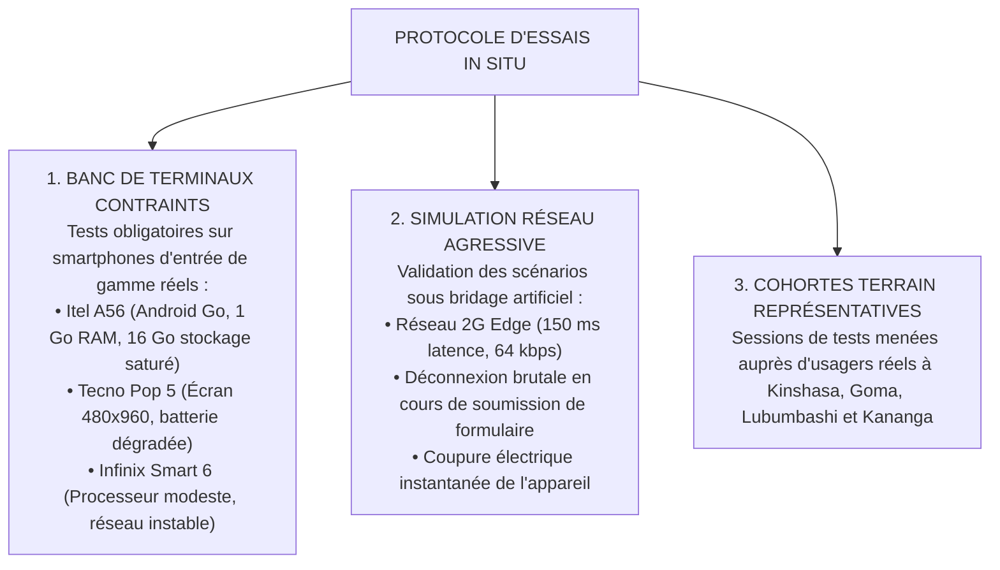
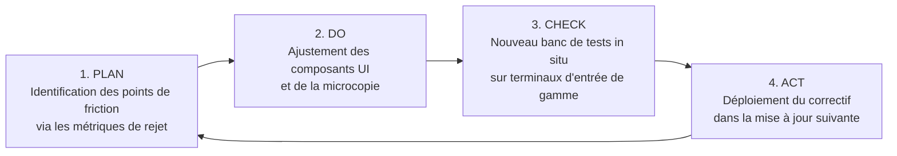

# TOME 6 — EXPÉRIENCE UTILISATEUR ET DESIGN SYSTEM
## 105. Tests Utilisateurs de Terrain et Amélioration Continue UX

---

> **Positionnement :** Protocoles d'essais in situ, métriques métrologiques d'utilisabilité et boucle d'amélioration ergonomique  
> **Autorité :** Conforme aux principes de rigueur expérimentale et d'amélioration continue (Tome 3, Module 3.9 — Plan PAC)  
> **Liaison amont :** Module 86 (Personas), Modules 87 à 94 (Parcours) | **Liaison aval :** Module 106 (Matrice de dépendances)

---

## 1. Objet et Portée du Sous-Tome

Aucune interface éducative ne peut être déclarée « prête » sur la seule foi de tests réalisés dans un bureau climatisé avec une connexion fibre optique et un ordinateur haut de gamme. Les tests utilisateurs d'ELLYSIUM doivent être conduits dans les conditions matérielles réelles de la RDC : smartphones à écran fissuré, poussière, forte chaleur, processeurs saturés et réseaux cellulaires oscillant entre la 2G et la 4G. Ce sous-tome formalise le protocole d'essais et les métriques de validation ergonomique.

---

## 2. Protocole des Tests In Situ sur Terminaux Réels

---

## 3. Métriques Quantitatives d'Admissibilité Ergonomique (SLO UX)

Pour obtenir le visa de mise en production, chaque parcours utilisateur doit franchir avec succès les seuils métrologiques minimaux suivants :

| Parcours Testé | Métrique Mesurée | Seuil d'Admissibilité Exigé |
|---|---|---|
| **Inscription Apprenant Indépendant** | Taux de complétion sans aide humaine | **$\ge 92 \%$** des candidats |
| **Inscription Apprenant Indépendant** | Durée totale de remplissage du formulaire | **$\le 3$ minutes** sur mobile |
| **Appel de Classe Enseignant** | Durée d'appel pour une classe de 45 élèves | **$\le 90$ secondes** montre en main |
| **Saisie des Cotes Trimestrielles** | Vitesse d'encodage par colonne de 45 élèves | **$\le 4$ minutes** au clavier |
| **Soumission Devoir Manuscrit** | Prise de photo + cadrage + compression locale | **$\le 45$ secondes** |
| **Paiement Frais Mobile Money** | Taux de réussite au premier essai | **$\ge 95 \%$** des transactions |
| **Consultation Bulletin Hors-ligne** | Temps d'ouverture d'un bulletin en cache | **$\le 500$ millisecondes** |

---

## 4. Signalement d'Anomalie Ergonomique Intégré

**Règle UX-105-01** : Un bouton discret *« Signaler une difficulté sur cet écran »* est présent en bas de chaque page. Il permet à l'usager d'envoyer en un tapotement :
- Une capture d'écran anonymisée automatique.
- La sélection d'un motif parmi 4 choix simples (*« Texte incompréhensible »*, *« Bouton qui ne marche pas »*, *« Trop lent »*, *« Autre »*).
- La possibilité d'enregistrer un message vocal de 15 secondes pour les personnes en difficulté avec l'écrit.

---

## 5. Boucle d'Amélioration Continue (Roue de Deming Ergonomique)

---

## 6. Verrous Fonctionnels de Validation des Tests

| Réf. | Intitulé | Conséquence en cas de transgression |
|---|---|---|
| **VF-105-01** | Interdiction de mise en production sans test sur 1 Go RAM | Aucune nouvelle version de l'application ne peut être diffusée sans avoir été validée sur au moins un smartphone équipé de 1 Go de RAM sous Android Go. |
| **VF-105-02** | Obligation de traitement des blocages critiques | Tout point de friction signalant un taux d'échec supérieur à $10\%$ sur un écran critique (inscription, devoirs, paiement) entraîne un gel immédiat des déploiements jusqu'à résolution. |

---

*Sous-tome rédigé conformément aux Normes documentaires ELLYSIUM — Fondations 04.*  
*Version 1.0 — Référence : ELLYSIUM/T6/105/v1.0*
