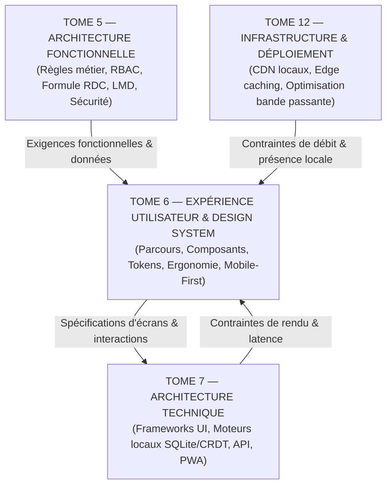

# TOME 6 — EXPÉRIENCE UTILISATEUR ET DESIGN SYSTEM
## 106. Matrice des Dépendances Formelle — Liaisons avec les Tomes 5, 7 et 12

---

> **Positionnement :** Cartographie des dépendances bidirectionnelles et contrats d'interface inter-tomes  
> **Autorité :** Conforme aux conventions de traçabilité intégrale ELLYSIUM (Fondations 04)  
> **Liaison amont :** Tome 5 (Fonctionnel) | **Liaison aval :** Tome 7 (Architecture Technique), Tome 12 (Infrastructure)

---

## 1. Objet et Portée du Sous-Tome

Le Design System et l'ingénierie de l'expérience utilisateur (Tome 6) ne fonctionnent pas en vase clos. Ils constituent la projection visuelle et interactive des règles de gestion définies dans le Tome 5 (Architecture Fonctionnelle) et reposent sur les capacités techniques décrites dans le Tome 7 (Architecture Technique) et déployées sur l'infrastructure du Tome 12 (Infrastructure & Hébergement). Ce sous-tome formalise la matrice des dépendances contractuelles garantissant l'alignement absolu entre la doctrine, la fonction, l'interface et le code.

---

## 2. Diagramme des Dépendances Inter-Tomes

---

## 3. Matrice de Dépendances Croisées Exhaustive

| Module Tome 6 (UX / UI) | Module Dépendance Tome 5 (Fonctionnel) | Module Dépendance Tome 7 (Technique) | Contrat d'Interface & Invariants Assurés |
|---|---|---|---|
| **87. Apprenant Indépendant** | Mod. 58 (Entonnoir) & Mod. 59 (Candidatures) | Mod. 114 (Auth locale & JWT) & Mod. 118 (PWA) | Gratuité absolue (zéro appel de paiement), IUNE généré au standard `CD-EL-YYYY-NNNNNNNN`. |
| **88. Élève Affilié** | Mod. 61 (Écoles) & Mod. 68 (Bulletins) | Mod. 120 (Cache local SQLite) & Mod. 123 (QR Code) | Bulletin scellé SHA-256 avec QR code vérifiable hors-ligne. Formule RDC cumulative stricte. |
| **89. Étudiant LMD** | Mod. 63 (Paramétrage LMD) & Mod. 67 (Moteur déterministe) | Mod. 116 (Moteur de calcul WASM) | Règle des 30 crédits ECTS stricts par semestre, calcul de compensation immédiat sans latence. |
| **90. Enseignant** | Mod. 65 (Présences) & Mod. 66 (Cahier des cotes) | Mod. 117 (Sync CRDT bi-directionnelle) | Saisie de notes < 4 min par classe, synchronisation différée sans conflit, audit trail inaltérable. |
| **91. Parent d'Élève** | Mod. 70 (Messagerie) & Mod. 71 (Caisse d'école) | Mod. 125 (Passerelle Mobile Money API) | Étanchéité pédagogie/finances absolue, tunnel de paiement M-Pesa/Orange/Airtel en 3 étapes. |
| **92. Préfet des Études** | Mod. 68 (Bulletins) & Mod. 80 (RBAC / SoD) | Mod. 122 (Signature cryptographique PKI) | Séparation stricte Préfet/Caissier. Clé de scellement institutionnelle pour les délibérations. |
| **93. Promoteur / DG** | Mod. 71 (Caisse) & Mod. 72 (RH / Paie) | Mod. 126 (Moteur comptable OHADA) | Double balance USD/CDF, génération des fiches de paie croisées avec présences effectives. |
| **94. Partenaire d'État** | Mod. 76 (Diplômes) & Mod. 77 (BI / SIGE) | Mod. 127 (API d'interopérabilité ministérielle) | Accès en Read-Only strict, anonymisation des données nominatives pour statistiques globales. |
| **95. Vie Communautaire** | Mod. 70 (Protection mineurs) & Mod. 74 (Tuteur IA) | Mod. 124 (Moteur de modération sémantique) | Zéro message direct adulte/mineur hors classe. RAG strict sur corpus éducatifs validés. |
| **97. Charte & Tokens** | Mod. 56 (Constitution traduite) | Mod. 113 (Design Tokens CSS / Webpack) | Mode sombre éco-énergie AMOLED, contrastes WCAG AAA (> 7:1) obligatoires. |
| **98. Composants UI** | Mod. 81 (Exceptions) & Mod. 82 (Event-Driven) | Mod. 115 (Bibliothèque de composants Web Components) | Zone tactile minimale 48×48px, formulaires résilients à la coupure électrique. |
| **100. Typographie** | Mod. 55 (Périmètre souverain) | Mod. 118 (Assets locaux WOFF2) | Zéro appel CDN externe (Google Fonts banni), polices système et WOFF2 locaux < 35 Ko. |
| **101. Accessibilité** | Mod. 56 (Article 3 — Égalité républicaine) | Mod. 119 (Audits automatisés Axe / Lighthouse) | Balisage ARIA complet pour TalkBack Android, navigation intégrale au clavier sans piège. |
| **102. Responsive** | Mod. 55 (Dualité d'équipements) | Mod. 113 (CSS Grid / Media Queries) | Mobile-First prioritaire, optimisation pour processeurs modestes 1 Go RAM. |
| **103. Gestion des États** | Mod. 82 (Synchronisation asynchrone) | Mod. 121 (Service Worker Offline-First) | 4 états systématiques (Chargement, Vide, Erreur, Succès), timeout réseau à 8 secondes. |
| **105. Tests In Situ** | Mod. 83 (Matrice globale) | Mod. 128 (Banc d'émulation réseau bridé) | Validation obligatoire sur smartphones Itel/Tecno d'entrée de gamme réels. |

---

## 4. Protocole de Gestion des Changements Transverses

Lorsqu'une règle métier du Tome 5 est modifiée (ex. décret ministériel révisant les coefficients de l'EXETAT ou les seuils de compensation LMD) :
1. Mise à jour de la spécification dans le module concerné du Tome 5.
2. Déclinaison de l'impact dans le parcours utilisateur du Tome 6 (écrans, microcopie, états d'erreur).
3. Adaptation du composant UI dans le module 98.
4. Transmission des spécifications techniques au Tome 7 pour implémentation logicielle.
5. Re-validation sur le banc d'essais in situ (Module 105).

---

*Sous-tome rédigé conformément aux Normes documentaires ELLYSIUM — Fondations 04.*  
*Version 1.0 — Référence : ELLYSIUM/T6/106/v1.0*

---

## 7. Verrous Fonctionnels Critiques

| Réf. Verrou | Description Fonctionnelle et Technique | Conséquence en Cas de Violation |
| :--- | :--- | :--- |
| **`VF-106-01`** | **Adhérence parfaite avec l'architecture fonctionnelle du Tome 5** | Chaque écran UI correspond à une capacité métier formellement spécifiée au Tome 5. |
| **`VF-106-02`** | **Compatibilité technique stricte avec le Tome 7** | Les composants du Design System doivent s'intégrer sans surcharge dans le frontend Angular/PWA. |
| **`VF-106-03`** | **Garantie d'opérabilité sur les applications du Tome 12** | Le Design System est la référence unique pour les applications Web, Android et Offline. |
| **`VF-106-04`** | **Mise à jour synchronisée des maquettes et du code** | Toute évolution d'un token de design est propagée dans le dépôt UI partagé. |
| **`VF-106-05`** | **Clôture solennelle du Tome 6** | Le présent module valide l'intégralité ergonomique et visuelle des 23 sous-tomes d'ELLYSIUM. |

---

*Sous-tome rédigé conformément aux Normes documentaires ELLYSIUM — Fondations 04.*
