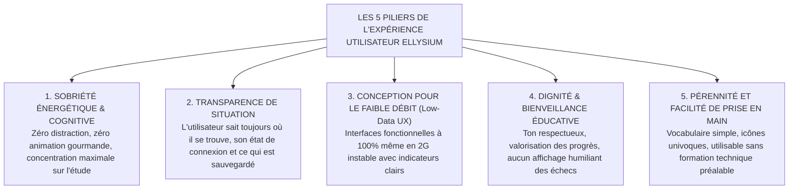

# TOME 6 — EXPÉRIENCE UTILISATEUR ET DESIGN SYSTEM
## 84. Périmètre du Tome 6 — Principes UX Institutionnels

---

> **Positionnement :** Doctrine ergonomique et cadre de conception de l'expérience utilisateur  
> **Autorité :** Subordonné à la Constitution (Tome 2, Articles 3, 4 et 19)  
> **Liaison amont :** Tome 1 (Vision) et Tome 5 (Architecture Fonctionnelle) | **Liaison aval :** Tome 6 (Modules 85 à 106)

---

## 1. Objet et Finalité du Sous-Tome

Le présent sous-tome pose les principes directeurs de l'Expérience Utilisateur (UX) régissant la conception de l'ensemble des interfaces numériques d'ELLYSIUM (application mobile Android, application web PWA, portails administratifs).

L'UX d'ELLYSIUM refuse le mimétisme des plateformes de divertissement ou des réseaux sociaux mercantiles, caractérisés par l'économie de l'attention, les notifications compulsives et la surcharge visuelle. Elle affirme une **posture de dignité républicaine, de sobriété didactique et d'utilité publique**.

---

## 2. Les 5 Principes Directeurs de l'UX ELLYSIUM

---

## 3. Définition du Périmètre Visuel et Ergonomique

Le périmètre du Tome 6 couvre :
1. **L'expérience multi-terminaux** :
   - *Smartphone Android d'entrée de gamme* (Cœur de cible des apprenants et enseignants sur le terrain).
   - *Tablettes tactiles* (Usage préférentiel des directeurs d'écoles et tuteurs nomades).
   - *Ordinateurs de bureau et ordinateurs portables* (Usage bureautique des secrétariats, salles informatiques et préfectures).
2. **La modélisation des flux d'écrans** pour l'intégralité des fonctionnalités spécifiées dans le Tome 5 (de l'inscription au téléchargement du bulletin scellé).
3. **Le système de composants unifié (Design System)** garantissant une cohérence visuelle parfaite entre le web et le mobile.

---

## 4. Ce que le Design d'ELLYSIUM S'Interdit Formellement

- **Zéro Dark Patterns (Pièges ergonomiques)** : Aucun bouton trompeur, aucun consentement forcé, aucune navigation labyrinthique destinée à dissimuler une information légale.
- **Zéro surcharge publicitaire ou marchande** : Aucun espace publicitaire, aucune sollicitation d'achat de services payants dans les espaces apprenants.
- **Zéro dépendance aux connexions à haut débit** : Aucune fonctionnalité critique ne doit exiger le chargement obligatoire d'une vidéo en streaming HD ou de scripts volumineux non mis en cache.

---

## 7. Verrous Fonctionnels Critiques

| Réf. Verrou | Description Fonctionnelle et Technique | Conséquence en Cas de Violation |
| :--- | :--- | :--- |
| **`VF-084-01`** | **Frugalité cognitive absolue** | Les interfaces ne doivent comporter aucun élément décoratif surchargeant l'attention de l'apprenant. |
| **`VF-084-02`** | **Poids d'écran initial < 150 Ko** | Toute page d'accueil ou tableau de bord doit charger en moins de 150 Ko hors médias. |
| **`VF-084-03`** | **Affichage instantané du texte** | Utilisation de polices système de secours avec font-display: swap sans blocage d'affichage. |
| **`VF-084-04`** | **Indicateur permanent de connectivité** | L'interface signale sans ambiguïté si l'utilisateur opère en ligne ou hors-ligne. |
| **`VF-084-05`** | **Navigation universelle à 3 clics** | Toute ressource pédagogique fondamentale doit être accessible en 3 interactions au maximum. |
| **`VF-084-06`** | **L'interface reste pleinement fonctionnelle avec un contraste minimum de 4,5:1 sur tous les supports** | **Conséquence : violation = inéligibilité du module pour mise en production** |

---

*Sous-tome rédigé conformément aux Normes documentaires ELLYSIUM — Fondations 04.*
