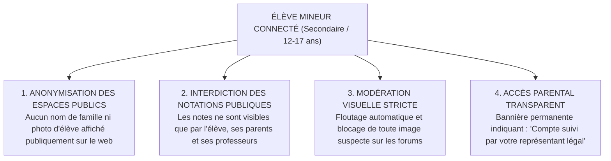

# TOME 6 — EXPÉRIENCE UTILISATEUR ET DESIGN SYSTEM
## 85. Conformité Constitutionnelle de l'UX (Protection des Mineurs et Sobriété)

---

> **Positionnement :** Traduction des garde-fous constitutionnels en règles de conception d'interfaces  
> **Autorité :** Subordonné à la Constitution (Tome 2, Articles 3, 4, 7, 8 et 15)  
> **Liaison amont :** Module 56 (Conformité fonctionnelle) | **Liaison aval :** Modules 97 à 104

---

## 1. Objet et Portée du Sous-Tome

Le présent sous-tome définit les **règles éthiques, légales et protectrices** imposées aux concepteurs d'interfaces, graphistes et développeurs frontend d'ELLYSIUM.

L'ergonomie d'un logiciel scolaire ne peut pas être neutre : elle influence la santé mentale des enfants, le respect de leur dignité et la sérénité des familles. ELLYSIUM formalise une ergonomie constitutionnellement encadrée qui :
- Protège les apprenants mineurs contre toute exposition ou manipulation.
- Refuse la gamification toxique et l'anxiété scolaire.
- Assure la sobriété énergétique et la préservation du pouvoir d'achat des ménages (forfaits data).

---

## 2. Protection Visuelle et Ergonomique des Mineurs

### 2.1 Refus de la Gamification Anxiogène (Non-Toxique UX)
De nombreuses applications d'apprentissage commercial utilisent des mécaniques psychologiques manipulatrices (séries de jours consécutifs avec pénalités de perte de points, classements compétitifs publics agressifs). ELLYSIUM bannit formellement ces pratiques :
- **Zéro pénalité en cas de coupure réseau** : L'apprenant qui ne se connecte pas pendant trois jours en raison d'un délestage électrique ou d'une panne d'antenne relais ne perd aucune progression acquise.
- **Valorisation du progrès personnel plutôt que de la compétition sauvage** : Les indicateurs visuels mettent en valeur l'effort individuel par rapport à ses propres objectifs passés, et non par écrasement des camarades.

### 2.2 Préservation de la Dignité face à l'Échec
- Une mauvaise note n'est jamais affichée avec des signaux visuels humiliants (pas de croix rouges clignotantes, pas de signaux d'alarme sonores disgracieux).
- Tout affichage de cote inférieure à $10/20$ est obligatoirement accompagné d'un bandeau bienveillant : **« Cette notion demande un approfondissement. Voici 2 exercices guidés pour progresser »**.

---

## 3. Sobriété Numérique et Frugalité Énergétique (Article 19)

Conformément à l'Article 19 de la Constitution (Responsabilité sociétale) :
- **Mode Sombre Éco-Énergie Obligatoire** :
  L'application propose un thème sombre profond (`#0F172A` / `#000000`) réduisant la consommation énergétique des écrans AMOLED de plus de 40 %, prolongeant l'autonomie des téléphones dans les zones où la recharge électrique est payante ou dépendante de groupes électrogènes.
- **Micro-Poids des Écrans (Low-Carbon Design)** :
  L'empreinte d'un écran standard ne dépasse pas **50 kilo-octets de code HTML/CSS/JS** (hors données textuelles de cours).
- **Zéro Lecture Automatique (No Auto-Play)** :
  Aucune vidéo, aucun audio ne démarre automatiquement sans action tactile délibérée de l'utilisateur, évitant l'épuisement accidentel du forfait data mobile de la famille.

---

## 4. Règles de Conception et Verrous Ergonomiques

- **Règle 85.1 (Clarté des boutons d'engagement formel)** : Tout bouton déclenchant une action juridique ou académique irréversible (ex. *« Soumettre définitivement ma copie d'examen »* ou *« Valider l'inscription »*) doit utiliser un libellé sans équivoque, une couleur d'avertissement contrastée et une fenêtre de confirmation obligatoire récapitulant les conséquences de l'action.
- **Règle 85.2 (Affichage permanent du statut hors-ligne)** : Lorsque le terminal bascule en mode déconnecté, une bannière discrète mais explicite s'affiche en haut de l'écran : **« Mode hors-ligne actif — Vos devoirs et notes sont sauvegardés sur votre appareil »**, rassurant immédiatement l'élève.

---

## 7. Verrous Fonctionnels Critiques

| Réf. Verrou | Description Fonctionnelle et Technique | Conséquence en Cas de Violation |
| :--- | :--- | :--- |
| **`VF-085-01`** | **Neutralité éthique et absence de dark patterns** | Interdiction formelle de tout mécanisme incitatif trompeur ou addictif pour les mineurs. |
| **`VF-085-02`** | **Protection visuelle des mineurs** | Absence totale de bannières publicitaires, liens commerciaux ou sponsors sur les portails élèves. |
| **`VF-085-03`** | **Sobriété énergétique logicielle** | Mode sombre natif disponible sur toutes les applications pour préserver les batteries. |
| **`VF-085-04`** | **Droit à l'effacement visuel direct** | L'apprenant peut masquer son historique d'activité de l'affichage en un clic. |
| **`VF-085-05`** | **Conformité du langage institutionnel** | Les mentions légales et consentements sont rédigés en français simple accessible aux collégiens. |
| **`VF-085-06`** | **L'interface reste pleinement fonctionnelle avec un contraste minimum de 4,5:1 sur tous les supports** | **Conséquence : violation = inéligibilité du module pour mise en production** |

---

*Sous-tome rédigé conformément aux Normes documentaires ELLYSIUM — Fondations 04.*
