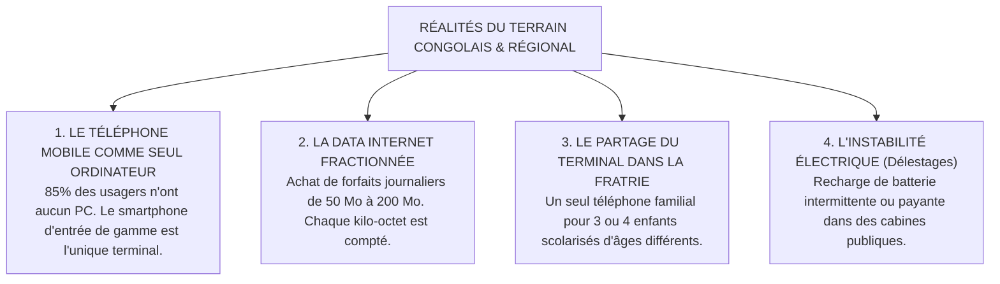

# TOME 6 — EXPÉRIENCE UTILISATEUR ET DESIGN SYSTEM
## 86. Recherche Utilisateur et Profils Sociologiques de Terrain

---

> **Positionnement :** Étude des réalités matérielles, économiques et sociologiques des usagers en Afrique francophone  
> **Autorité :** Conforme au Tome 1 (Section 6 — Publics cibles) et à la Constitution (Tome 2, Article 3)  
> **Liaison amont :** Tome 1 | **Liaison aval :** Modules 87 à 94 (Parcours utilisateurs)

---

## 1. Objet et Portée du Sous-Tome

Le présent sous-tome consigne les résultats des analyses sociologiques, des observations d'usage et des contraintes matérielles réelles observées auprès des populations cibles en République Démocratique du Congo, en Afrique centrale et au sein de la diaspora.

Concevoir un système sans tenir compte de la réalité sociologique du terrain conduit inévitablement à l'échec d'adoption. Ce document dresse le portrait sans fard des conditions d'usage réelles afin d'imposer des choix d'ingénierie ergonomique parfaitement adaptés.

---

## 2. Les 4 Réalités Sociologiques Majeures du Terrain Congolais

---

## 3. Typologie des Personas Sociologiques Réels

Pour calibrer chaque écran du système, quatre personas représentatifs ont été modélisés :

### Persona 1 : Gloire, 15 ans — Élève en 2e des Humanités Scientifiques (Goma)
- **Équipement** : Smartphone Android d'entrée de gamme (Itel A56, 16 Go de stockage saturé par les photos de famille, 1 Go de RAM).
- **Connectivité** : Connexion Wi-Fi communautaire 2 heures par jour à la paroisse du quartier ou forfait data de 100 Mo acheté les jours de devoir.
- **Besoin UX critique** : Application ultra-légère (< 20 Mo d'installation), téléchargement en 1 clic de ses devoirs, capacité de travailler hors-ligne dans sa chambre à la lueur d'une lampe solaire.

### Persona 2 : Maman Jeannette, 42 ans — Commerçante et Mère de 4 enfants (Kinshasa - Matete)
- **Équipement** : Téléphone portable d'occasion, maîtrise intuitive des messages vocaux WhatsApp et du Mobile Money, mais anxieuse devant les formulaires administratifs compliqués.
- **Connectivité** : Données mobiles activées par intermittence pour consulter ses messages d'affaires.
- **Besoin UX critique** : Notification SMS claire en cas d'absence de son fils à l'école, paiement des frais scolaires en 3 clics via M-Pesa sans se déplacer à l'intendance, bulletin scolaire lisible d'un coup d'œil sans acronymes obscurs.

### Persona 3 : Professeur Ilunga, 53 ans — Enseignant de Mathématiques (Lubumbashi)
- **Équipement** : Ordinateur portable ancien reconditionné à l'école et smartphone personnel.
- **Habitude de travail** : A tenu pendant 25 ans des registres d'appel et des carnets de cotes manuscrits sur cahiers quadrillés. Méfiant envers les « logiciels compliqués ».
- **Besoin UX critique** : Interface tabulaire ressemblant à son cahier papier habituel, saisie ultra-rapide des notes au clavier sans temps de chargement entre deux élèves, calcul automatique qui lui fait gagner 3 jours de travail de calcul à chaque trimestre.

### Persona 4 : Christian, 26 ans — Apprenant Universitaire Indépendant (Kananga)
- **Équipement** : Smartphone personnel et accès occasionnel aux ordinateurs d'un cybercafé local.
- **Situation** : Titulaire de l'EXETAT, employé le jour dans une agence locale, étudie le soir pour obtenir sa Licence en Informatique et Gestion sur ELLYSIUM.
- **Besoin UX critique** : Téléchargement complet des syllabus en PDF/A légers, lecteur de cours en mode sombre avec prise de notes synchronisée, soumission de projets logiciels par fichiers légers.

---

## 4. Conséquences Ergonomiques et Choix de Conception Impératifs

De ces profils sociologiques découlent **cinq impératifs de design non négociables** :
1. **Multi-profils sur un même appareil (Fast Account Switching)** :
   L'application permet à un parent de basculer en un tapotement d'écran entre le profil de son fils en 8e année et celui de sa fille en 3e des humanités, sans ressaisir l'identifiant ni retélécharger les données communes.
2. **Indicateur visuel de consommation de données** :
   Avant tout téléchargement d'un cours ou d'un enregistrement audio, l'application affiche explicitement son poids en kilo-octets (ex. *« Ce résumé audio pèse 180 Ko — Continuer ? »*).
3. **Persistance des données en cache local (Zero Data Loss)** :
   Tout formulaire commencé est sauvé en temps réel en mémoire locale. Même si la batterie du téléphone s'éteint brutalement ou que le réseau coupe, l'utilisateur retrouve sa saisie intacte au redémarrage.
4. **Vocabulaire familier et contextualisé** :
   Utilisation de termes conformes aux usages scolaires et administratifs congolais (ex. *« Période »*, *« Travaux Journaliers »*, *« Minerval »*, *« Préfet »*, *« Cotes »*, *« EXETAT »*).
