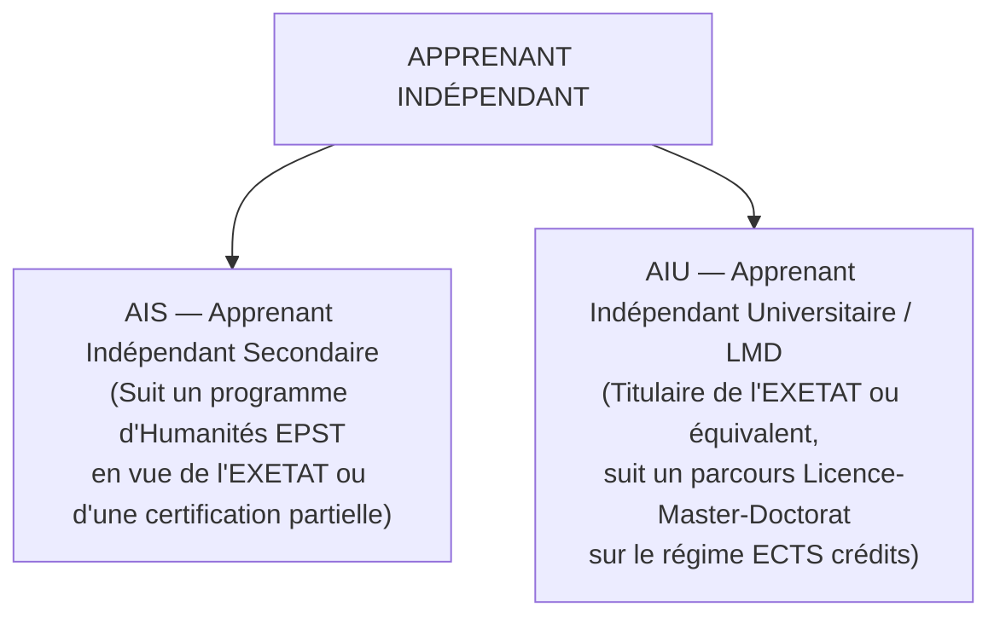
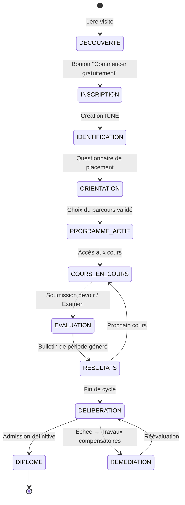
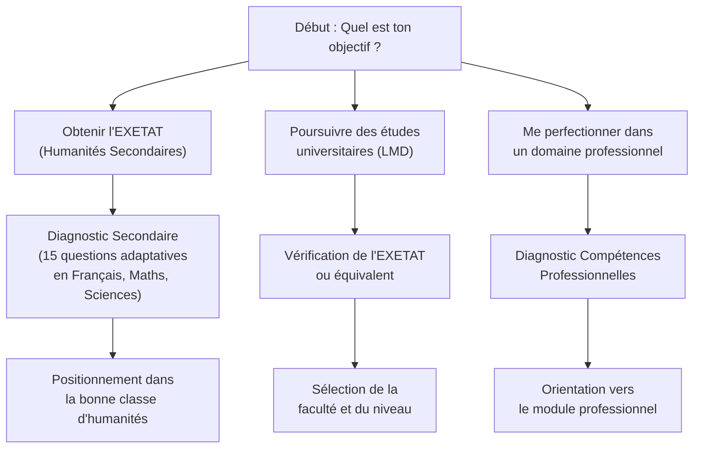
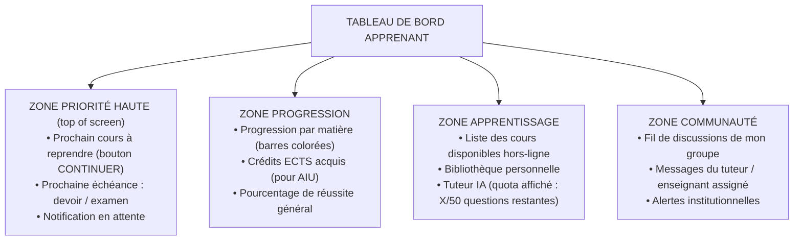
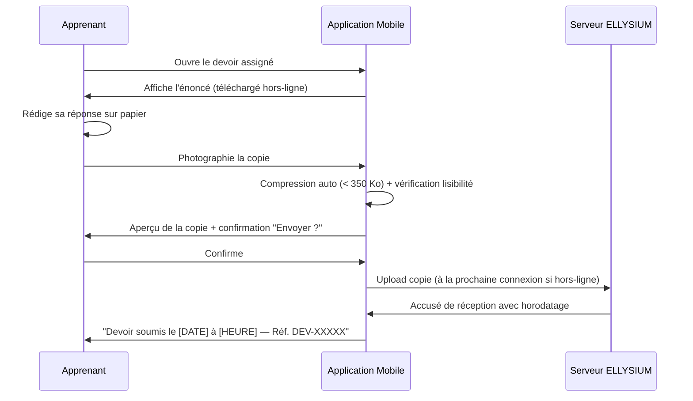
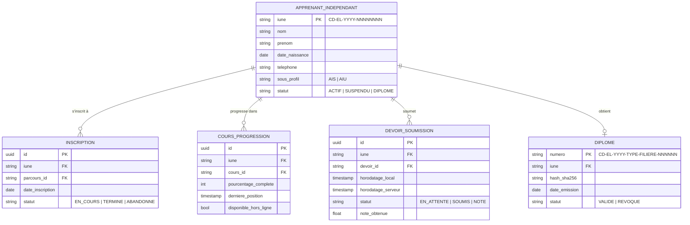

# TOME 6 — EXPÉRIENCE UTILISATEUR ET DESIGN SYSTEM
## 87. Parcours Utilisateur — Apprenant Indépendant (Secondaire & Supérieur)

---

> **Positionnement :** Cartographie exhaustive des points de contact UX de l'apprenant indépendant, de son inscription jusqu'à la délivrance de son diplôme  
> **Autorité :** Conforme au Tome 2 (Art. 4 — Gratuité absolue des apprenants indépendants) et au Tome 5, Module 58 (Entonnoir d'identification souverain)  
> **Liaison amont :** Modules 57 (RBAC), 58 (inscription), 59 (candidatures), 67 (calcul des cotes), 76 (diplômes)  
> **Liaison aval :** Module 96 (architecture de navigation), Module 103 (états d'interface)

---

## 1. Objet et Portée du Sous-Tome

L'apprenant indépendant est la figure centrale et fondatrice du projet ELLYSIUM. Il s'inscrit librement, suit ses cours sans être affilié à un établissement physique, et passe ses évaluations selon le calendrier de la plateforme. Sa gratuité est constitutionnellement garantie (Tome 2, Art. 4). Ce sous-tome détaille chaque écran, chaque état, chaque décision de navigation que cet apprenant rencontre depuis sa première visite jusqu'à l'obtention de son titre officiel.

---

## 2. Deux Sous-Profils de l'Apprenant Indépendant



### 2.1 Différences fonctionnelles critiques

| Critère | AIS | AIU |
|---|---|---|
| **Condition d'accès** | Aucune condition (primaire validé suffit pour la 1ère humanité) | EXETAT ou équivalent reconnu par l'ESU |
| **Référentiel pédagogique** | Programmes DIPROMAT/MEPST par option | Cursus LMD (Tome 4, modules 4.24 à 4.54) |
| **Calcul des cotes** | Formule RDC cumulative par période (Tome 5, Module 67) | Crédits ECTS, 30 par semestre, compensation intra-UE |
| **Titre final** | Attestation de Réussite ELLYSIUM + Présentation aux sessions EXETAT | Diplôme LMD scellé SHA-256 (Tome 5, Module 76) |
| **Quota tuteur IA** | 50 questions/jour (Tome 5, Module 74) | 50 questions/jour identique |
| **Gratuité** | Intégrale (Tome 2, Art. 4) | Intégrale (Tome 2, Art. 4) |

---

## 3. Cartographie Globale du Parcours — Diagramme d'État



---

## 4. Phase 0 — Découverte et Première Impression

### 4.1 Point de contact : Page d'accueil publique

**Règle UX-87-01** : La page d'accueil publique doit permettre à un visiteur n'ayant jamais entendu parler d'ELLYSIUM de comprendre en moins de 8 secondes : (a) ce que propose la plateforme, (b) que c'est gratuit pour les apprenants indépendants, (c) comment commencer. Ces trois informations doivent être lisibles sans défilement sur un écran de 360 × 640 px.

**Règle UX-87-02** : Aucune création de compte n'est requise pour visualiser les plans de cours, les prérequis et les programmes disponibles. La navigation exploratoire est entièrement libre et sans formulaire.

### 4.2 Actions disponibles sans compte

- Consulter le catalogue des programmes (secondaire et supérieur)
- Visualiser le plan détaillé de n'importe quelle matière
- Lire la page « Qui sommes-nous / Accréditation »
- Accéder à la FAQ sur les conditions d'accès et les titres délivrés

---

## 5. Phase 1 — Inscription et Création de l'IUNE

### 5.1 Déclencheur

L'apprenant clique sur **« Commencer gratuitement »** ou **« S'inscrire »**.

### 5.2 Formulaire d'inscription (écran unique progressif)

**Règle UX-87-03** : Le formulaire d'inscription est structuré en 3 étapes maximum affichées séquentiellement avec une barre de progression. Il ne doit jamais dépasser 7 champs au total sur mobile.

| Étape | Champs | Validation |
|---|---|---|
| **1 — Identité** | Nom de famille, Prénom(s), Date de naissance, Sexe | Nom et prénom obligatoires ; date de naissance obligatoire pour la protection des mineurs (vérification âge < 13 ans avec consentement parental) |
| **2 — Contact** | Numéro de téléphone mobile (principal), E-mail (optionnel), Province/Territoire | Téléphone obligatoire — format international +243XXXXXXXXX validé par regex |
| **3 — Accès** | Mot de passe (6 caractères minimum), Confirmation | Indicateur visuel de robustesse ; pas de questions secrètes |

### 5.3 Génération de l'IUNE

À validation du formulaire, le système génère immédiatement l'identifiant unique national :

```
Format : CD-EL-YYYY-NNNNNNNN
Exemple : CD-EL-2025-00000001
```

**Règle UX-87-04** : L'IUNE généré est affiché en grand caractère gras sur un écran de confirmation distinct, avec :
- Bouton **« Copier »** (copie dans le presse-papier)
- Bouton **« Partager »** (partage natif via WhatsApp/SMS)
- Instruction textuelle claire : *« Notez cet identifiant. Il vous accompagnera à vie sur ELLYSIUM. »*
- Un SMS de confirmation envoyé automatiquement au numéro saisi

---

## 6. Phase 2 — Questionnaire de Placement et Orientation

### 6.1 Objectif

Le questionnaire de placement n'est pas un test d'élimination. Il est un outil d'orientation bienveillant permettant de positionner l'apprenant au bon niveau sans le stigmatiser.

**Règle UX-87-05** : Le questionnaire de placement est présenté comme un « auto-diagnostic de niveau ». Le mot « test » ou « examen » n'apparaît jamais dans cette phase. Le vocabulaire adopté est : *« Voyons ensemble ce que tu sais déjà. »*

### 6.2 Structure du questionnaire



### 6.3 Règles de positionnement

**Règle UX-87-06** : Le résultat du questionnaire propose **toujours** 2 ou 3 options de positionnement, jamais une seule. L'apprenant choisit librement. Le système indique sa recommandation sans l'imposer.

**Règle UX-87-07** : Si l'apprenant choisit un niveau supérieur à la recommandation du système, une alerte bienveillante s'affiche (*« Ce niveau est exigeant — tu peux commencer et revenir si besoin »*) mais n'empêche pas la sélection.

---

## 7. Phase 3 — Tableau de Bord Apprenant (Dashboard)

### 7.1 Structure de l'écran principal



**Règle UX-87-08** : Le bouton **« CONTINUER »** vers le cours interrompu doit être le premier élément cliquable du dashboard, positionné dans les 200 premiers pixels de l'écran sur mobile. Le parcours de reprise ne doit pas dépasser 2 tapotements depuis le dashboard.

### 7.2 Indicateur de consommation de données

**Règle UX-87-09** : Un compteur discret mais visible en haut à droite du tableau de bord indique l'estimation de la consommation de données de la session en cours (ex. *« Session : 2,3 Mo utilisés »*). Cette valeur se met à jour à chaque action réseau.

---

## 8. Phase 4 — Accès aux Cours et Apprentissage

### 8.1 Lecteur de cours

**Règle UX-87-10** : Chaque cours s'ouvre dans un lecteur immersif à 3 modes :
1. **Mode Texte** (défaut) : cours en markdown rendu, police lisible, sans publicité ni distraction.
2. **Mode Audio** : fichier MP3 léger (< 5 Mo) lu par synthèse vocale ou enregistrement humain.
3. **Mode Hors-ligne** : téléchargement en un tapotement du cours complet. Le poids exact est affiché avant téléchargement.

**Règle UX-87-11** : La progression dans un cours est sauvegardée **localement** toutes les 30 secondes et synchronisée avec le serveur à la prochaine connexion disponible (architecture CRDT, Tome 5, Module 82).

### 8.2 Prise de notes intégrée

- Zone de saisie de notes personnelles attachée à chaque section du cours.
- Les notes sont stockées localement et synchronisées en arrière-plan.
- Export des notes en PDF possible hors-ligne.

### 8.3 Tuteur IA intégré

**Règle UX-87-12** : Le tuteur IA (Tome 5, Module 74) est accessible depuis n'importe quelle page de cours via un bouton fixe en bas à droite. Le quota restant (X/50) est affiché en permanence. Lorsque le quota est épuisé, un message bienveillant s'affiche : *« Tu as atteint ta limite quotidienne de questions. Le compteur se renouvellera demain. »*

---

## 9. Phase 5 — Soumission des Évaluations

### 9.1 Soumission d'un devoir (Tome 5, Module 69)



**Règle UX-87-13** : En mode hors-ligne, la soumission est mise en file d'attente locale avec horodatage certifié par l'horloge système. À la reconnexion, l'envoi est automatique. L'apprenant voit l'état : *« En attente d'envoi »* → *« Envoyé »* → *« Accusé de réception »*.

### 9.2 Examen en ligne surveillé

**Règle UX-87-14** : L'entrée en session d'examen affiche obligatoirement :
1. La durée totale de l'examen
2. Le nombre de questions
3. L'impossibilité de revenir en arrière une fois une question soumise (si le mode est linéaire)
4. Le mode de surveillance appliqué (photo d'identité requise, verrouillage de l'écran)

Un compte à rebours visible en permanence est affiché pendant l'examen.

---

## 10. Phase 6 — Résultats et Bulletin

### 10.1 Notification de résultats

**Règle UX-87-15** : La publication des résultats donne lieu à une notification push (ou SMS si pas de connexion). La notification ne révèle pas la note — elle invite l'apprenant à consulter son bulletin dans l'application pour protéger la confidentialité.

### 10.2 Affichage du bulletin

- Bulletin affiché selon la maquette officielle RDC à 15 colonnes (Tome 5, Module 68).
- QR code de vérification publique affiché en bas du bulletin.
- Mention légale de scellement SHA-256 visible.
- Bouton **« Télécharger en PDF »** — génération locale du PDF/A signé.

**Règle UX-87-16** : Le taux de réussite affiché dans le bulletin applique **exclusivement** la formule officielle RDC :
$$\text{Taux} = \frac{\sum \text{Points obtenus}}{\sum \text{Maxima}} \times 100$$
Jamais une moyenne arithmétique des pourcentages par matière.

---

## 11. Phase 7 — Délibération et Diplôme

### 11.1 Notification de délibération

Lorsqu'un cycle est terminé (fin d'année, fin de semestre LMD), l'apprenant reçoit :
- Notification avec la date et l'heure de la délibération le concernant.
- Accès en temps réel au statut : *« En cours de délibération »* → *« Décision rendue »*.

### 11.2 Réception du diplôme

**Règle UX-87-17** : Le diplôme numérique est accessible depuis l'onglet **« Mes titres »** du profil. Il est présenté avec :
- Numérotation officielle (`CD-EL-YYYY-TYPE-FILIÈRE-NNNNNN`)
- Double hachage SHA-256 visible
- Lien de vérification publique (sans compte)
- Bouton **« Partager »** → génère un lien de vérification public partageable sur WhatsApp/LinkedIn/e-mail

---

## 12. Règles de Gestion et Verrous Fonctionnels

| Ref. | Règle | Conséquence en cas de violation |
|---|---|---|
| **VF-87-01** | La gratuité est absolue pour tout apprenant indépendant | Zéro écran de paiement ne doit jamais apparaître dans le parcours AIS/AIU. Tentative = blocage système. |
| **VF-87-02** | L'IUNE est inaltérable une fois créé | Aucun écran ne permet à l'apprenant de modifier son IUNE. Toute demande passe par le support officiel. |
| **VF-87-03** | Le quota IA de 50 questions/jour est strict | Au-delà de 50, le tuteur IA répond : message de limitation uniquement, zéro réponse de contenu. |
| **VF-87-04** | L'horodatage de soumission des devoirs est celui de l'heure locale du terminal, certifié en hors-ligne | Impossibilité de modifier l'horodatage a posteriori. |
| **VF-87-05** | Aucune décision de délibération n'est communiquée par notification externe | La décision n'est consultable que dans l'application, après authentification. |

---

## 13. Modèle Conceptuel de Données (MCD) — Parcours Apprenant Indépendant



---

*Sous-tome rédigé conformément aux Normes documentaires ELLYSIUM — Fondations 04.*  
*Version 1.0 — Référence : ELLYSIUM/T6/87/v1.0*
