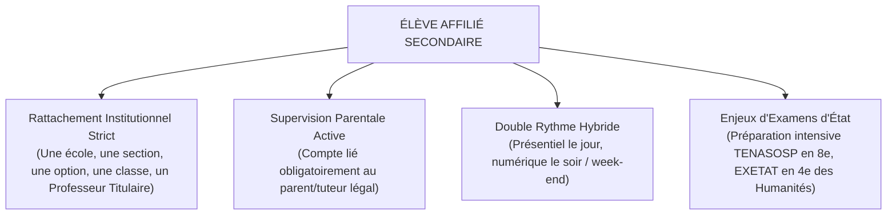
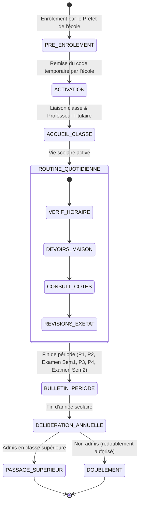
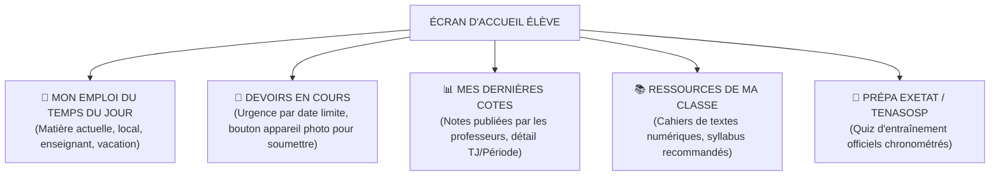
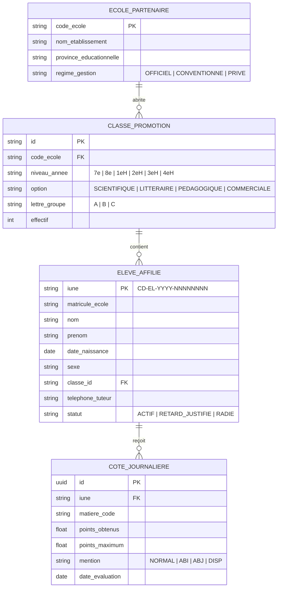

# TOME 6 — EXPÉRIENCE UTILISATEUR ET DESIGN SYSTEM
## 88. Parcours Utilisateur — Élève Affilié (Secondaire EPST)

---

> **Positionnement :** Expérience utilisateur de l'élève inscrit dans une école partenaire conventionnée ou publique en RDC  
> **Autorité :** Conforme au Tome 2 (Art. 3 — Égalité républicaine) et au Tome 5, Modules 61 (Écoles partenaires), 62 (Classes/Promotions), 66 (Cahier des cotes), 68 (Bulletins)  
> **Liaison amont :** Modules 57, 58, 61, 62, 65, 66, 68 | **Liaison aval :** Module 91 (Parcours parent), Module 96 (Navigation)

---

## 1. Objet et Portée du Sous-Tome

L'élève affilié est scolarisé dans une école physique partenaire d'ELLYSIUM (complexe scolaire, institut, lycée, collège). Il utilise la plateforme en complément de ses cours en présentiel : consultation de son horaire, devoirs à la maison, vérification de ses cotes et bulletins, accès aux annales d'examens d'État (EXETAT) et interactions supervisées avec ses enseignants de classe.

---

## 2. Spécificités Ergonomiques de l'Élève Affilié

---

## 3. Cartographie du Parcours Utilisateur — Élève Affilié

---

## 4. Phase 1 — Activation du Compte par l'Élève

### 4.1 Réception des identifiants scolaires

L'élève ne crée pas son compte de façon isolée : son établissement l'enrôle via le module 61/62. Il reçoit de son école une fiche cartonnée sécurisée contenant son IUNE et un mot de passe temporaire à 6 chiffres.

**Règle UX-88-01** : L'écran d'activation requiert uniquement :
1. L'IUNE scolaire (ex. `CD-EL-2025-01428590`)
2. Le code secret temporaire remis par l'école
3. La date de naissance (pour vérification d'identité)

**Règle UX-88-02** : Au premier accès, l'élève doit obligatoirement définir un mot de passe personnel et associer le numéro de téléphone de son parent/tuteur légal avant d'accéder au tableau de bord.

---

## 5. Phase 2 — Tableau de Bord Élève (« Mon École »)

### 5.1 En-tête institutionnel

L'interface de l'élève affilié affiche immédiatement le blason/logo de son école, son nom complet, sa classe exacte (ex. *« 3e des Humanités — Scientifique B »*), le nom de son Préfet et de son Professeur Titulaire.

### 5.2 Organisation des tuiles d'accueil

**Règle UX-88-03** : En cas de retard ou d'absence signalée par l'enseignant le matin lors de l'appel (Tome 5, Module 65), un badge d'alerte jaune ou rouge s'affiche en tête d'écran rappelant à l'élève de régulariser son justificatif auprès de la direction.

---

## 6. Phase 3 — Gestion des Devoirs et Travaux Dirigés

### 6.1 Flux de soumission de travail

1. Notification de nouveau devoir assigné par un enseignant de sa classe.
2. Consultation de l'énoncé téléchargeable hors-ligne (< 100 Ko en texte/image).
3. Rédaction manuscrite sur cahier.
4. Capture photo optimisée par la caméra de l'application (filtre noir et blanc, rognage automatique des marges, compression sous 300 Ko).
5. Confirmation et horodatage certifié.

**Règle UX-88-04** : Si la date limite de soumission est dépassée, le bouton de soumission devient grisé avec la mention *« Délai expiré le [Date] à [Heure] — Contactez votre enseignant »*. Zéro contournement technique possible.

---

## 7. Phase 4 — Consultation des Cotes et Bulletins

### 7.1 Affichage des Cotes Journalières (TJ)

L'élève accède à la grille de ses Travaux Journaliers par matière. Chaque cote affiche :
- Note obtenue / Maximum de l'interrogation (ex. 7.5 / 10)
- Date de l'épreuve
- Intitulé ou chapitre évalué
- Statut : *Noté*, *Absence Justifiée (ABJ)*, *Absence Injustifiée (ABI)*

**Règle UX-88-05** : Conformément à la formule officielle RDC (Tome 5, Module 67), les cumuls de points et pourcentages provisoires affichés sont calculés strictement comme le rapport du total des points obtenus sur le total des maxima réels. Aucune moyenne arithmétique de pourcentages n'est présentée.

### 7.2 Consultation du Bulletin Périodique et Semestriel

Dès validation et scellement par le Préfet (Tome 5, Module 68) :
- Visualisation interactive du bulletin officiel congolais (15 colonnes).
- Mention du rang de l'élève dans sa classe (ex. *« 4e sur 42 élèves »*).
- Application du filigrane anti-falsification et affichage du QR code de contrôle.
- Bouton de génération du fichier PDF/A sécurisé pour impression ou conservation.

---

## 8. Phase 5 — Révisions et Préparation aux Examens Nationaux

### 8.1 Espace Annales et Quiz d'entraînement

- Banques d'items réels des sessions précédentes de l'EXETAT et du TENASOSP classées par matière et année (Tome 5, Module 73).
- Mode simulation en temps réel : chronomètre officiel, grille de réponse standardisée à choix multiples, correction immédiate avec commentaires pédagogiques détaillés.

**Règle UX-88-06** : Les quiz d'entraînement aux examens d'État sont entièrement utilisables hors-ligne une fois le paquet de questions téléchargé (taille < 500 Ko pour 50 questions).

---

## 9. Verrous Fonctionnels et Règles Métier

| Réf. | Intitulé | Conséquence en cas de transgression |
|---|---|---|
| **VF-88-01** | Étanchéité absolue Pédagogie / Finances | Aucun impayé de frais scolaires ne peut masquer les cours, devoirs ou le suivi pédagogique de l'élève (Art. 5 Constitution). Seul le document officiel final peut faire l'objet de retenue selon la réglementation nationale. |
| **VF-88-02** | Protection des mineurs | Aucun élève affilié mineur ne peut recevoir de message privé direct non modéré d'un adulte en dehors des canaux de classe supervisés. |
| **VF-88-03** | Inaltérabilité des cotes publiées | Une fois scellée par le professeur et le préfet, aucune note ne peut être modifiée unilatéralement dans l'interface élève. |

---

## 10. Modèle Conceptuel de Données (MCD) — Élève Affilié

---

*Sous-tome rédigé conformément aux Normes documentaires ELLYSIUM — Fondations 04.*  
*Version 1.0 — Référence : ELLYSIUM/T6/88/v1.0*
