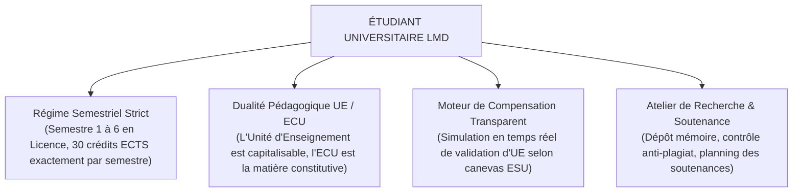
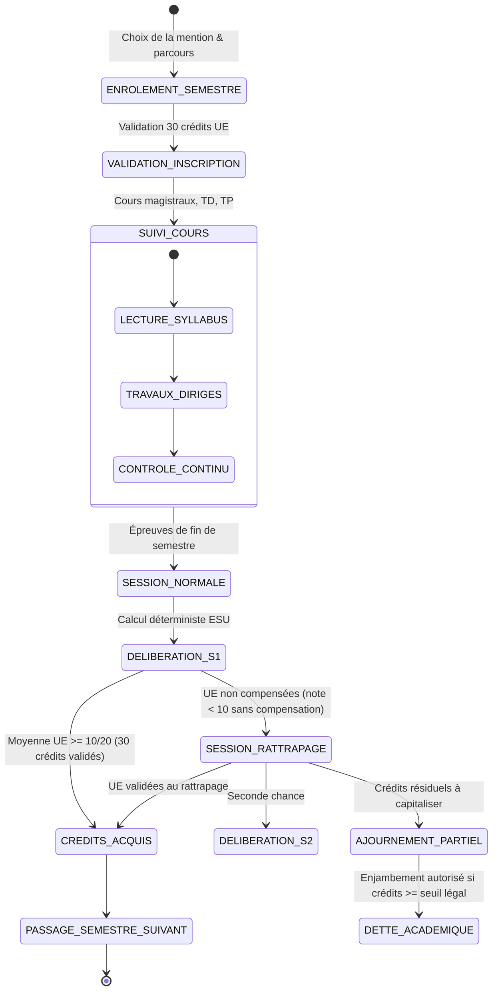
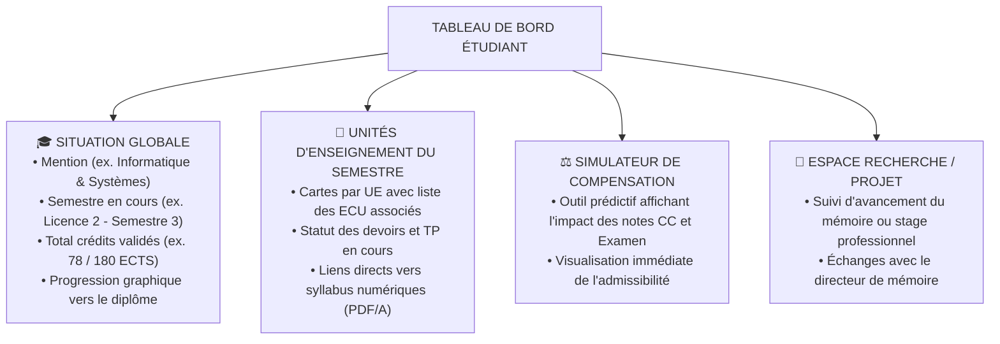
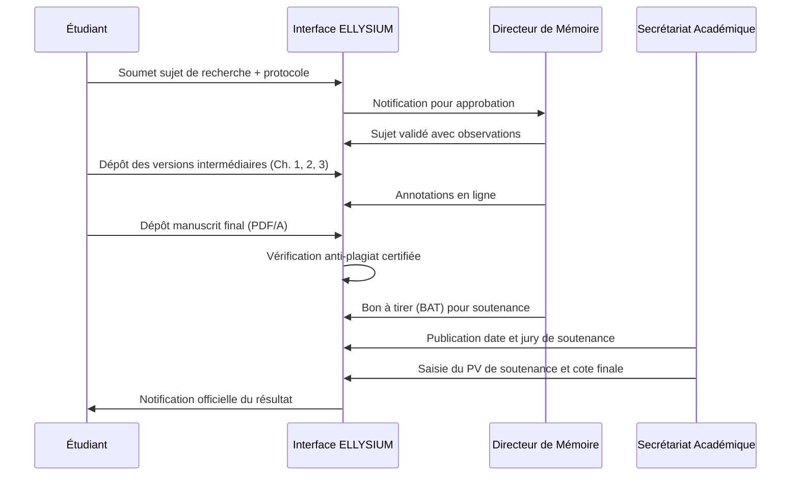
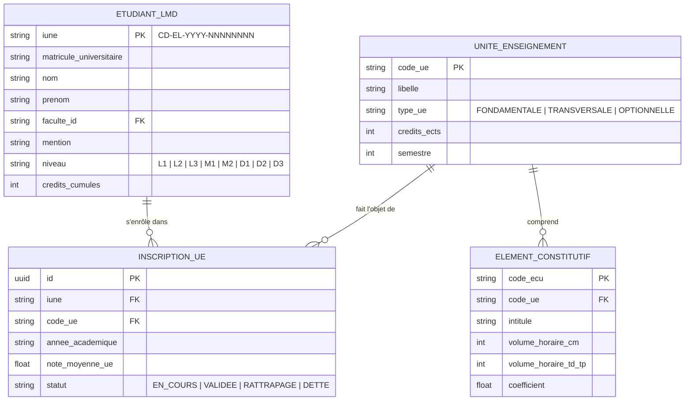

# TOME 6 — EXPÉRIENCE UTILISATEUR ET DESIGN SYSTEM
## 89. Parcours Utilisateur — Étudiant Universitaire (Cursus LMD)

---

> **Positionnement :** Expérience utilisateur intégrale des étudiants inscrits en Licence, Master ou Doctorat (LMD)  
> **Autorité :** Conforme aux Directives Cadres du Ministère de l'ESU (RDC) sur le système LMD et au Tome 4 (Modules 4.24 à 4.54)  
> **Liaison amont :** Modules 57, 58, 60, 63 (Paramétrage LMD), 67 (Moteur déterministe LMD), 75 (Examens), 76 (Diplômes)  
> **Liaison aval :** Module 96 (Navigation), Module 102 (Responsive), Module 106 (Matrice de dépendances)

---

## 1. Objet et Portée du Sous-Tome

Le présent sous-tome détaille l'ergonomie, les fonctionnalités et les écrans dédiés à l'étudiant universitaire évoluant dans le cadre strict de la réforme LMD (Licence en 3 ans / 180 crédits, Master en 2 ans / 120 crédits, Doctorat en 3 ans / 180 crédits). L'interface doit rendre intelligibles des règles académiques complexes : validation d'Unités d'Enseignement (UE), capitalisation de crédits ECTS, règles de compensation, sessions de rattrapage et soumission de travaux de recherche (TFE / Mémoires).

---

## 2. Piliers Ergonomiques du Parcours Universitaire



---

## 3. Cartographie du Cycle de Vie Annuel de l'Étudiant



---

## 4. Phase 1 — Enrôlement Semestriel et Choix des UE

### 4.1 Sélection et validation des 30 crédits obligatoires

**Règle UX-89-01** : L'écran d'enrôlement semestriel présente un panier académique strict. L'étudiant sélectionne les UE obligatoires (UEF), transversales (UET) et optionnelles (UEO). Le système bloque toute validation tant que la somme exacte des crédits ne totalise pas **30 crédits ECTS**.

```
Compteur dynamique à l'écran :
[ Crédits sélectionnés : 24 / 30 ]  --> Bouton « Confirmer l'inscription » GRISÉ
[ Crédits sélectionnés : 30 / 30 ]  --> Bouton « Confirmer l'inscription » VERT ACTIF
[ Crédits sélectionnés : 34 / 30 ]  --> Alerte rouge « Dépassement : 30 crédits max »
```

---

## 5. Phase 2 — Tableau de Bord Académique LMD

### 5.1 Architecture de l'écran principal



---

## 6. Phase 3 — Suivi Pédagogique et Syllabus Numériques

### 6.1 Lecture et téléchargement des Syllabus

Les cours universitaires comportent des volumes documentaires denses (100 à 300 pages par ECU).

**Règle UX-89-02** : Chaque syllabus universitaire est disponible en trois formats :
1. **Module Web interactif (Micro-learning)** : découpé en chapitres progressifs, quiz d'auto-évaluation en fin de module.
2. **Document PDF/A compacté** : format universitaire standardisé, table des matières interactive, compression vectorielle (< 3 Mo par syllabus complet).
3. **Paquet hors-ligne compressé (ZIP/SQLite)** : contient les textes, énoncés de TD, et codes sources d'exemples téléchargeables en un clic pour travail sans connexion.

---

## 7. Phase 4 — Contrôle Continu et Examens LMD

### 7.1 Répartition des poids de notation

Conformément aux normes LMD en vigueur en RDC :
$$\text{Note Finale ECU} = (\text{Contrôle Continu} \times 0.40) + (\text{Examen Semestriel} \times 0.60)$$

**Règle UX-89-03** : L'interface de consultation des notes détaille pour chaque ECU :
- Note CC (interrogations, TP de laboratoire, exposés) sur 20.
- Note d'Examen sur 20.
- Note pondérée finale sur 20.
- Moyenne arithmétique pondérée de l'Unité d'Enseignement globale avec mention : *VALIDÉE (Capitalisée)* ou *AJOURNÉE*.

---

## 8. Phase 5 — Dépôt de Mémoire, TFE et Soutenance

### 8.1 Espace Mémoire de Fin d'Études (L3 et M2)



---

## 9. Verrous Fonctionnels et Règles Métier

| Réf. | Intitulé | Conséquence en cas de transgression |
|---|---|---|
| **VF-89-01** | Règle des 30 crédits stricts | Aucun semestre ne peut être validé s'il ne totalise pas exactement 30 crédits ECTS au plan d'études. |
| **VF-89-02** | Capitalisation définitive des UE acquises | Toute UE validée avec une moyenne $\ge 10/20$ est définitivement acquise à vie (Tome 2, Art. 12). Elle ne peut jamais faire l'objet d'une réinscription ou réévaluation. |
| **VF-89-03** | Note éliminatoire plancher | Une note strictement inférieure à 07/20 à un ECU empêche la compensation automatique au sein de l'UE, imposant le rattrapage sur cet ECU spécifique. |
| **VF-89-04** | Intégrité du mémoire final | Le fichier final du TFE déposé est scellé par empreinte SHA-256 à la clôture de la soutenance et archivé au dépôt national institutionnel. |

---

## 10. Modèle Conceptuel de Données (MCD) — Cursus LMD



---

*Sous-tome rédigé conformément aux Normes documentaires ELLYSIUM — Fondations 04.*  
*Version 1.0 — Référence : ELLYSIUM/T6/89/v1.0*

---

## 7. Verrous Fonctionnels Critiques

| Réf. Verrou | Description Fonctionnelle et Technique | Conséquence en Cas de Violation |
| :--- | :--- | :--- |
| **`VF-089-01`** | **Affichage standardisé LMD (Semestres & Crédits)** | Présentation des résultats académiques en crédits ECTS acquis, compensés et validés. |
| **`VF-089-02`** | **Gestion des unités capitalisables** | L'étudiant conserve la vue permanente sur les UE définitivement acquises. |
| **`VF-089-03`** | **Dépôt des mémoires et TFE avec contrôle anti-plagiat** | Interface de soumission de travaux de fin d'études avec reçu certifié. |
| **`VF-089-04`** | **Inscription aux sessions de rattrapage en ligne** | Formulaire simplifié d'inscription aux épreuves de seconde session. |
| **`VF-089-05`** | **Espace d'échange avec le directeur de mémoire** | Fil de discussion asynchrone avec partage de versions de manuscrits annotés. |

---

*Sous-tome rédigé conformément aux Normes documentaires ELLYSIUM — Fondations 04.*
