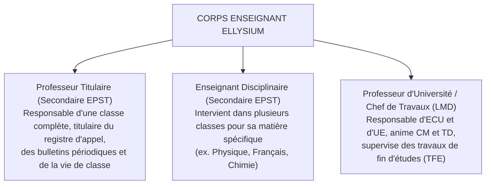
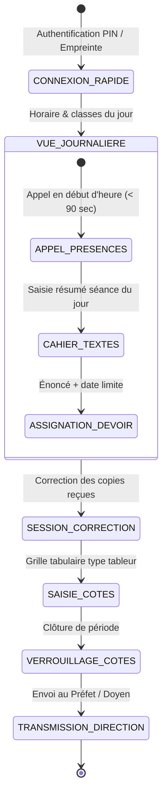
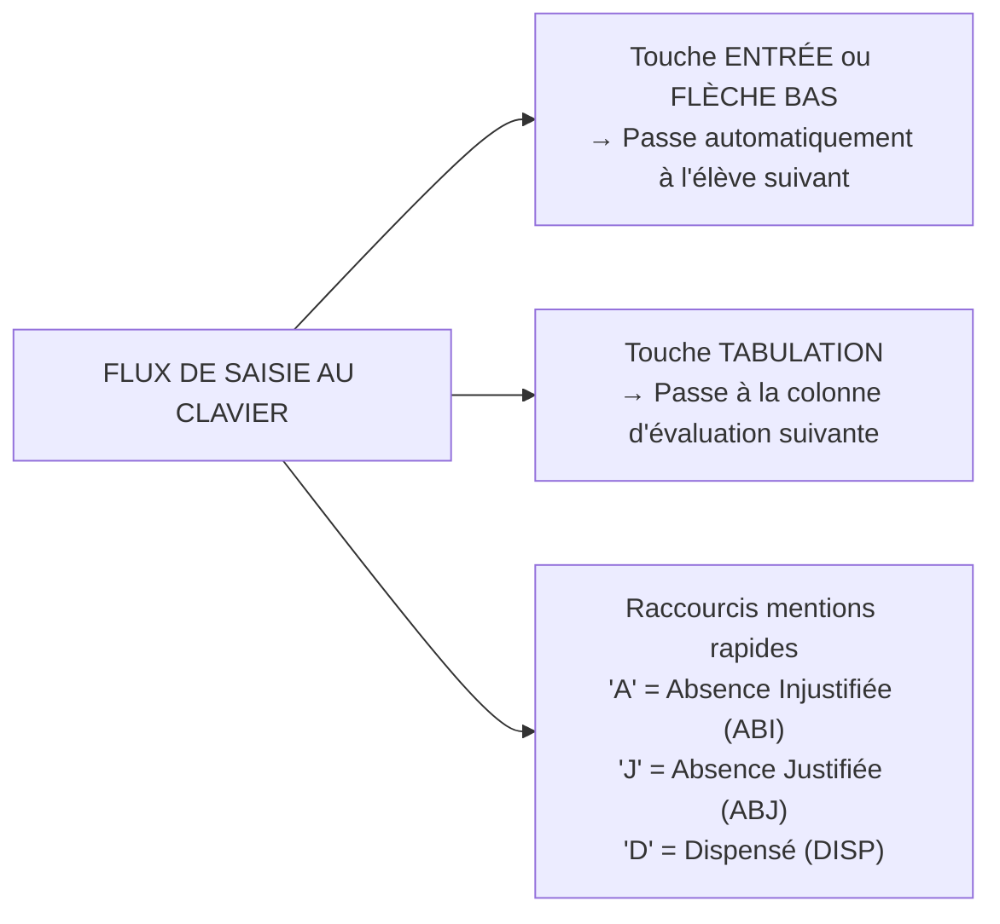
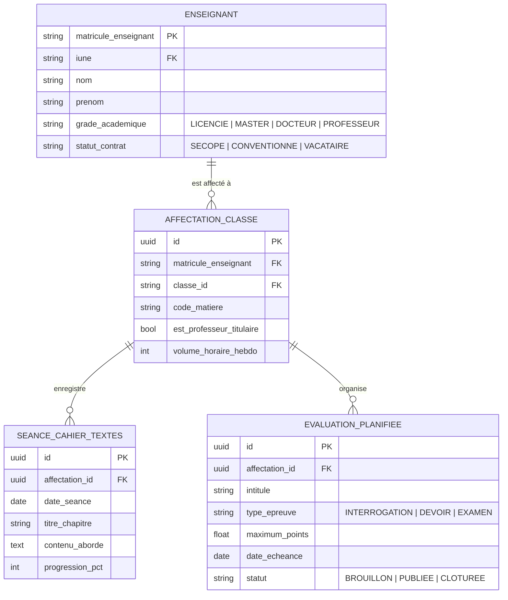

# TOME 6 — EXPÉRIENCE UTILISATEUR ET DESIGN SYSTEM
## 90. Parcours Utilisateur — Enseignant (Professeur Titulaire & Chargé de Cours)

---

> **Positionnement :** Expérience utilisateur professionnelle pour le corps professoral du secondaire et de l'enseignement supérieur  
> **Autorité :** Conforme au Statut du personnel enseignant de l'EPST/ESU et au Tome 5, Modules 62, 64, 65, 66, 69, 72  
> **Liaison amont :** Modules 57, 62, 65 (Présences), 66 (Cotes), 69 (Devoirs) | **Liaison aval :** Module 92 (Préfet), Module 98 (Composants UI)

---

## 1. Objet et Portée du Sous-Tome

L'enseignant est l'acteur pivot de la transmission pédagogique et de la métrologie des apprentissages. Qu'il soit Professeur Titulaire en humanités secondaires ou Professeur d'Université / Chef de Travaux dans l'enseignement supérieur LMD, son interface de travail doit privilégier la rapidité opératoire, l'ergonomie tabulaire (mode "cahier de cotes"), la résilience en mode hors-ligne et l'assistance à la correction sans jamais substituer l'IA à son jugement souverain (Tome 2, Art. 6).

---

## 2. Typologie des Profils Enseignants



---

## 3. Cartographie du Parcours Quotidien de l'Enseignant



---

## 4. Phase 1 — Appel et Cahier de Présence Numérique

### 4.1 Appel en classe ultra-rapide (< 90 secondes pour 45 élèves)

**Règle UX-90-01** : L'écran d'appel affiche la liste des élèves ordonnée par ordre alphabétique ou par plan de classe visuel. Par défaut, **tous les élèves sont présélectionnés « Présents »**. L'enseignant n'a qu'à cliquer sur les absents ou retardataires.

```
Interface d'appel :
[✓ Tout le monde est présent]  --> 1 tapotement valide l'ensemble
Sinon, tapoter sur le nom :
[ Vert = Présent ]  --> 1 tap : [ Rouge = Absent ]  --> 2e tap : [ Jaune = Retard ]
```

**Règle UX-90-02** : L'appel fonctionne à 100 % hors-ligne. Les données d'absence sont horodatées localement et synchronisées dès qu'un réseau (cellulaire ou Wi-Fi d'école) est détecté, déclenchant les alertes SMS aux parents (Tome 5, Module 70).

---

## 5. Phase 2 — Cahier de Textes et Avancement du Programme

### 5.1 Enregistrement de la séance de cours

L'enseignant consigne en fin de séance :
1. Intitulé du chapitre et objectif pédagogique du jour (sélection dans la nomenclature officielle DIPROMAT/LMD préchargée).
2. Résumé succinct des notions abordées (texte ou dictée vocale).
3. Devoir ou exercice à faire pour la prochaine séance.

**Règle UX-90-03** : Le cahier de textes calcule automatiquement le pourcentage d'avancement du programme national par rapport au calendrier officiel et alerte l'enseignant en cas de retard sur la progression type.

---

## 6. Phase 3 — Saisie et Gestion du Cahier des Cotes

### 6.1 Interface Tabulaire Haute Vitesse ("Tableur sans latence")

L'enseignant saisit souvent plusieurs centaines de notes d'affilée. L'interface ne doit présenter aucun temps de latence entre deux saisies d'élèves.



**Règle UX-90-04** : La grille de cotes vérifie en temps réel que la note saisie ne dépasse pas le maximum configuré (ex. saisie de `12` sur un maximum de `10` → bordure rouge immédiate et blocage du passage à la ligne suivante).

---

## 7. Phase 4 — Correction des Devoirs et Évaluations

### 7.1 Atelier de correction numérique

- Visualisation de la copie manuscrite photographiée par l'élève en haute définition avec zoom fluide.
- Outils d'annotation directe sur la copie : crayon rouge, surligneur jaune, tampons d'appréciation (*« Vu »*, *« Bien développé »*, *« Calcul inexact »*).
- Grille critériée dynamique : attribution de points par critère (ex. Rigueur du raisonnement : 3/3, Clarté de la rédaction : 2/2).

**Règle UX-90-05** : Conformément à la Constitution (Tome 2, Art. 6), aucun système automatisé d'IA ne peut attribuer une note définitive à la place de l'enseignant. L'IA peut proposer une pré-analyse syntaxique ou de cohérence, mais la validation humaine et la note finale relèvent exclusivement du professeur.

---

## 8. Verrous Fonctionnels et Règles Métier

| Réf. | Intitulé | Conséquence en cas de transgression |
|---|---|---|
| **VF-90-01** | Verrouillage temporel des cotes | Dès la date limite de remise des cotes fixée par la direction, la grille passe en lecture seule. Toute modification ultérieure exige un déverrouillage formel signé par le Préfet ou le Doyen. |
| **VF-90-02** | Séparation des fonctions (SoD) | Un enseignant ne peut pas valider ou sceller les bulletins officiels d'une classe sans le visa formel du Préfet des études. |
| **VF-90-03** | Traçabilité absolue de correction | Chaque modification de note fait l'objet d'une ligne d'audit trail (valeur précédente, nouvelle valeur, motif, horodatage certifié). |

---

## 9. Modèle Conceptuel de Données (MCD) — Espace Enseignant



---

*Sous-tome rédigé conformément aux Normes documentaires ELLYSIUM — Fondations 04.*  
*Version 1.0 — Référence : ELLYSIUM/T6/90/v1.0*
