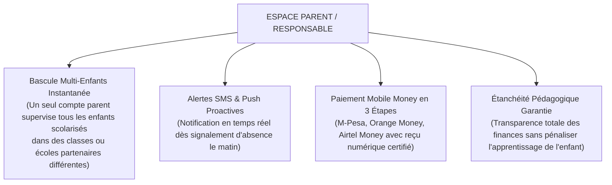
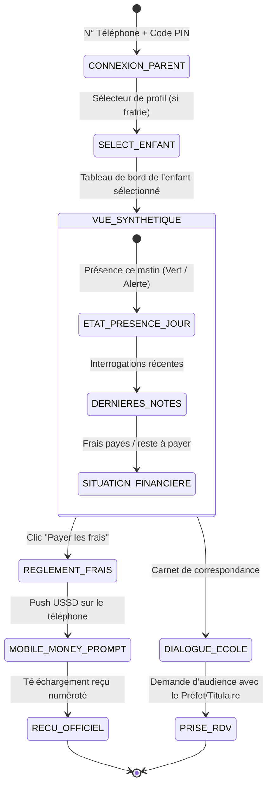
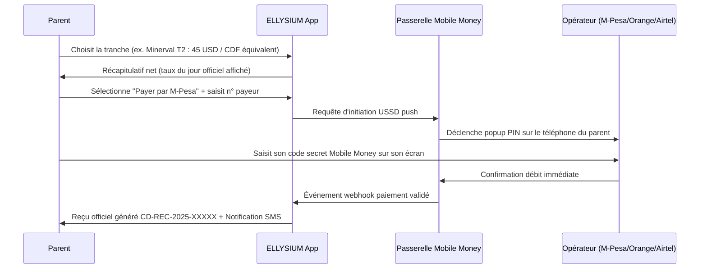
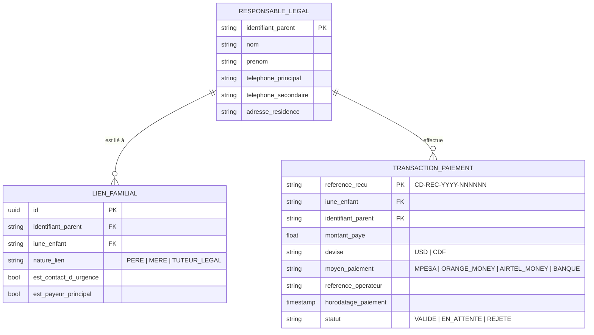

# TOME 6 — EXPÉRIENCE UTILISATEUR ET DESIGN SYSTEM
## 91. Parcours Utilisateur — Parent ou Responsable Légal

---

> **Positionnement :** Interface d'accompagnement familial, de suivi éducatif et de gestion financière des frais scolaires  
> **Autorité :** Conforme à la Constitution ELLYSIUM (Art. 3 — Protection des mineurs, Art. 5 — Étanchéité Pédagogie / Finances) et au Tome 5, Modules 70, 71  
> **Liaison amont :** Modules 57, 58, 60, 65, 68, 71 (Caisse d'établissement) | **Liaison aval :** Module 96 (Navigation), Module 98 (Composants)

---

## 1. Objet et Portée du Sous-Tome

Le parent ou tuteur légal est le garant moral et financier de la scolarité de l'enfant mineur. Souvent contraint par des journées de travail chargées et une connectivité mobile intermittente, il a besoin d'une interface épurée, sans jargon technique, lui permettant de veiller sur la régularité des présences, les résultats scolaires et d'effectuer le paiement sécurisé des frais d'études par Mobile Money sans se déplacer physiquement à l'école.

---

## 2. Spécificités Ergonomiques Fondamentales



---

## 3. Cartographie du Parcours Utilisateur Parent



---

## 4. Phase 1 — Connexion et Gestion de la Fratrie (Multi-Profil)

### 4.1 Sélecteur de Fratrie (Carousel d'enfants)

**Règle UX-91-01** : En tête de l'écran d'accueil parent, un carrousel horizontal affiche chaque enfant avec sa photo, son prénom, son école et sa classe actuelle. Un simple glissement ou tapotement permet de commuter l'intégralité du tableau de bord d'un enfant à l'autre sans rechargement de page.

```
+-------------------------------------------------------------+
| [Photo Gloire]            | [Photo Divine]                  |
| Gloire (15 ans)           | Divine (11 ans)                 |
| 3e Sc. - Institut Lumumba | 7e EB - Complexe Boboto         |
| [ ACTIF (Sélectionné) ]   | [ Tapoter pour basculer ]       |
+-------------------------------------------------------------+
```

---

## 5. Phase 2 — Suivi des Présences et Alertes Immédiates

### 5.1 Alerte Absence en Temps Réel

Dès que le professeur titulaire valide l'appel du matin avec une mention *Absent* :
1. Déclenchement d'un SMS prioritaire :  
   *« ELLYSIUM ALERTE : Gloire a été signalé absent ce matin à 07h45 à l'Institut Lumumba. Si cette absence est prévue, veuillez la justifier dans l'application. »*
2. Notification push enrichie dans l'application.

**Règle UX-91-02** : Le parent peut transmettre un justificatif d'absence en deux tapotements : choix du motif (Maladie, Deuil familial, Problème de transport) + ajout facultatif d'une photo de certificat médical.

---

## 6. Phase 3 — Consultation des Notes et Bulletins Périodiques

### 6.1 Lisibilité bienveillante des résultats

- Affichage des notes avec codes couleur rassurants (Vert $\ge 60\%$, Jaune $50-59\%$, Rouge $< 50\%$).
- Graphique d'évolution périodique de l'enfant montrant sa progression par rapport aux périodes précédentes.
- Consultation et téléchargement du bulletin officiel signé numériquement.

**Règle UX-91-03** : Le bulletin est toujours consultable et téléchargeable par le parent dès sa publication officielle par l'école, que les frais scolaires soient totalement réglés ou non.

---

## 7. Phase 4 — Caisse Scolaire et Règlement Mobile Money

### 7.1 Tunnel de paiement sécurisé en 3 clics



**Règle UX-91-04** : Le reçu de caisse émis est téléchargeable hors-ligne au format PDF/A sécurisé avec QR code vérifiable, prouvant juridiquement la libération de la dette scolaire.

---

## 8. Verrous Fonctionnels et Règles Métier

| Réf. | Intitulé | Conséquence en cas de transgression |
|---|---|---|
| **VF-91-01** | Étanchéité financière absolue | Aucun retard de paiement d'un parent ne peut entraîner l'exclusion numérique de l'enfant, la coupure des cours ou le refus d'affichage des devoirs (Constitution, Art. 5). |
| **VF-91-02** | Confidentialité stricte des fratries | Les informations d'un enfant ne sont visibles que par les personnes légalement autorisées enregistrées sur son dossier (pas de fuite inter-familles). |
| **VF-91-03** | Traçabilité légale des transactions financières | Chaque transaction Mobile Money est enregistrée avec sa référence opérateur unique, garantissant le non-répudiement comptable. |

---

## 9. Modèle Conceptuel de Données (MCD) — Espace Parent



---

*Sous-tome rédigé conformément aux Normes documentaires ELLYSIUM — Fondations 04.*  
*Version 1.0 — Référence : ELLYSIUM/T6/91/v1.0*
