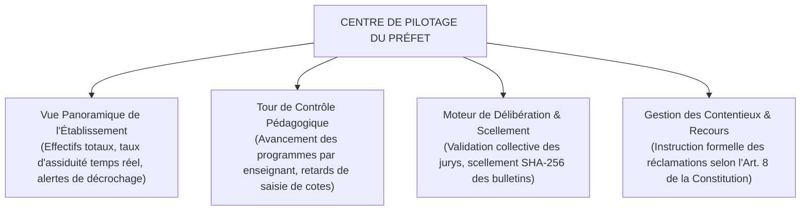
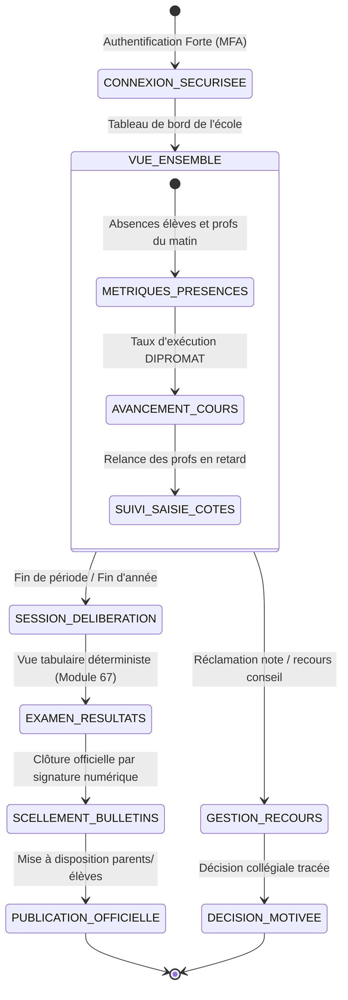
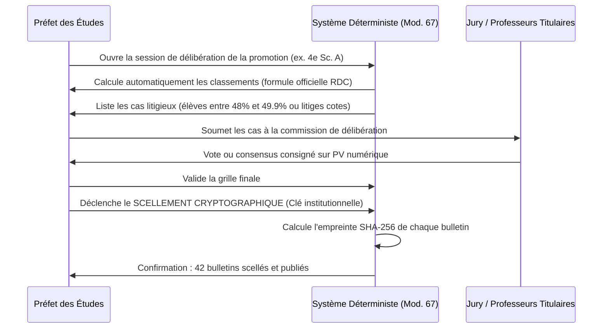
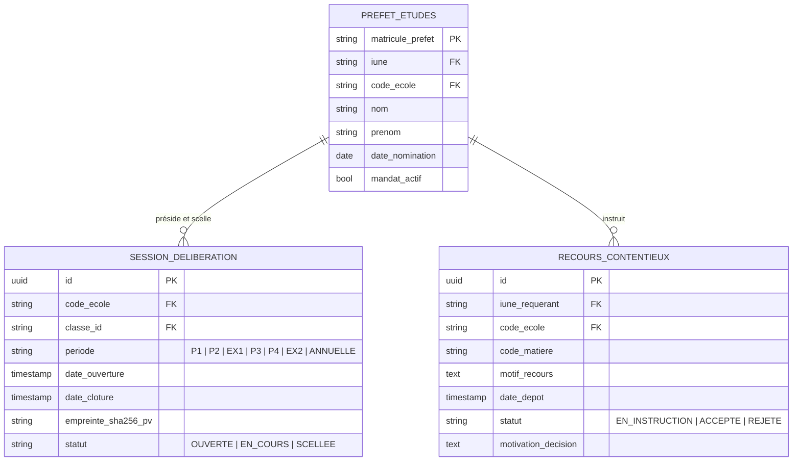

# TOME 6 — EXPÉRIENCE UTILISATEUR ET DESIGN SYSTEM
## 92. Parcours Utilisateur — Préfet des Études (Direction Pédagogique)

---

> **Positionnement :** Tableau de bord de pilotage pédagogique, gouvernance des cohortes et scellement légal des délibérations  
> **Autorité :** Conforme aux règlements de l'EPST (Loi-Cadre n° 14/004) et au Tome 5, Modules 61, 62, 67, 68, 75, 76, 80  
> **Liaison amont :** Modules 57, 61, 62, 67, 68, 75, 80 (SoD) | **Liaison aval :** Module 93 (Directeur/Promoteur), Module 96 (Navigation)

---

## 1. Objet et Portée du Sous-Tome

Le Préfet des études est l'autorité pédagogique suprême de l'établissement secondaire. Il est responsable devant l'État congolais de la conformité de l'enseignement dispensé, de la ponctualité des programmes DIPROMAT, de la régularité des évaluations et de la sincérité absolue des bulletins scolaires délivrés. Son interface utilisateur est un centre de contrôle décisionnel conçu pour superviser, valider, délibérer et sceller les actes académiques en toute sécurité.

---

## 2. Piliers Ergonomiques de l'Espace Préfet

---

## 3. Cartographie du Parcours Utilisateur Préfet

---

## 4. Phase 1 — Tableau de Bord Matinal et Indicateurs Clés

### 4.1 Vue d'ensemble opérationnelle dès 08h00

**Règle UX-92-01** : Dès l'ouverture de l'application, le Préfet visualise une synthèse immédiate en 4 cartes dynamiques :
1. **Assiduité Élèves** : Taux de présence global (ex. *94.2 %* — 612 présents sur 650).
2. **Présence Enseignants** : Professeurs ayant validé leur appel matinal vs enseignants non encore signalés en classe.
3. **Avancement Moyen du Programme** : Pourcentage moyen par rapport à la progression attendue à cette semaine de l'année scolaire.
4. **Alertes Actives** : Incidents de discipline signalés ou réclamations de parents en attente.

---

## 5. Phase 2 — Supervision Pédagogique et Suivi des Enseignants

### 5.1 Matrice de saisie des cotes par matière

Le Préfet dispose d'un écran matriciel visualisant l'état de remplissage des carnets de cotes par tous les enseignants de l'école pour chaque période (P1, P2, P3, P4) :
- Vert : Carnet 100 % saisi et transmis.
- Orange : Saisie en cours (taux affiché, ex. *65 %*).
- Rouge : Aucun point encodé alors que la date limite approche ou est dépassée.

**Règle UX-92-02** : Un bouton d'action groupée **« Relancer les enseignants en retard »** envoie un rappel SMS/push personnalisé à l'ensemble des professeurs concernés en un seul clic.

---

## 6. Phase 3 — Délibération de Période et Scellement des Bulletins

### 6.1 Session de Délibération Collégiale

**Règle UX-92-03** : Le scellement d'une promotion est une action irréversible sans procédure extraordinaire d'audit. L'écran de confirmation exige la saisie du mot de passe administrateur du Préfet et affiche un récapitulatif formel des mentions attribuées.

---

## 7. Phase 4 — Instruction des Recours et Contentieux

### 7.1 Traitement des réclamations (Tome 2, Art. 8)

Lorsqu'un parent ou un élève dépose une contestation formelle de note :
1. La réclamation apparaît dans l'onglet **« Contentieux & Recours »**.
2. Le Préfet accède en un clic à l'historique de la note : énoncé du devoir, copie manuscrite scannée, grille de correction du professeur, audit trail des modifications.
3. Le Préfet peut ordonner une double correction aveugle par un enseignant tiers.
4. La décision motivée est enregistrée et notifiée au requérant sous 72 heures ouvrées.

---

## 8. Verrous Fonctionnels et Règles Métier

| Réf. | Intitulé | Conséquence en cas de transgression |
|---|---|---|
| **VF-92-01** | Séparation stricte des fonctions (SoD) | Le compte du Préfet des études ne possède aucun droit d'encaissement financier de frais scolaires (Module 80). Les fonctions de Préfet et de Caissier sont incompatibles. |
| **VF-92-02** | Inviolabilité du moteur de calcul | Le Préfet ne peut en aucun cas forcer manuellement le calcul mathématique officiel RDC. Le système interdit toute modification des règles de calcul. |
| **VF-92-03** | Traçabilité absolue des délibérations | Tout repêchage ou ajustement de note décidé en jury doit obligatoirement être justifié par une mention écrite versée au PV numérique inaltérable. |

---

## 9. Modèle Conceptuel de Données (MCD) — Espace Préfet

---

*Sous-tome rédigé conformément aux Normes documentaires ELLYSIUM — Fondations 04.*  
*Version 1.0 — Référence : ELLYSIUM/T6/92/v1.0*

---

## 7. Verrous Fonctionnels Critiques

| Réf. Verrou | Description Fonctionnelle et Technique | Conséquence en Cas de Violation |
| :--- | :--- | :--- |
| **`VF-092-01`** | **Supervision académique en temps réel** | Tableau de bord du préfet affichant le taux de saisie des cotes par matière et classe. |
| **`VF-092-02`** | **Verrouillage d'autorité des périodes de cotes** | Bouton de clôture définitive de période interdisant toute modification ultérieure. |
| **`VF-092-03`** | **Détection des anomalies didactiques** | Signalement automatique des classes présentant des retards de programme significatifs. |
| **`VF-092-04`** | **Validation formelle des PV de délibération** | Signature électronique du préfet apposée sur les délibérations avant publication. |
| **`VF-092-05`** | **Gestion des remplacements d'urgence** | Réaffectation d'une classe à un professeur suppléant en moins de 2 minutes. |

---

*Sous-tome rédigé conformément aux Normes documentaires ELLYSIUM — Fondations 04.*
