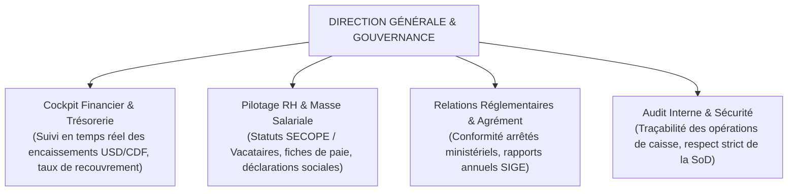
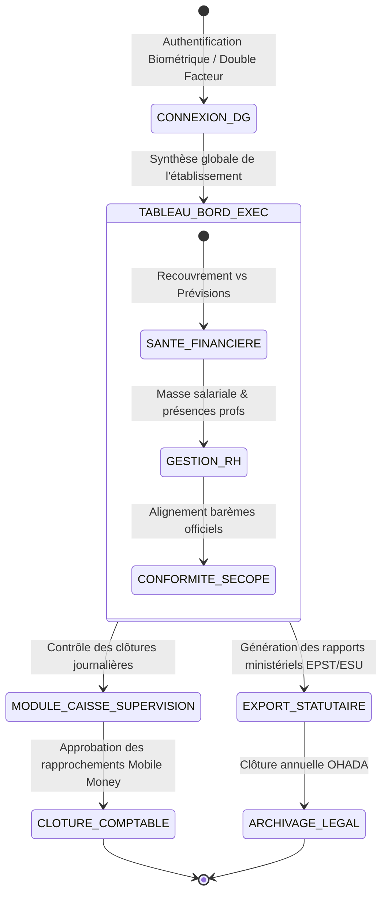
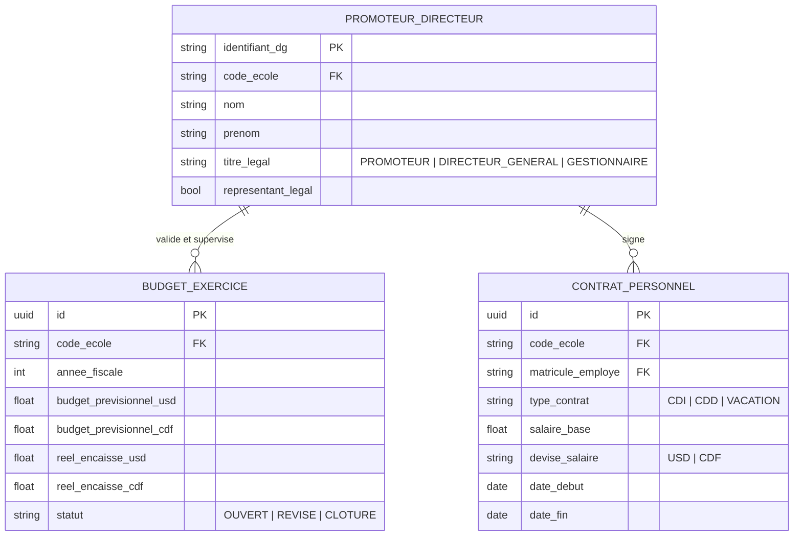

# TOME 6 — EXPÉRIENCE UTILISATEUR ET DESIGN SYSTEM
## 93. Parcours Utilisateur — Directeur / Promoteur d'Établissement

---

> **Positionnement :** Direction générale, gouvernance institutionnelle, gestion administrative, financière et ressources humaines  
> **Autorité :** Conforme aux normes OHADA, aux textes de l'EPST/ESU et au Tome 5, Modules 61, 71, 72, 77  
> **Liaison amont :** Modules 57, 61, 71 (Caisse), 72 (RH), 77 (BI) | **Liaison aval :** Module 94 (Partenaire institutionnel), Module 96 (Navigation)

---

## 1. Objet et Portée du Sous-Tome

Le Promoteur ou Directeur Général d'un établissement partenaire est le responsable légal, économique et moral de la structure. Qu'il s'agisse d'un établissement conventionné (catholique, protestant, kimbanguiste, islamique) ou privé agréé, il doit arbitrer les budgets, superviser la masse salariale des enseignants, s'assurer de l'équilibre de trésorerie et garantir la conformité réglementaire devant les autorités de tutelle sans interférer avec la neutralité pédagogique garantie par la Constitution ELLYSIUM.

---

## 2. Piliers Ergonomiques de l'Espace Promoteur

---

## 3. Cartographie du Parcours Utilisateur Promoteur

---

## 4. Phase 1 — Cockpit Financier et Suivi de Trésorerie

### 4.1 Vue financière bimonétaire (USD et Francs Congolais)

**Règle UX-93-01** : Le cockpit financier présente en permanence une double balance transparente :
- Solde disponible en USD et en CDF (comptes bancaires et portefeuilles marchands Mobile Money M-Pesa, Orange, Airtel).
- Taux officiel appliqué pour les conversions du jour (source Banque Centrale du Congo ou taux conventionnel fixé).
- Taux de recouvrement global de l'année scolaire en cours :
$$\text{Taux Recouvrement} = \frac{\sum \text{Frais Scolaires Réellement Encaissés}}{\sum \text{Frais Scolaires Facturés Totalité Cohorte}} \times 100$$

---

## 5. Phase 2 — Gestion des Ressources Humaines et Masse Salariale

### 5.1 Fichier du Personnel et Ventilation des Rémunérations

Le Promoteur supervise les contrats de travail de son équipe (Tome 5, Module 72) :
- Enseignants mécanisés/budgétisés SECOPE (complément local de prime de gratuité).
- Enseignants conventionnés ou sous contrat de travail privé.
- Vacataires rémunérés au volume horaire effectivement presté (calculé à partir des fiches d'appel validées).

**Règle UX-93-02** : La génération des bulletins de paie s'opère en un clic à la fin du mois, après confrontation automatique entre les heures prestées au cahier de présence et le contrat d'engagement.

---

## 6. Phase 3 — Rapports Annuels et Conformité Institutionnelle

### 6.1 Exports normalisés pour le Ministère (SIGE / DIPROMAT)

Le système compile en fin de trimestre ou d'année les états statistiques exigés par les sous-divisions provinciales de l'EPST :
- Tableau synoptique des effectifs (par sexe, option, âge).
- Taux d'abandon et taux de rétention scolaire.
- État récapitulatif des cotes pour les candidats aux examens d'État (listes EXETAT prêtes à l'export).

---

## 7. Verrous Fonctionnels et Règles Métier
| **`VF-093-01`** | **Cockpit global de l'établissement** | Indicateurs macro : effectif total, assiduité globale, taux d'encaissement minerval. |
| **`VF-093-02`** | **Respect du cloisonnement étanche de l'Art. 5** | Impossibilité pour le promoteur de croiser la liste des débiteurs avec le logiciel d'examen. |
| **`VF-093-03`** | **Clôture d'exercice comptable** | Génération des états financiers certifiés pour l'administration fiscale. |
| **`VF-093-04`** | **Gestion des accréditations du personnel** | Activation, suspension ou révocation des comptes d'enseignants et surveillants. |
| **`VF-093-05`** | **Canal de communication institutionnelle d'urgence** | Diffusion d'un message général à l'ensemble de la communauté de l'école. |

| Réf. | Intitulé | Conséquence en cas de transgression |
|---|---|---|
| **VF-93-01** | Non-ingérence dans le calcul pédagogique | Le Promoteur ne dispose d'aucun droit technique pour altérer une note, modifier un classement ou forcer l'admission d'un élève. Seule la commission académique présidée par le Préfet délibère. |
| **VF-93-02** | Rapprochement bancaire strict | Toute écriture financière validée par le Promoteur doit correspondre à une transaction tracée (ID Mobile Money ou référence bancaire certifiée). |
| **VF-93-03** | Ségrégation des pouvoirs financiers | Le Promoteur peut auditer et approuver les dépenses, mais la saisie brute des encaissements reste sous la responsabilité du Caissier titulaire (SoD). |

---

## 8. Modèle Conceptuel de Données (MCD) — Espace Promoteur

---

*Sous-tome rédigé conformément aux Normes documentaires ELLYSIUM — Fondations 04.*  
*Version 1.0 — Référence : ELLYSIUM/T6/93/v1.0*