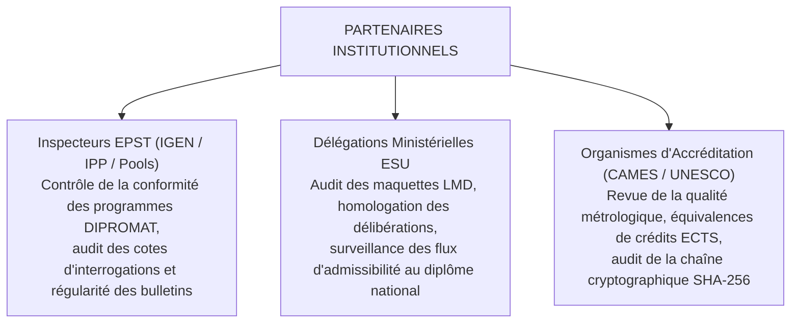
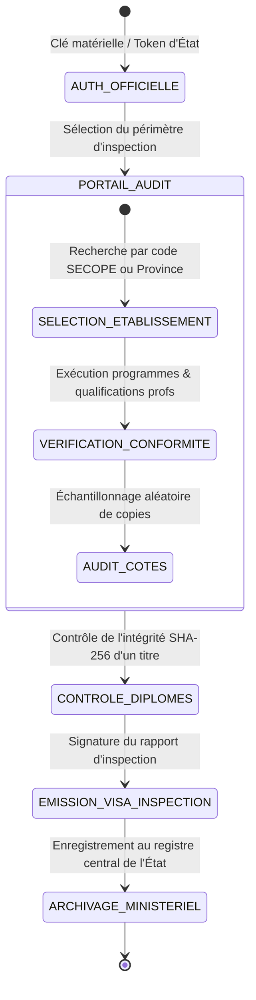
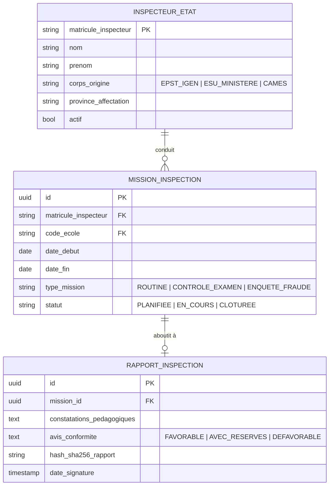

# TOME 6 — EXPÉRIENCE UTILISATEUR ET DESIGN SYSTEM
## 94. Parcours Utilisateur — Partenaire Institutionnel (Inspecteurs & Ministères)

---

> **Positionnement :** Portails d'audit, d'inspection pédagogique, d'accréditation et de contrôle de conformité républicaine  
> **Autorité :** Conforme aux prérogatives de l'Inspection Générale de l'EPST (IGEN), de l'ESU et aux normes CAMES / UNESCO  
> **Liaison amont :** Modules 57, 76 (Diplômes), 77 (BI & Statistiques), 78 (API d'interopérabilité)  
> **Liaison aval :** Module 96 (Navigation), Module 101 (Accessibilité)

---

## 1. Objet et Portée du Sous-Tome

Les partenaires institutionnels incarnent l'autorité publique de régulation et de certification. Qu'il s'agisse d'un Inspecteur Principal Provincial (IPP), d'un membre de l'Inspection Générale de l'Éducation Nationale (IGEN), d'un représentant du Ministère de l'ESU ou d'un auditeur international (CAMES, UNESCO), leur accès au système doit offrir une transparence totale en lecture certifiée, sans possibilité d'altérer unilatéralement les données souveraines d'un élève ou d'une école sans décision contradictoire tracée.

---

## 2. Typologie des Partenaires Institutionnels

---

## 3. Cartographie du Parcours Utilisateur Institutionnel

---

## 4. Phase 1 — Connexion Réglementaire et Périmètre d'Accréditation

### 4.1 Authentification souveraine

**Règle UX-94-01** : L'inspecteur ou régulateur s'authentifie via un portail d'État dédié. Son profil délimite strictement son rayon d'action géographique ou disciplinaire (ex. *Province Éducationnelle Nord-Kivu 1 — Option Scientifique*). Tout accès hors de sa juridiction est strictement bloqué et journalisé.

---

## 5. Phase 2 — Tableaux de Bord Statistiques Macro et Décisionnels

### 5.1 Indicateurs Nationaux et Provinciaux

L'inspecteur dispose d'un tableau de bord de Business Intelligence (Tome 5, Module 77) :
- Taux d'achèvement des programmes par province et par discipline.
- Disparités régionales et indice d'équité de genre (ratio filles/garçons dans les options techniques).
- Taux d'assiduité moyen des corps enseignants par réseau d'enseignement (Officiel vs Conventionné).
- Distribution gaussienne des cotes (détection des anomalies de notation ou des biais d'évaluation).

---

## 6. Phase 3 — Audit Métrologique et Vérification des Titres

### 6.1 Contrôle d'Intégrité d'un Diplôme ou Relevé de Notes

**Règle UX-94-02** : L'inspecteur peut soumettre n'importe quel document PDF/A officiel ou scanner son QR code. Le système vérifie instantanément :
1. La validité de l'IUNE du récipiendaire.
2. L'empreinte cryptographique SHA-256 enregistrée lors de la délibération.
3. Le statut légal actuel du titre (*VALIDE*, *EN_ENQUÊTE*, *RÉVOQUÉ_POUR_FRAUDE*).

### 6.2 Rédaction et Scellement du Rapport d'Inspection

À l'issue de sa mission dans un établissement, l'inspecteur remplit son procès-verbal officiel numérique :
- Évaluation qualitative des infrastructures et du respect du calendrier scolaire.
- Observations pédagogiques destinées au Préfet et aux enseignants.
- Recommandations contraignantes avec échéancier de mise en conformité.
- Signature électronique de l'inspecteur scellant le rapport d'inspection.

---

## 7. Verrous Fonctionnels et Règles Métier

| Réf. | Intitulé | Conséquence en cas de transgression |
|---|---|---|
| **VF-94-01** | Principe du Read-Only institutionnel | L'accès d'un inspecteur est strictement en lecture seule sur les carnets de cotes et les bulletins. Un inspecteur ne peut jamais éditer directement une note d'élève. |
| **VF-94-02** | Anonymisation des cohortes statistiques | Les exports statistiques macroscopiques exportés par les ministères sont obligatoirement anonymisés au niveau individuel (pas de fuite de données personnelles sensibles). |
| **VF-94-03** | Journal d'audit d'inspection opposable | Toute consultation de dossier nominatif par un inspecteur est tracée avec son matricule, le motif de consultation et l'horodatage exact. |

---

## 8. Modèle Conceptuel de Données (MCD) — Espace Institutionnel

---

*Sous-tome rédigé conformément aux Normes documentaires ELLYSIUM — Fondations 04.*  
*Version 1.0 — Référence : ELLYSIUM/T6/94/v1.0*
