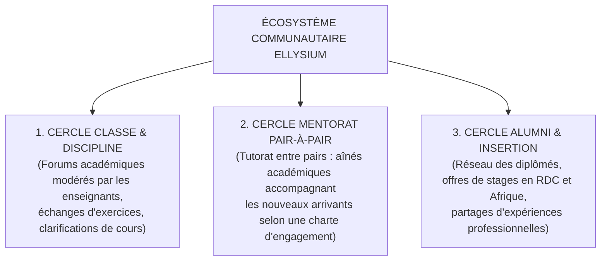
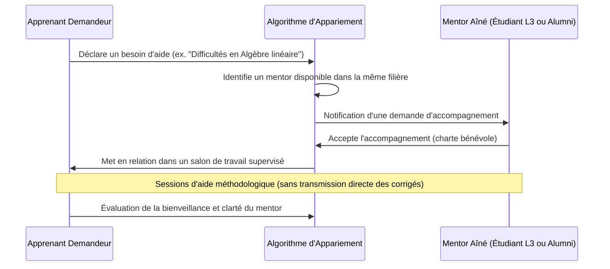
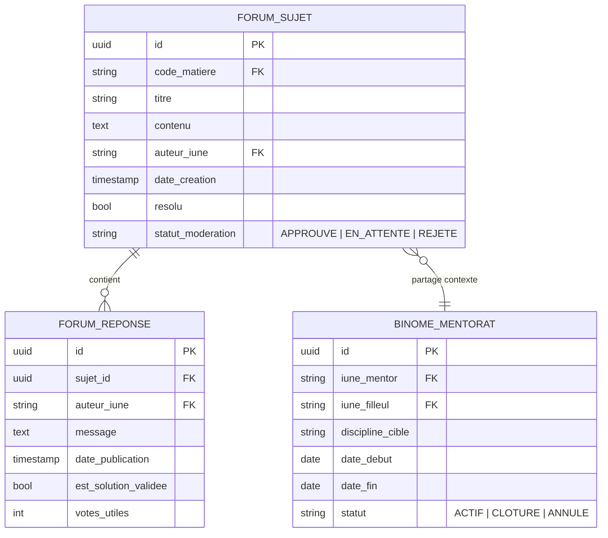

# TOME 6 — EXPÉRIENCE UTILISATEUR ET DESIGN SYSTEM
## 95. Vie Communautaire — Forums, Mentorat Pair-à-Pair et Réseau Alumni

---

> **Positionnement :** Ingénierie des interactions sociales apprenantes, entraide académique et insertion professionnelle  
> **Autorité :** Conforme au Tome 2 (Art. 3 — Protection des mineurs, Art. 19 — Fraternité éducative) et au Tome 5, Module 70  
> **Liaison amont :** Modules 57, 70 (Communications), 76 (Diplômes) | **Liaison aval :** Module 96 (Navigation), Module 104 (UX Writing)

---

## 1. Objet et Portée du Sous-Tome

L'apprentissage à distance ou hybride risque d'engendrer l'isolement de l'apprenant s'il n'est pas soutenu par une communauté d'apprentissage dynamique et solidaire. Ce sous-tome définit l'architecture sociale d'ELLYSIUM : des forums de discussion structurés par discipline, un système de mentorat pair-à-pair encadré, et un réseau des alumni tourné vers l'insertion économique, le tout sous une modération sémantique rigoureuse protégeant l'intégrité morale des mineurs.

---

## 2. Les 3 Cercles Communautaires d'ELLYSIUM

---

## 3. Architecture des Forums Pédagogiques

### 3.1 Structuration thématique stricte (Zéro dispersion)

Pour éviter l'écueil des discussions stériles ou hors-sujet :
- **Forums de Matière** : rattachés directement à un chapitre du programme (ex. *« Mathématiques 4e Sc. — Géométrie dans l'espace »*).
- **Questions Résolues** : balisage visuel clair des questions ayant reçu une réponse validée par un enseignant ou un mentor certifié.
- **Règle anti-doublon** : lors de la frappe d'un titre de question, le système suggère en temps réel les questions similaires déjà résolues.

### 3.2 Modération et Protection des Mineurs

**Règle UX-95-01** : Tout message posté par un élève mineur dans un espace public ou semi-public fait l'objet d'un filtrage sémantique automatique immédiat (détection d'insultes, harcèlement, prosélytisme religieux/politique, partage de coordonnées privées telles que numéros de téléphone ou adresses physiques).

---

## 4. Programme de Mentorat Pair-à-Pair

### 4.1 Mécanisme de Jumelage Solidaire

**Règle UX-95-02** : Le rôle de mentor est valorisé par un badge honorifique officiel et une attestation d'engagement civique délivrée par l'institution, valorisable dans le supplément au diplôme.

---

## 5. Réseau des Anciens Diplômés (Alumni)

### 5.1 Passerelle vers l'Emploi et l'Entrepreneuriat

L'espace Alumni s'active dès la délivrance du premier diplôme officiel scellé :
- Annuaire certifié des diplômés ELLYSIUM (visibilité paramétrable par l'usager).
- Bourse aux stages et aux emplois proposée par les entreprises et organisations partenaires en RDC, dans le Bassin du Congo et à l'international.
- Tables rondes virtuelles d'orientation professionnelle pour les élèves des humanités.

---

## 6. Verrous Fonctionnels et Règles Métier

| Réf. | Intitulé | Conséquence en cas de transgression |
|---|---|---|
| **VF-95-01** | Interdiction formelle de messagerie privée non supervisée pour mineurs | Les élèves de moins de 18 ans ne peuvent en aucun cas initier ou recevoir de messages privés directs en tête-à-tête avec des adultes non enseignants vérifiés. |
| **VF-95-02** | Neutralité absolue républicaine | Tout propos à caractère tribaliste, xénophobe, discriminatoire ou incitant à la haine entraîne le blocage immédiat du compte et la saisine du conseil de discipline. |
| **VF-95-03** | Interdiction de diffusion de corrigés frauduleux | Tout partage direct de corrigés d'examens ou de copies d'évaluation en cours de session est détecté et sanctionné pour tentative de fraude académique. |

---

## 7. Modèle Conceptuel de Données (MCD) — Vie Communautaire

---

*Sous-tome rédigé conformément aux Normes documentaires ELLYSIUM — Fondations 04.*  
*Version 1.0 — Référence : ELLYSIUM/T6/95/v1.0*

---

## 7. Verrous Fonctionnels Critiques

| Réf. Verrou | Description Fonctionnelle et Technique | Conséquence en Cas de Violation |
| :--- | :--- | :--- |
| **`VF-095-01`** | **Modération préventive par IA et superviseurs humains** | Filtrage automatique des propos haineux, diffamatoires ou non académiques sur les forums. |
| **`VF-095-02`** | **Interdiction d'échanges privés d'argent entre usagers** | Rejet et bannissement de toute annonce ou sollicitation financière non institutionnelle. |
| **`VF-095-03`** | **Encadrement du mentorat pair-à-pair** | Les mentors étudiants sont certifiés et soumis à une charte de déontologie. |
| **`VF-095-04`** | **Sanctuarisation de l'espace alumni** | Réseau d'anciens diplômés dédié à l'insertion professionnelle et au partage d'offres de stages. |
| **`VF-095-05`** | **Signalement à un clic de tout contenu abusif** | Bouton d'alerte directe transmettant le message suspect à l'équipe juridique ELLYSIUM. |

---

*Sous-tome rédigé conformément aux Normes documentaires ELLYSIUM — Fondations 04.*
