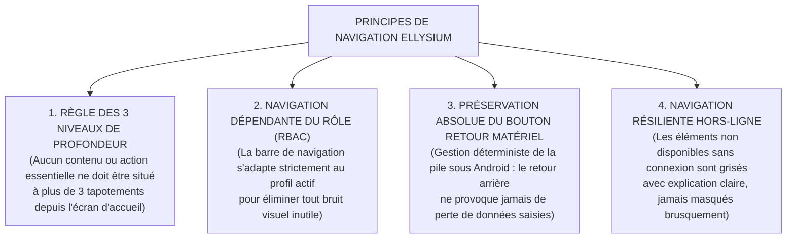
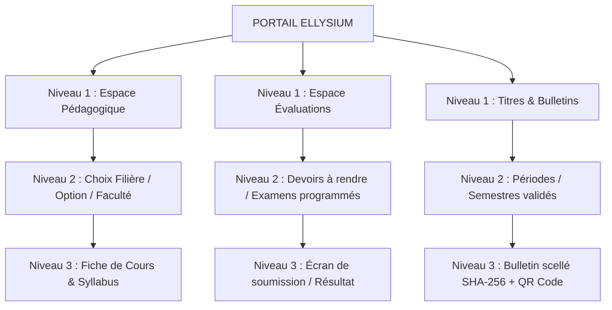

# TOME 6 — EXPÉRIENCE UTILISATEUR ET DESIGN SYSTEM
## 96. Architecture de Navigation, Arborescence et Cartographie d'Écran

---

> **Positionnement :** Structuration de l'information, principes de guidage spatial et patrons de navigation  
> **Autorité :** Conforme aux principes de sobriété cognitive et aux règles d'accessibilité numérique ELLYSIUM  
> **Liaison amont :** Modules 84, 87 à 94 (Tous les parcours utilisateurs) | **Liaison aval :** Modules 97 (Charte), 98 (Composants), 102 (Responsive)

---

## 1. Objet et Portée du Sous-Tome

L'architecture de navigation est le squelette invisible de l'expérience utilisateur. Dans un système éducatif couvrant du secondaire à l'université avec des profils très diversifiés (élèves, paysans, universitaires, directeurs), une navigation mal conçue égare l'usager et augmente la charge cognitive. Ce sous-tome formalise l'arborescence complète, fixe la règle impérative des **3 clics maximum**, et définit les patrons de navigation mobile et grand écran.

---

## 2. Principes Directeurs de Navigation

---

## 3. Barre de Navigation Inférieure Mobile (Bottom Navigation Bar)

Sur smartphone (terminal de 85 % des usagers), la navigation repose sur une barre inférieure fixe à 4 ou 5 onglets prioritaires selon le rôle :

### 3.1 Découpage par Profil Utilisateur

| Profil | Onglet 1 | Onglet 2 | Onglet 3 | Onglet 4 | Onglet 5 |
|---|---|---|---|---|---|
| **Apprenant Indépendant** | Accueil | Mes Cours | Devoirs & Examens | Tuteur IA | Mon Profil / Diplômes |
| **Élève Affilié** | Accueil | Horaire & Cours | Devoirs & Cotes | Communauté | Mon École |
| **Étudiant LMD** | Tableau de Bord | Unités (UE) | Examens / Notes | Recherche / TFE | Profil & Crédits |
| **Enseignant** | Planning | Mes Classes | Cahier de Cotes | Cahier de Textes | Profil |
| **Parent** | Mes Enfants | Présences & Alertes | Bulletins | Frais Scolaires | Messagerie École |
| **Préfet des Études** | Synthèse | Cohortes / Classes | Cotes & Délibérations | Corps Enseignant | Paramètres École |

**Règle UX-96-01** : Chaque onglet de la barre inférieure conserve son état de défilement interne lorsqu'on bascule d'un onglet à un autre, évitant de faire perdre à l'utilisateur sa position de lecture.

---

## 4. Arborescence Système Complète (Hiérarchie à 3 Niveaux)

---

## 5. Patrons de Navigation Grand Écran (Desktop et Tablette)

Pour les postes administratifs d'école (Préfet, Direction, Secrétariat, Enseignants sur PC) :
- **Barre latérale rétractable (Sidebar)** : regroupe l'ensemble des modules opérationnels avec icônes et libellés clairs.
- **Fil d'Ariane dynamique (Breadcrumbs)** : toujours présent sous l'en-tête (ex. *Accueil > 3e Humanités Scientifique A > Mathématiques > Cahier des cotes*).
- **Zone de travail centrale élargie** : optimisée pour l'affichage de tableaux denses à 15 colonnes sans défilement horizontal excessif.

---

## 6. Recherche Universelle Instantanée (Omnibox Locale)

**Règle UX-96-02** : Une barre de recherche rapide (raccourci `Ctrl + K` ou icône loupe) permet d'accéder instantanément à n'importe quel cours, devoir, élève ou document en moins de 3 frappes de touches, y compris en mode déconnecté grâce à un index SQLite local.

---

## 7. Verrous Fonctionnels de Navigation
| **`VF-096-01`** | **Menu de navigation constant et persistant** | Barre de navigation prévisible sur toutes les vues de l'application. |
| **`VF-096-02`** | **Fil d'Ariane (Breadcrumbs) systématique** | Localisation exacte de l'usager dans l'arborescence pédagogique à tout moment. |
| **`VF-096-03`** | **Barre de recherche universelle avec autocomplétion** | Recherche instantanée de cours, professeurs, devoirs et ressources. |
| **`VF-096-04`** | **Bouton de retour d'urgence à la page d'accueil** | Accès direct au cockpit principal en une seule interaction. |
| **`VF-096-05`** | **Persistance de la position de lecture dans les cours** | Reprise automatique à la dernière phrase lue après fermeture de l'application. |

| Réf. | Intitulé | Conséquence en cas de transgression |
|---|---|---|
| **VF-96-01** | Détection de sortie de formulaire non sauvé | Si un utilisateur tente de quitter un écran contenant des données saisies non enregistrées, une modale d'interruption bloque la navigation (*« Vos modifications n'ont pas été enregistrées. Quitter quand même ? »*). |
| **VF-96-02** | Cloisonnement des périmètres de rôles | Aucune URL ou raccourci de navigation ne permet d'accéder à un écran non autorisé par la matrice RBAC (Module 57). Tentative = redirection immédiate vers l'accueil. |

---

*Sous-tome rédigé conformément aux Normes documentaires ELLYSIUM — Fondations 04.*  
*Version 1.0 — Référence : ELLYSIUM/T6/96/v1.0*