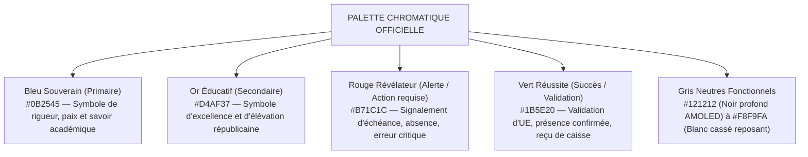

# TOME 6 — EXPÉRIENCE UTILISATEUR ET DESIGN SYSTEM
## 97. Charte Graphique, Identité Visuelle et Tokens de Design

---

> **Positionnement :** Grammaire visuelle souveraine, palette chromatique républicaine et variables fondamentales (Tokens)  
> **Autorité :** Conforme aux symboles républicains (Tome 2, Art. 1 — Souveraineté) et au principe de sobriété technologique  
> **Liaison amont :** Module 85 (Sobriété & Éco-énergie) | **Liaison aval :** Modules 98 (Composants), 99 (Iconographie), 100 (Typographie)

---

## 1. Objet et Portée du Sous-Tome

L'identité visuelle d'ELLYSIUM doit inspirer la dignité académique, la rigueur de l'État et la confiance des familles et étudiants. Dans un environnement technique exigeant (forte luminosité solaire en Afrique centrale, téléphones à écrans économiques, batterie limitée), la charte graphique rejette tout artifice tape-à-l'œil au profit d'un design rigoureux, d'un contraste élevé et d'une efficience énergétique maximale.

---

## 2. Palette Chromatique Institutionnelle

La palette repose sur les couleurs républicaines de la RDC, harmonisées pour les standards d'accessibilité numérique WCAG AAA :



---

## 3. Tokens de Design Standardisés (Variables CSS / JSON)

Tous les composants de la plateforme consomment strictement ces jetons de design pour garantir une cohérence visuelle parfaite :

### 3.1 Jetons de Couleur (Tokens Color)

```json
{
  "color": {
    "brand": {
      "primary": "#0B2545",
      "primary-light": "#134074",
      "secondary": "#D4AF37",
      "secondary-light": "#EECA65"
    },
    "feedback": {
      "success": "#1B5E20",
      "warning": "#E65100",
      "danger": "#B71C1C",
      "info": "#0277BD"
    },
    "neutral": {
      "surface-light": "#FFFFFF",
      "background-light": "#F8F9FA",
      "text-primary-light": "#1A1A1A",
      "surface-dark": "#1E1E1E",
      "background-dark": "#121212",
      "text-primary-dark": "#F0F0F0"
    }
  }
}
```

### 3.2 Grille d'Espacements (Échelle modulaire basée sur 4px / 8px)

```
spacing-xs  : 4px   (Séparation fine d'icônes ou micro-badges)
spacing-sm  : 8px   (Marges internes des champs et boutons compacts)
spacing-md  : 16px  (Marge standard des cartes et conteneurs mobiles)
spacing-lg  : 24px  (Séparation entre blocs majeurs d'écran)
spacing-xl  : 32px  (Marges extérieures des pages grand écran)
spacing-2xl : 48px  (Espacements institutionnels des en-têtes)
```

---

## 4. Dualité Mode Clair / Mode Sombre (Dark Mode Éco-Énergie)

**Règle UX-97-01** : Le Mode Sombre utilise un fond noir pur `#121212` (et `#000000` sur écrans AMOLED). Sur les smartphones d'entrée de gamme largement répandus en RDC, ce choix technique réduit la consommation électrique de l'écran jusqu'à 42 %, prolongeant l'autonomie lors des délestages de courant.

**Règle UX-97-02** : Le ratio de contraste texte/fond doit toujours être supérieur à **7:1** (norme WCAG AAA) en mode clair comme en mode sombre, garantissant une lisibilité parfaite en plein soleil à l'extérieur.

---

## 5. Règles de Rayons de Courbure et Élévations

- **Arrondis (Border Radius)** :
  - Boutons et champs de saisie : `rounded-md` (6px) — sobre et moderne.
  - Cartes et conteneurs : `rounded-lg` (8px).
  - Éléments circulaires : badges de notification, pastilles d'avatar.
- **Élévations (Ombres portées)** :
  - Interdiction des ombres complexes à flou étendu (gourmandes en GPU sur processeurs modestes).
  - Utilisation de bordures nettes de 1px (`#E0E0E0` en clair, `#2C2C2C` en sombre) avec une ombre subtile de 2px au maximum.

---

## 6. Verrous Fonctionnels de Charte Graphique

| Réf. | Intitulé | Conséquence en cas de transgression |
|---|---|---|
| **VF-97-01** | Interdiction des couleurs non tokenisées | Aucun développeur ne peut injecter une couleur arbitraire hors palette officielle. Tout composant doit hériter des variables du Design System. |
| **VF-97-02** | Sobriété visuelle absolue | Les animations décoratives non informatives (effets de parallaxe, particules, rebonds superflus) sont strictement proscrites du code de production. |

---

*Sous-tome rédigé conformément aux Normes documentaires ELLYSIUM — Fondations 04.*  
*Version 1.0 — Référence : ELLYSIUM/T6/97/v1.0*
