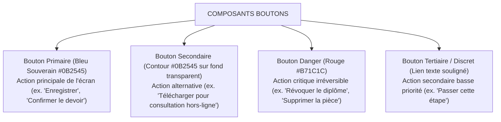
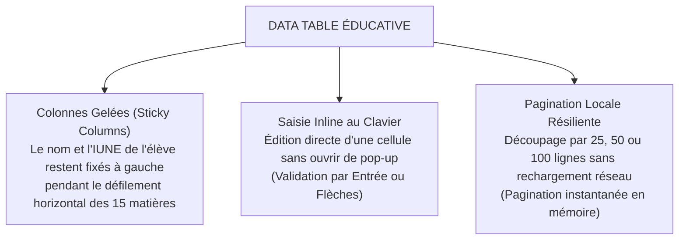

# TOME 6 — EXPÉRIENCE UTILISATEUR ET DESIGN SYSTEM
## 98. Système de Composants Réutilisables UI

---

> **Positionnement :** Bibliothèque de briques élémentaires et moléculaires de l'interface (Boutons, Formulaires, Tableaux, Cartes)  
> **Autorité :** Conforme aux normes d'accessibilité WAI-ARIA et aux tokens du Design System (Module 97)  
> **Liaison amont :** Module 97 (Tokens) | **Liaison aval :** Modules 99 (Iconographie), 101 (Accessibilité), 103 (Gestion des états)

---

## 1. Objet et Portée du Sous-Tome

Un système d'information de grande envergure requiert une bibliothèque de composants standardisée. La réutilisation systématique garantit : (a) une cohérence cognitive immédiate pour l'apprenant, (b) un poids de bundle JavaScript minimal, et (c) une maintenance centralisée des règles d'accessibilité. Ce sous-tome spécifie l'anatomie, les états et les comportements des composants majeurs de la plateforme.

---

## 2. Anatomie et Variantes des Boutons (Buttons)

Les boutons constituent le point d'action principal de l'utilisateur.



### 2.1 États d'un Bouton

Chaque bouton implémente obligatoirement les 6 états interactifs suivants :
1. **Défaut (Default)** : surface pleine ou contour net, texte lisible.
2. **Survol (Hover)** : assombrissement de 10 % de la teinte de fond.
3. **Focus (Clavier / Accessibilité)** : anneau extérieur double de 2px (`outline-offset: 2px`).
4. **Actif / Pressé (Active)** : léger enfoncement visuel (mise à l'échelle 0.98).
5. **Désactivé (Disabled)** : opacité à 40 %, curseur `not-allowed`, non focusable.
6. **Chargement (Loading)** : libellé masqué et remplacé par un spinner SVG léger (< 1 Ko) avec attribut `aria-busy="true"`.

---

## 3. Champs de Formulaires et Contrôles de Saisie

### 3.1 Anatomie d'un Champ de Saisie (Input Field)

```
[ Libellé du champ * (Obligatoire) ]
+-------------------------------------------------------------+
| [Icône préfixe] | Valeur saisie...         | [Icône statut] |
+-------------------------------------------------------------+
[ Message d'aide ou libellé d'erreur explicite en rouge ]
```

**Règle UX-98-01** : Tout champ invalide affiche une explication claire sous le champ dès la perte de focus (*onBlur*), sans attendre la soumission finale du formulaire. Exemple : *« Le numéro de téléphone doit comporter 10 chiffres (ex. 0812345678) »*.

### 3.2 Contrôles Spécifiques

- **Sélecteur de date (Date Picker)** : adapté aux naissances anciennes et aux calendriers scolaires (saisie directe au clavier numérique possible sans forcer l'usage du calendrier déroulant).
- **Zone de dépôt de fichier (File Uploader)** : optimisée pour la prise de photo directe sur mobile avec indicateur de poids instantané en kilo-octets.

---

## 4. Tableaux de Données Haute Densité (Data Tables)

Les tableaux d'ELLYSIUM (cahier de cotes, liste de présence, délibérations) affichent des volumes denses de données administratives.



---

## 5. Cartes Pédagogiques (Cards)

Les cartes structurent les tableaux de bord des élèves et étudiants :
- **Carte Cours** : image de couverture optionnelle (remplacée par un motif vectoriel léger de 2 Ko si connexion faible), titre du cours, barre de progression en pourcentage, bouton direct *« Continuer »*.
- **Carte Devoir** : badge d'urgence (Jours restants), coefficient, matière, statut (*Non rendu*, *En attente de correction*, *Noté*).

---

## 6. Tiroirs Mobiles Inférieurs (Bottom Sheets)

**Règle UX-98-02** : Sur mobile, toute action contextuelle secondaire (menu d'options d'une note, détails d'un cours, sélecteur de matière) s'ouvre sous forme de panneau inférieur rétractable (Bottom Sheet), manipulable facilement d'une seule main dans la zone d'atteinte naturelle du pouce.

---

## 7. Verrous Fonctionnels des Composants UI

| Réf. | Intitulé | Conséquence en cas de transgression |
|---|---|---|
| **VF-98-01** | Standard tactile minimal | Tout élément interactif (bouton, lien, case à cocher) possède une zone de frappe tactile minimale de **48 × 48 px** pour éviter les erreurs de frappe sur petits écrans. |
| **VF-98-02** | Rétroaction immédiate | Tout clic sur une action de soumission déclenche un état visuel immédiat en moins de 100 ms (spinner ou désactivation) pour interdire les doubles soumissions accidentelles. |

---

*Sous-tome rédigé conformément aux Normes documentaires ELLYSIUM — Fondations 04.*  
*Version 1.0 — Référence : ELLYSIUM/T6/98/v1.0*
