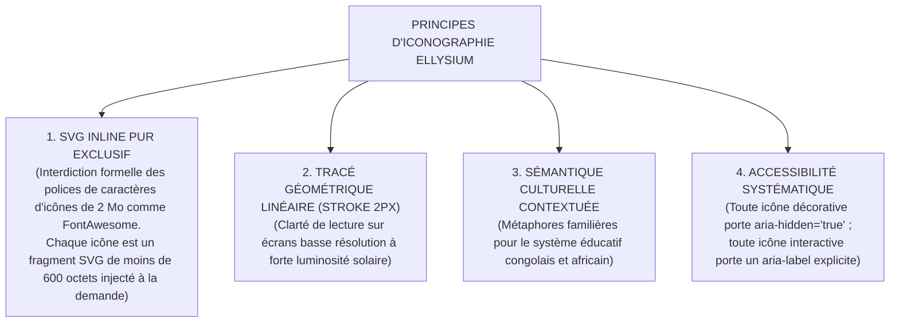
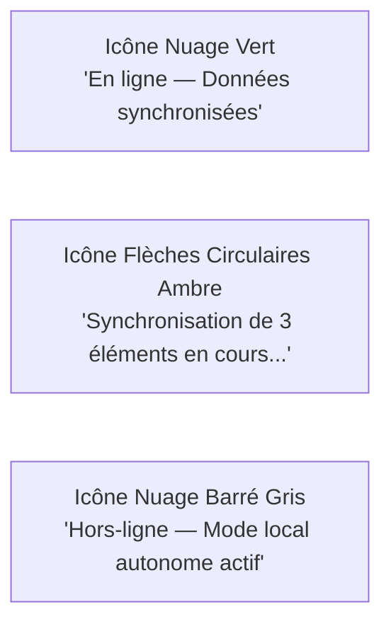

# TOME 6 — EXPÉRIENCE UTILISATEUR ET DESIGN SYSTEM
## 99. Iconographie, Pictogrammes et Signaux d'État

---

> **Positionnement :** Grammaire sémiotique, symboles vectoriels ultra-légers et sémantique visuelle des états  
> **Autorité :** Conforme aux normes d'accessibilité numérique et d'efficacité de transmission (Sobriété data)  
> **Liaison amont :** Module 97 (Charte graphique) | **Liaison aval :** Module 100 (Typographie), Module 101 (Accessibilité)

---

## 1. Objet et Portée du Sous-Tome

Les icônes et signaux d'état transmettent une information instantanée sans barrière linguistique ni lourdeur textuelle. Sur un terminal mobile utilisé dans des conditions de mobilité ou d'éclairage difficile, une icône ambiguë provoque des erreurs de manipulation graves (ex. suppression accidentelle ou soumission involontaire). Ce sous-tome normalise le catalogue d'icônes vectorielles, leurs règles de chargement en SVG inline pur, et les signaux d'état universels.

---

## 2. Principes Techniques Fondamentaux

---

## 3. Répertoire des Signaux d'État Pédagogiques et Administratifs

Les pastilles et badges de statut obéissent à un code universel immuable :

| Symbole / Badge | Couleur officielle | Signification fonctionnelle |
|---|---|---|
| **Pastille Verte Pleine** | `#1B5E20` (Vert foncé) | Présent en classe / Devoir validé / Reçu de caisse régularisé / Titre légal actif |
| **Pastille Rouge Pleine** | `#B71C1C` (Rouge sang) | Absent non justifié (ABI) / Devoir en retard / Titre révoqué |
| **Pastille Jaune / Ambre** | `#E65100` (Orange ambré) | Retard en classe / Devoir en attente de correction / Paiement en cours |
| **Pastille Bleue Info** | `#0277BD` (Bleu ciel) | Absence justifiée (ABJ) / Dispensé (DISP) / Information consultative |
| **Pastille Grise** | `#757575` (Gris neutre) | Non évalué / Cours non encore commencé / Hors calendrier |

---

## 4. Indicateur d'État de Connectivité Réseau (Offline / Sync)

L'indicateur de connectivité est fixé en permanence dans la barre d'état supérieure de l'application :

**Règle UX-99-01** : Lorsque le mode hors-ligne s'active, aucun message d'alerte agressif n'interrompt l'usager. L'icône de nuage passe discrètement en mode barré gris avec le texte informatif : *« Vous travaillez hors-ligne. Vos modifications seront envoyées dès le retour de la connexion. »*

---

## 5. Métaphores Iconographiques Spécifiques ELLYSIUM

Pour éviter les confusions d'usage observées sur le terrain :
- **Cahier de cotes** : représenté par un carnet quadrillé stylisé, et non par une calculatrice.
- **Bulletin de période** : représenté par une feuille scellée d'un sceau officiel, et non par un simple document générique.
- **Tuteur IA** : représenté par une étincelle de sagesse stylisée ou une lampe à huile de la connaissance, évitant les représentations de robots menaçants ou déshumanisés.
- **Mobile Money** : représenté par une main échangeant une pièce numérique avec un téléphone portable.

---

## 6. Verrous Fonctionnels d'Iconographie

| Réf. | Intitulé | Conséquence en cas de transgression |
|---|---|---|
| **VF-99-01** | Jamais d'icône seule pour une action destructrice | Tout bouton effectuant une suppression, révocation ou annulation doit obligatoirement comporter son libellé textuel explicite à côté de l'icône (ex. *« [Icône Poubelle] Supprimer ce document »*). |
| **VF-99-02** | Contraste d'état non basé sur la seule couleur | Tout signal d'état (vert/rouge) doit s'accompagner d'une forme ou d'un texte d'accompagnement pour les usagers daltoniens (norme WCAG 1.4.1). |

---

*Sous-tome rédigé conformément aux Normes documentaires ELLYSIUM — Fondations 04.*  
*Version 1.0 — Référence : ELLYSIUM/T6/99/v1.0*

---

## 7. Verrous Fonctionnels Critiques

| Réf. Verrou | Description Fonctionnelle et Technique | Conséquence en Cas de Violation |
| :--- | :--- | :--- |
| **`VF-099-01`** | **Icônes SVG vectorielles compressées** | Poids de chaque pictogramme inférieur à 2 Ko, rendu net à toute résolution. |
| **`VF-099-02`** | **Signification sémantique universelle des symboles** | Les icônes courantes (accueil, recherche, paramètres) respectent les conventions mondiales. |
| **`VF-099-03`** | **Association texte + icône pour clarté cognitive** | Les boutons critiques associent systématiquement une icône et son libellé textuel. |
| **`VF-099-04`** | **Codes couleurs d'état sans ambiguïté** | Vert (Succès / Validé), Orange (En attente), Rouge (Erreur / Bloqué), Bleu (Information). |
| **`VF-099-05`** | **Non-dépendance à la couleur pour daltoniens** | Chaque signal d'état combine une couleur et un motif ou pictogramme distinct. |

---

*Sous-tome rédigé conformément aux Normes documentaires ELLYSIUM — Fondations 04.*
