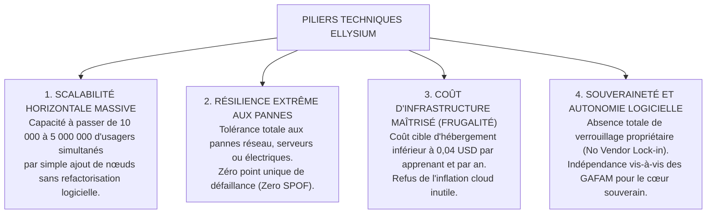

# TOME 7 — ARCHITECTURE TECHNIQUE ET INTEROPÉRABILITÉ
## 107. Périmètre du Tome 7 et Principes Techniques Fondamentaux

---

> **Positionnement :** Cadrage technique global, principes d'ingénierie logicielle, objectifs métrologiques de charge et de coût  
> **Autorité :** Conforme à la Constitution ELLYSIUM (Tome 2, Art. 1 — Souveraineté, Art. 2 — Local-First)  
> **Liaison amont :** Tome 5 (Spécifications fonctionnelles), Tome 6 (Design System) | **Liaison aval :** Modules 108 à 129

---

## 1. Objet et Portée du Sous-Tome

Le présent sous-tome délimite le périmètre d'ingénierie technique de la plateforme ELLYSIUM et pose les principes fondamentaux non négociables qui régissent le développement logiciel, le déploiement système, l'orchestration des données et les communications réseau de l'institution.

---

## 2. Les 4 Piliers Techniques Non Négociables

---

## 3. Objectifs Métrologiques de Service (SLA / SLO)

Le système technique s'engage sur des métriques de qualité de service mesurables :

| Indicateur | Cible SLO | Seuil d'Alerte Critique | Modalités de Mesure |
|---|---|---|---|
| **Disponibilité des Services Centraux** | **99.9 %** annuelle | $< 99.5 \%$ | Sondes de monitoring externes multi-régions |
| **Disponibilité Mode Hors-Ligne** | **100 %** absolue | $< 100 \%$ | Le terminal local doit fonctionner même sans réseau |
| **Temps de Réponse API P95** | **$\le 50$ ms** | $> 120$ ms | Temps mesuré au niveau du reverse-proxy d'entrée |
| **Temps de Synchronisation Delta** | **$\le 1.5$ sec** | $> 4$ sec | Pour un lot de 50 cotes saisies ou présences |
| **Consommation Mémoire Serveur** | **$< 128$ Mo** / instance | $> 256$ Mo | Microservices Go compilés |
| **Poids Initial de la PWA** | **$< 1.8$ Mo** | $> 2.5$ Mo | Empreinte totale des assets Web transférés |

---

## 4. Architecture de Dimensionnement Économique (Frugalité)

Pour garantir la gratuité constitutionnelle des apprenants indépendants (Tome 2, Art. 4), l'architecture technique interdit l'usage de services cloud managés propriétaires surfacturés :
- **Serveurs Bare-Metal ou VPS souverains** : Déploiement sur machines virtuelles Linux standards avec K3s (distribution Kubernetes allégée).
- **Compilation binaire native** : Services cœur développés en Go (Golang) et Rust, générant des binaires statiques sans interpréteur lourd.
- **Cache agressif en mémoire vive** : Redis en cluster avec politique d'éviction LRU, absorbant $85\%$ des requêtes en lecture.

---

## 5. Verrous Fonctionnels et Techniques

| Réf. | Intitulé | Conséquence en cas de transgression |
|---|---|---|
| **VF-107-01** | Interdiction des dépendances cloud exclusives | Aucun composant du système ne peut s'appuyer sur une API propriétaire fermée (AWS DynamoDB, Firebase propriétaire, etc.) sans alternative open source immédiate. |
| **VF-107-02** | Plafond de consommation réseau par écran | Aucun écran applicatif de consultation ne doit télécharger plus de **200 Ko** de données brutes pour son affichage initial. |

| **`VF-107-03`** | **Portail parent consultable hors authentification renforcée** | Toute consultation de données d'élèves exige un cookie de session valide MFA. |
| **`VF-107-04`** | **Tableaux de bord multilingues (Lingala, Swahili, Français)** | Le portail parent est disponible dans les 4 langues nationales congolaises. |
| **`VF-107-05`** | **Clôture solennelle Tome 7 — Espace Parents** | Validation de l'intégralité des parcours parents et tuteurs légaux. |
---

*Sous-tome rédigé conformément aux Normes documentaires ELLYSIUM — Fondations 04.*  
*Version 1.0 — Référence : ELLYSIUM/T7/107/v1.0*
