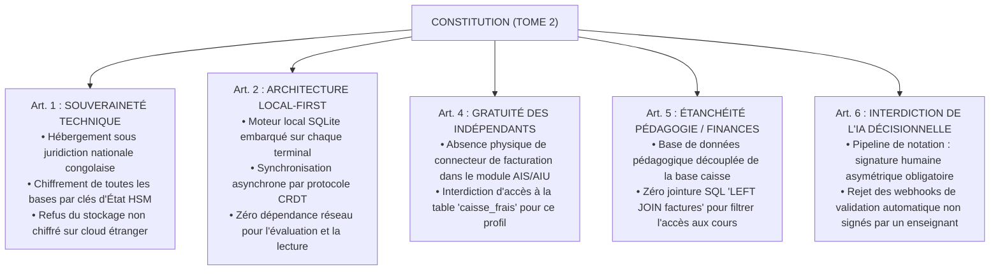

# TOME 7 — ARCHITECTURE TECHNIQUE ET INTEROPÉRABILITÉ
## 108. Conformité Constitutionnelle Technique et Sécurité des Données

---

> **Positionnement :** Traduction cryptographique et logicielle des 21 articles de la Constitution ELLYSIUM  
> **Autorité :** Constitution ELLYSIUM (Tome 2, Art. 1 à 21) — Norme suprême  
> **Liaison amont :** Tome 2 (Constitution), Tome 5 (Module 56) | **Liaison aval :** Module 114 (Bases de données), Module 117 (Auth)

---

## 1. Objet et Portée du Sous-Tome

La Constitution ELLYSIUM (Tome 2) n'est pas un texte philosophique abstrait : elle constitue le cahier des charges juridique suprême dont chaque article s'incarne en contraintes de code, de cryptographie et de schéma de base de données. Ce sous-tome documente la traduction technique formelle de chaque exigence constitutionnelle dans l'architecture système.

---

## 2. Traduction Technique des Articles Constitutionnels Clés

---

## 3. Chiffrement et Protection Cryptographique des Données

### 3.1 Données en Transit (In-Flight)

**Règle TECH-108-01** : Tout flux réseau (Web, Mobile, Inter-services) applique obligatoirement :
- **TLS 1.3** exclusif (suites cryptographiques modernes : `TLS_AES_256_GCM_SHA384` et `TLS_CHACHA20_POLY1305_SHA256`).
- Désactivation absolue de TLS 1.0, 1.1 et 1.2.
- **Mutual TLS (mTLS)** obligatoire pour toutes les communications inter-microservices au sein du cluster Kubernetes via un maillage de services (Service Mesh).

### 3.2 Données au Repos (At-Rest)

- **Chiffrement des volumes de stockage** : Chiffrement intégral LUKS au niveau du système de fichiers avec clés AES-256-XTS.
- **Chiffrement au niveau applicatif (Column-Level Encryption)** : Les données sensibles des élèves mineurs (noms, dates de naissance, téléphones, cotes) sont chiffrées avant écriture en base avec l'algorithme `AES-256-GCM` à l'aide d'une clé dérivée par établissement scolaire.

---

## 4. Journalisation Immuable et Audit Trail (Merkle Tree)

**Règle TECH-108-02** : Pour satisfaire l'Article 8 (Droit de recours et transparence absolue), toute modification de note, délibération de jury ou transaction financière est consignée dans un registre de transactions chaîné (arbre de Merkle). Chaque enregistrement contient :
$$\text{Hash}_n = \text{SHA-256}(\text{Données}_n + \text{Horodatage}_n + \text{SignatureActeur}_n + \text{Hash}_{n-1})$$

Toute altération a posteriori d'un enregistrement brise la chaîne cryptographique et déclenche une alerte de sécurité d'État immédiate.

---

## 5. Verrous Fonctionnels Constitutionnels

| Réf. | Intitulé | Conséquence en cas de transgression |
|---|---|---|
| **VF-108-01** | Interdiction formelle de backdoor | Aucun compte administrateur « maître » universel ne peut exister dans le code. Toute intervention requiert un consensus cryptographique à double clé. |
| **VF-108-02** | Cloisonnement pédagogie / finance en base | Tout code source tentant une requête liant la table `bulletin_notes` à la table `facturation_statut` est rejeté dès la phase d'analyse statique de code CI/CD. |

| **`VF-108-03`** | **Audit de toutes les consultations des dossiers enfants** | Chaque consultation parentale est tracée avec horodatage. |
| **`VF-108-04`** | **Restriction d'accès par plage horaire configurable** | Les parents peuvent restreindre l'accès à la plateforme de leur enfant le soir. |
| **`VF-108-05`** | **Mise à jour automatique des coordonnées de contact** | Synchronisation des numéros de téléphone avec les opérateurs OTP en cas de changement. |
---

*Sous-tome rédigé conformément aux Normes documentaires ELLYSIUM — Fondations 04.*  
*Version 1.0 — Référence : ELLYSIUM/T7/108/v1.0*
