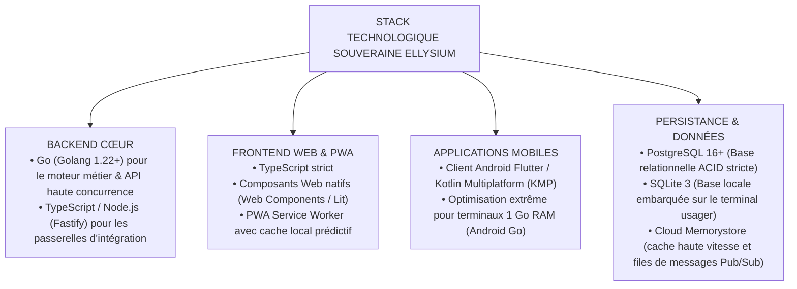

# TOME 7 — ARCHITECTURE TECHNIQUE ET INTEROPÉRABILITÉ
## 109. Choix Technologiques Fondamentaux et Justifications Métrologiques

---

> **Positionnement :** Sélection rationnelle de la stack technique, comparatifs de performance et critères de souveraineté  
> **Autorité :** Conforme aux impératifs d'éco-conception, de performance en milieu contraint et de pérennité du code  
> **Liaison amont :** Module 107 (Principes techniques) | **Liaison aval :** Modules 110 à 114 (Architectures détaillées)

---

## 1. Objet et Portée du Sous-Tome

Le choix d'une pile technologique pour une institution éducative nationale ne doit jamais résulter d'un effet de mode ou d'un enthousiasme passager pour un framework éphémère. Chaque composant de la stack ELLYSIUM a été sélectionné sur des critères rigoureux et mesurables : **empreinte mémoire minimale, vitesse d'exécution, stabilité de long terme (LTS), documentation accessible et absence de dépendance propriétaire**.

---

## 2. Matrice Comparative de la Stack Technologique

---

## 3. Justification Détaillée des Choix Backend

### 3.1 Pourquoi Go (Golang) pour le Cœur Métier ?

1. **Faible consommation de ressources** : Une instance de service en Go consomme entre 15 et 30 Mo de RAM au repos, contre 150 à 400 Mo pour une application équivalente en Java Spring Boot ou Python Django.
2. **Concurrence native puissante** : Le modèle des *goroutines* permet à un seul serveur à 4 cœurs de traiter plus de **40 000 connexions concurrentes** sans effondrement mémoire.
3. **Binaire statique autonome** : Compilation en un binaire unique sans dépendance système externe, simplifiant drastiquement les déploiements dans des centres de données provinciaux isolés.

---

## 4. Justification Détaillée des Choix Frontend

### 4.1 Pourquoi les Web Components et le TypeScript Strict ?

- **Pérennité garantie par le W3C** : Contrairement aux frameworks JavaScript qui se déprécient tous les 3 ans, les Web Components sont un standard du navigateur supporté nativement sans bibliothèque lourde.
- **Poids de bundle ultra-léger** : Moins de **80 Ko** de code JavaScript total pour charger la bibliothèque complète de composants ELLYSIUM, contre 500 Ko à 1.5 Mo pour les architectures React classiques.
- **Typage statique absolu** : Détection des erreurs de calcul ou de mapping de données dès la compilation.

---

## 5. Justification Détaillée du Moteur de Données

| Composant | Technologie Retenue | Rôle Spécifique dans ELLYSIUM | Justification face aux alternatives |
|---|---|---|---|
| **Base Centrale** | **PostgreSQL 16** | Registre d'État des inscriptions, cotes, bulletins et diplômes | Respect strict ACID, fonctionnalités RLS (Row-Level Security) pour le cloisonnement des écoles, support JSONB natif |
| **Base Locale Client** | **SQLite 3** | Persistance Local-First sur smartphone et PC d'école | Moteur SQL embarqué le plus testé au monde, zéro configuration, supporte des millions d'écritures fiables |
| **Cache & File** | **Cloud Memorystore** | Sessions utilisateurs, limitation de débit (Rate Limiting), cache | Latence sub-milliseconde, structures de données natives (Streams, Sets) |
| **Stockage Fichiers** | **Cloud Storage (GCS)** | Syllabus PDF/A, copies de devoirs scannées, reçus | Souveraineté cryptographique CMEK/EKM, stockage managé Google |

---

## 6. Verrous Techniques de la Stack

| Réf. | Intitulé | Conséquence en cas de transgression |
|---|---|---|
| **VF-109-01** | Interdiction des frameworks backend lourds non compilés | L'intégration de frameworks à forte empreinte mémoire (Django, Rails, Spring lourd) est interdite sur le chemin critique des requêtes élèves. |
| **VF-109-02** | Obligation de rétrocompatibilité Android | L'application mobile doit obligatoirement fonctionner sans régression sur Android 8.0 (Oreo / API Level 26) et versions supérieures. |

---

*Sous-tome rédigé conformément aux Normes documentaires ELLYSIUM — Fondations 04.*  
*Version 1.0 — Référence : ELLYSIUM/T7/109/v1.0*

---

## 7. Verrous Fonctionnels Critiques

| Réf. Verrou | Description Fonctionnelle et Technique | Conséquence en Cas de Violation |
| :--- | :--- | :--- |
| **`VF-109-03`** | **Validation de la relation parent-enfant par l'établissement** | Le directeur d'école doit approuver tout lien parent-enfant nouvellement créé. |
| **`VF-109-04`** | **Révocation immédiate en cas de jugement de garde** | Suppression de l'accès du parent non-gardien sur décision judiciaire vérifiée. |
| **`VF-109-05`** | **Protection contre la manipulation parentale des notes** | Aucun parent ne peut initier une modification de cote directement depuis son espace. |

---

*Sous-tome rédigé conformément aux Normes documentaires ELLYSIUM — Fondations 04.*
