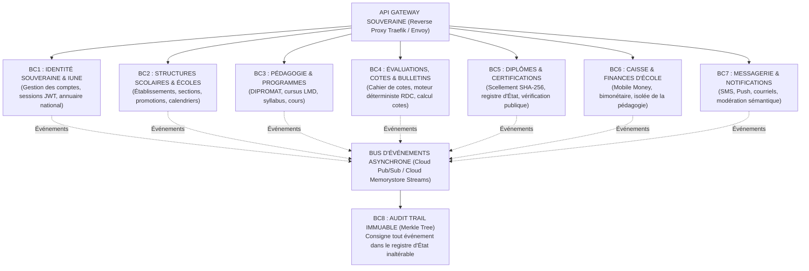

# TOME 7 — ARCHITECTURE TECHNIQUE ET INTEROPÉRABILITÉ
## 110. Architecture Logicielle Globale — Approche Modulaire et Orientée Événements

---

> **Positionnement :** Topologie système macroscopique, découpage en contextes délimités (DDD) et communication événementielle  
> **Autorité :** Conforme aux principes d'évolutivité modulaire, de tolérance aux pannes et de résilience institutionnelle  
> **Liaison amont :** Module 109 (Stack) | **Liaison aval :** Module 111 (Architecture backend), Module 120 (Mode hors-ligne)

---

## 1. Objet et Portée du Sous-Tome

Une architecture logicielle monolithique classique présente le risque fatal d'un effondrement total si une sous-fonction (ex. une surcharge lors du paiement des frais de scolarité) sature le serveur. À l'inverse, une prolifération anarchique de microservices engendre une complexité opérationnelle démesurée. ELLYSIUM adopte une architecture **Modulaire Orientée Événements (Event-Driven Modular Monolith & Decoupled Services)** organisée selon les principes du Domain-Driven Design (DDD).

---

## 2. Cartographie Globale des Bounded Contexts (DDD)

---

## 3. Définition Formelle des 8 Contextes Délimités (Bounded Contexts)

### BC1 — Identité Souveraine & IUNE (IAM)
- **Responsabilité** : Cycle de vie de l'Identifiant Unique National ELLYSIUM, authentification multifactorielle, émission des jetons de session cryptographiques.
- **Base de données** : Schéma PostgreSQL `iam_identity`.

### BC2 — Structures Scolaires & Établissements Partenaires
- **Responsabilité** : Cartographie des écoles, complexes scolaires, facultés universitaires, affectation des enseignants aux classes.
- **Base de données** : Schéma PostgreSQL `school_structure`.

### BC3 — Pédagogie, Programmes & Bibliothèque Numérique
- **Responsabilité** : Dépôt officiel des cours DIPROMAT et LMD, gestion des syllabus, distribution hors-ligne des supports d'étude.
- **Base de données** : Schéma PostgreSQL `pedagogy_curriculum`.

### BC4 — Évaluations, Cahier des Cotes & Moteur Déterministe
- **Responsabilité** : Encodage des travaux journaliers (TJ), calcul mathématique certifié selon la formule officielle RDC, génération des bulletins de période.
- **Base de données** : Schéma PostgreSQL `eval_grades`.

### BC5 — Titres, Diplômes & Vérification Publique
- **Responsabilité** : Génération des diplômes scellés SHA-256, QR codes cryptographiques et service public de vérification d'authenticité.
- **Base de données** : Schéma PostgreSQL `certification_registry`.

### BC6 — Caisse Scolaire & Gestion Financière (Totalement Isolé)
- **Responsabilité** : Rapprochement Mobile Money (M-Pesa, Orange, Airtel), double monnaie USD/CDF, émission des reçus numérotés.
- **Base de données** : Base de données physiquement distincte `caisse_finance_db`.

### BC7 — Notifications & Communication Supervisée
- **Responsabilité** : Relais SMS d'urgence pour les parents, notifications push mobiles, modération automatique des forums.
- **Base de données** : Schéma PostgreSQL `comms_notifications`.

### BC8 — Audit Trail & Registre Immuable
- **Responsabilité** : Journalisation cryptographique par arbre de Merkle de chaque transaction sensible, consultable en lecture seule par les corps d'inspection.
- **Base de données** : Base append-only `audit_merkle_log`.

---

## 4. Modèle de Communication Inter-Contextes

**Règle TECH-110-01** : Toute communication modifiant l'état du système entre deux contextes délimités s'effectue obligatoirement de façon asynchrone via des événements de domaine publiés sur le bus Cloud Pub/Sub.
- Aucun appel HTTP direct synchrone n'est autorisé entre BC4 (Cotes) et BC6 (Caisse).
- L'échec temporaire du service de caisse ou de notification n'empêche jamais la saisie des notes ou la consultation des cours.

---

## 5. Verrous Fonctionnels d'Architecture Globale

| Réf. | Intitulé | Conséquence en cas de transgression |
|---|---|---|
| **VF-110-01** | Indépendance physique de la caisse | Le service de caisse (BC6) est hébergé sur une instance de base de données séparée. Aucune indisponibilité financière ne peut bloquer l'accès pédagogique. |
| **VF-110-02** | Contrat d'interface strict (Schema Registry) | Tout événement transitant sur le bus Cloud Pub/Sub doit être validé par un schéma Protocol Buffers (Protobuf) versionné. Tout message non conforme est rejeté en Dead-Letter Queue. |

| **`VF-110-03`** | **Push critique pour convocations officielles** | Les convocations disciplinaires ou d'examen sont transmises par SMS et push simultanément. |
| **`VF-110-04`** | **Accusé de réception obligatoire pour actes importants** | Le parent confirme explicitement réception des bulletins et décisions de jury. |
| **`VF-110-05`** | **Archivage des communications parent-école** | Tous les échanges sont conservés 3 ans pour preuves éventuelles. |
| **`VF-110-06`** | **Toute réponse d'API cache doit être invalidée via Cloud CDN purge sur écriture critique** | **Conséquence : violation = inéligibilité du module pour mise en production** |
---

*Sous-tome rédigé conformément aux Normes documentaires ELLYSIUM — Fondations 04.*  
*Version 1.0 — Référence : ELLYSIUM/T7/110/v1.0*
