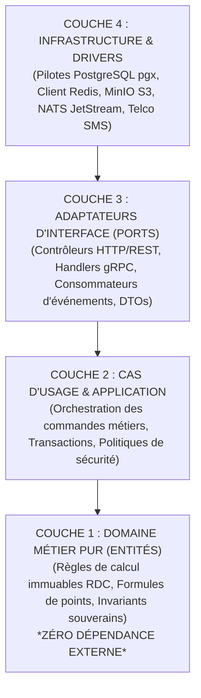
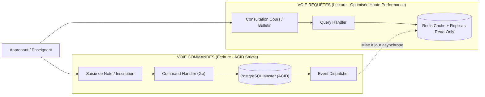

# TOME 7 — ARCHITECTURE TECHNIQUE ET INTEROPÉRABILITÉ
## 111. Architecture Backend — Clean Architecture, Découpage en Couches et CQRS

---

> **Positionnement :** Organisation interne des microservices backend, séparation stricte des responsabilités et patrons d'ingénierie  
> **Autorité :** Conforme aux normes de maintenabilité à long terme et aux exigences d'indépendance technologique  
> **Liaison amont :** Module 110 (Architecture logicielle globale) | **Liaison aval :** Module 114 (Bases de données), Module 115 (API)

---

## 1. Objet et Portée du Sous-Tome

Pour qu'un système d'État survive aux décennies et aux changements d'équipes techniques, le code backend ne doit jamais entremêler la logique métier (règles de calcul des cotes scolaires, conditions de diplômes) avec les détails techniques (SQL, requêtes HTTP, protocoles réseau). Ce sous-tome formalise l'implémentation de la **Clean Architecture (Architecture Hexagonale)** et du patron **CQRS (Command Query Responsibility Segregation)** pour l'ensemble des modules backend en Go.

---

## 2. Le Modèle Hexagonal en 4 Couches Concentriques

### 2.1 Règle de Dépendance Unidirectionnelle Absolue

**Règle TECH-111-01** : Les dépendances de code pointent **strictement vers l'intérieur**.
- La couche Domaine ne doit importer aucun package SQL, HTTP ou framework externe.
- Le calcul de la formule officielle de délibération RDC (`formule_rdc.go`) doit pouvoir être testé et validé sur n'importe quel ordinateur sans base de données ni connexion réseau.

---

## 3. Séparation CQRS (Command Query Responsibility Segregation)

Les flux d'écriture (Commandes) et les flux de lecture (Requêtes) présentent des profils de charge radicalement différents dans ELLYSIUM.

### 3.1 Avantages Opérationnels du CQRS dans ELLYSIUM
- **Voie Écriture (Write)** : Garantit la cohérence transactionnelle absolue lors de la saisie des notes et des paiements par verrous optimistes (`version_id`).
- **Voie Lecture (Read)** : Absorbe les pics de consultation massive des résultats lors de la proclamation des délibérations scolaires sans surcharger la base de données principale.

---

## 4. Patron Saga pour les Transactions Distribuées

Lorsqu'un processus métier traverse plusieurs services (ex. *Inscription d'un élève affilié* impliquant l'IAM, l'Établissement, l'affectation de la Classe et l'attribution des manuels) :
- ELLYSIUM applique une **Saga chorégraphiée** basée sur des événements asynchrones.
- Chaque étape réussie publie un événement déclenchant l'étape suivante.
- En cas d'échec d'une étape (ex. classe saturée), des transactions de compensation automatiques sont émises pour annuler les réservations précédentes.

---

## 5. Verrous d'Ingénierie Backend

| Réf. | Intitulé | Conséquence en cas de transgression |
|---|---|---|
| **VF-111-01** | Isolation pure du domaine | Tout commit introduisant une référence SQL ou HTTP dans le répertoire `/domain` est automatiquement rejeté par le linter de la CI/CD. |
| **VF-111-02** | Gestion déterministe des contextes | Tout appel de fonction I/O backend doit propager un `context.Context` Go avec timeout strict pour éviter les blocages de threads infinis. |

---

*Sous-tome rédigé conformément aux Normes documentaires ELLYSIUM — Fondations 04.*  
*Version 1.0 — Référence : ELLYSIUM/T7/111/v1.0*
