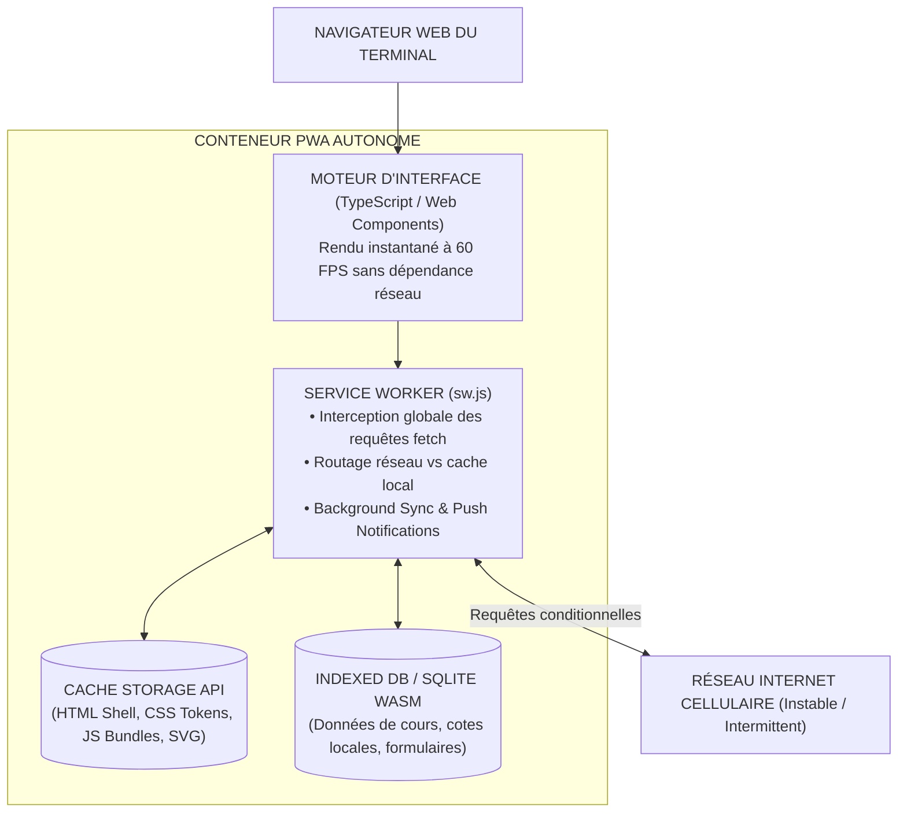

# TOME 7 — ARCHITECTURE TECHNIQUE ET INTEROPÉRABILITÉ
## 112. Architecture Frontend Web — SPA, PWA et Stratégies de Service Worker

---

> **Positionnement :** Architecture applicative côté client, Progressive Web App (PWA) et gestion du cache prédictif  
> **Autorité :** Conforme aux normes W3C pour les applications web progressives et au principe Local-First (Tome 2, Art. 2)  
> **Liaison amont :** Module 98 (Composants UI), Module 109 (Stack) | **Liaison aval :** Module 113 (Mobile), Module 120 (Hors-ligne)

---

## 1. Objet et Portée du Sous-Tome

La grande majorité des élèves, étudiants et parents accèdent à ELLYSIUM depuis un navigateur web mobile (Chrome Android, Opera Mini, Samsung Internet). L'application web doit se comporter exactement comme une application native : installation sur l'écran d'accueil sans passer par un magasin d'applications propriétaire, exécution immédiate hors-ligne et synchronisation transparente dès le retour du réseau. Ce sous-tome spécifie l'architecture de la Progressive Web App (PWA).

---

## 2. Architecture Globale du Client PWA

---

## 3. Stratégies de Cache des Requêtes (Service Worker Routing)

Pour concilier fraîcheur des données administratives et autonomie absolue hors-ligne, le Service Worker applique 4 stratégies de cache rigoureuses selon la nature de la ressource :

| Type de Ressource | Stratégie de Cache Appliquée | Comportement en cas de coupure réseau |
|---|---|---|
| **App Shell (HTML, CSS, JS)** | **Cache-First (Précaché)** | Chargement instantané en 0 ms depuis le cache local |
| **Syllabus & Cours (PDF/A, Textes)** | **Stale-While-Revalidate** | Affichage immédiat de la version locale, mise à jour en tâche de fond |
| **Cahier de Cotes & Présences** | **Network-First avec Fallback Local** | Tente le serveur en priorité ; si échec (< 2s), bascule sur la base locale |
| **Paiements & Actes Financiers** | **Network-Only + Background Sync** | Ne lit jamais du cache obsolète. Met en file d'attente sécurisée si hors-ligne |

---

## 4. Persistance des Données Structurées : SQLite en WebAssembly (WASM)

**Règle TECH-112-01** : Pour garantir la parité stricte des fonctionnalités entre le client web et le serveur, ELLYSIUM embarque une instance légère de **SQLite compilée en WebAssembly (WASM)** dans le navigateur web de l'usager :
- Les données de l'élève (ses cours, ses devoirs, son horaire) sont requêtées localement via du SQL pur avec des temps de réponse inférieurs à **5 millisecondes**.
- La base SQLite locale est persistée sur le système de fichiers du navigateur via l'API *Origin Private File System (OPFS)*, immunisée contre les nettoyages intempestifs du cache navigateur.

---

## 5. Manifest PWA et Expérience d'Installation Standalone

Le fichier `manifest.webmanifest` transforme le site en application installable :
- Mode d'affichage : `display: standalone` (suppression de la barre d'adresse du navigateur).
- Orientation : `orientation: portrait-primary` avec adaptation dynamique en paysage sur tablette.
- Thème de couleur : `#0B2545` (Bleu Souverain ELLYSIUM) harmonisé avec la barre d'état du système d'exploitation.

---

## 6. Verrous Techniques Frontend

| Réf. | Intitulé | Conséquence en cas de transgression |
|---|---|---|
| **VF-112-01** | Taille maximale du bundle initial | L'empreinte de l'App Shell initial (HTML + CSS critique + JS noyau) ne doit jamais excéder **250 Ko gzip**. Tout dépassement bloque la compilation de release. |
| **VF-112-02** | Obligation de fonctionnement déconnecté | Tout écran fonctionnel doit pouvoir s'ouvrir et s'afficher sans erreur Javascript même si le navigateur est configuré en mode avion complet. |

---

*Sous-tome rédigé conformément aux Normes documentaires ELLYSIUM — Fondations 04.*  
*Version 1.0 — Référence : ELLYSIUM/T7/112/v1.0*
