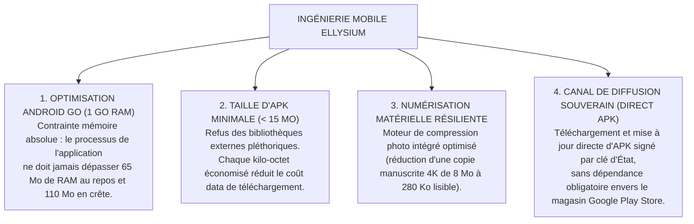
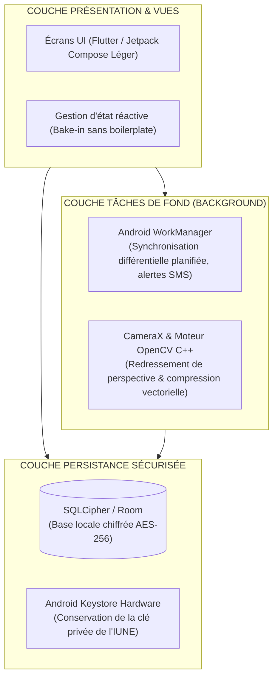

# TOME 7 — ARCHITECTURE TECHNIQUE ET INTEROPÉRABILITÉ
## 113. Architecture des Applications Mobiles — Écosystème Android et Multi-Plateforme

---

> **Positionnement :** Ingénierie logicielle des clients mobiles natifs, optimisation extrême pour 1 Go de RAM et résilience locale  
> **Autorité :** Conforme aux réalités d'équipement des populations scolaires en Afrique subsaharienne (Module 86)  
> **Liaison amont :** Module 86 (Personas), Module 109 (Stack) | **Liaison aval :** Module 114 (Bases de données), Module 120 (Hors-ligne)

---

## 1. Objet et Portée du Sous-Tome

Si la PWA assure une accessibilité universelle immédiate sans installation obligatoire, l'application mobile installée apporte des capacités matérielles indispensables : numérisation haute performance des copies de devoirs par la caméra, exécution de tâches de synchronisation en arrière-plan lorsque l'écran est éteint (WorkManager), et sécurité renforcée par le composant matériel sécurisé (Android Keystore). Ce sous-tome spécifie l'architecture du client mobile ELLYSIUM.

---

## 2. Piliers d'Ingénierie Mobile en Milieu Contraint

---

## 3. Pile Logicielle Mobile et Découpage Interne

---

## 4. Pipeline de Numérisation des Devoirs Manuscrits

Pour permettre aux élèves de soumettre leurs devoirs manuscrits sans saturer la bande passante de la famille :

1. **Prise de vue guidée** : Détection automatique des 4 coins de la feuille de cahier par le flux vidéo.
2. **Redressement de perspective (Homographie)** : Correction automatique de l'angle de prise de vue.
3. **Binarisation adaptative (Otsu Thresholding)** : Transformation de l'image couleur en noir et blanc net, éliminant les ombres disgracieuses de la main.
4. **Compression JPEG/WebP optimisée** : Réduction du fichier final sous le seuil strict de **350 Ko** tout en garantissant une lisibilité parfaite de l'écriture pour le professeur.

---

## 5. Gestion des Tâches en Arrière-Plan et Autonomie Batterie

**Règle TECH-113-01** : Pour respecter la batterie des smartphones soumis aux délestages électriques :
- La synchronisation en arrière-plan n'utilise aucun service persistant permanent (*Sticky Foreground Service* banni).
- Utilisation stricte de l'API `WorkManager` avec contraintes : déclenchement uniquement si le réseau est non-surchargé (*Constraint: NetworkType.CONNECTED*).
- Zéro réveil intempestif du CPU pendant les heures de sommeil (plage 22h00 - 05h30).

---

## 6. Verrous Techniques Mobiles

| Réf. | Intitulé | Conséquence en cas de transgression |
|---|---|---|
| **VF-113-01** | Seuil de mémoire OOM (Out Of Memory) | Toute fuite de mémoire ou pic dépassant **120 Mo** sur terminal 1 Go RAM entraîne le refus immédiat de certification QA. |
| **VF-113-02** | Signature cryptographique de l'APK d'État | Les fichiers APK distribués hors magasin officiel portent la signature cryptographique du Ministère de tutelle, vérifiée par l'installeur système. |

---

*Sous-tome rédigé conformément aux Normes documentaires ELLYSIUM — Fondations 04.*  
*Version 1.0 — Référence : ELLYSIUM/T7/113/v1.0*

---

## 7. Verrous Fonctionnels Critiques

| Réf. Verrou | Description Fonctionnelle et Technique | Conséquence en Cas de Violation |
| :--- | :--- | :--- |
| **`VF-113-03`** | **Commentaires parentaux soumis à modération** | Aucun commentaire n'est publié sans validation d'un modérateur humain. |
| **`VF-113-04`** | **Anonymisation des avis sur les enseignants** | Les évaluations pédagogiques des parents sont agrégées sans attribution nominale. |
| **`VF-113-05`** | **Calendrier collaboratif parent-école** | Synchronisation des dates importantes dans le calendrier du smartphone du parent. |
| **`VF-113-06`** | **Toute réponse d'API cache doit être invalidée via Cloud CDN purge sur écriture critique** | **Conséquence : violation = inéligibilité du module pour mise en production** |

---

*Sous-tome rédigé conformément aux Normes documentaires ELLYSIUM — Fondations 04.*
