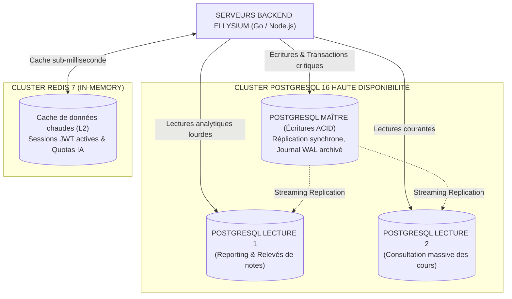

# TOME 7 — ARCHITECTURE TECHNIQUE ET INTEROPÉRABILITÉ
## 114. Base de Données — Modèles Relationnel, NoSQL et Partitionnement

---

> **Positionnement :** Architecture des données centrales, modélisation SQL stricte, partitionnement et sécurité au niveau des lignes (RLS)  
> **Autorité :** Conforme aux normes d'intégrité transactionnelle ACID et de protection des données souveraines  
> **Liaison amont :** Module 109 (Stack), Module 110 (Contextes DDD) | **Liaison aval :** Module 115 (API), Module 125 (Cache & Indexation)

---

## 1. Objet et Portée du Sous-Tome

Le registre d'État des apprentissages, des évaluations et des diplômes d'ELLYSIUM engage la sécurité juridique de la nation. Une perte de données ou une corruption de base de données équivaudrait à l'effacement de la scolarité de millions de citoyens. Ce sous-tome formalise l'architecture de données centrale sous **PostgreSQL 16 Enterprise**, la modélisation relationnelle stricte, le partitionnement par cohorte provinciale, la sécurité au niveau des lignes (Row-Level Security) et l'usage ciblé du NoSQL/Redis.

---

## 2. Topologie du Moteur de Données Central



---

## 3. Stratégie de Partitionnement de Données (Table Partitioning)

Pour maintenir des temps de requêtes inférieurs à 20 ms malgré des centaines de millions de lignes :

### 3.1 Partitionnement par Année Scolaire et Province

Les tables volumineuses (`eval_cotes_journalieres`, `cahier_presences`, `audit_transactions`) sont partitionnées selon une stratégie déclarative combinée :

```sql
-- Exemple de partitionnement de la table des cotes par année scolaire
CREATE TABLE eval_cotes_journalieres (
    id UUID NOT NULL,
    iune VARCHAR(32) NOT NULL,
    code_ecole VARCHAR(16) NOT NULL,
    annee_scolaire INT NOT NULL,
    province_educationnelle VARCHAR(64) NOT NULL,
    matiere_code VARCHAR(16) NOT NULL,
    note NUMERIC(5,2) NOT NULL,
    maximum NUMERIC(5,2) NOT NULL,
    created_at TIMESTAMPTZ DEFAULT NOW(),
    PRIMARY KEY (id, annee_scolaire, province_educationnelle)
) PARTITION BY RANGE (annee_scolaire);

-- Partition pour l'année 2025-2026
CREATE TABLE eval_cotes_2025 PARTITION OF eval_cotes_journalieres
    FOR VALUES FROM (2025) TO (2026)
    PARTITION BY LIST (province_educationnelle);
```

---

## 4. Sécurité au Niveau des Lignes (Row-Level Security - RLS)

**Règle TECH-114-01** : Aucun établissement scolaire partenaire ne peut techniquement accéder aux fiches d'élèves ou carnets de cotes d'une autre école. Ce cloisonnement est verrouillé directement au cœur du moteur SQL via la fonctionnalité native **PostgreSQL RLS** :

```sql
-- Activation de RLS sur la table des élèves
ALTER TABLE registre_eleves ENABLE ROW LEVEL SECURITY;

-- Politique d'isolation stricte par école partenaire
CREATE POLICY ecole_isolation_policy ON registre_eleves
    FOR ALL
    TO application_role
    USING (code_ecole = CURRENT_SETTING('app.current_school_id', true));
```

---

## 5. Rôle Complémentaire du Moteur NoSQL (Redis)

Redis n'est jamais utilisé pour stocker l'état souverain définitif d'un élève. Il remplit 3 missions auxiliaires d'accélération :
1. **Sessions et révocations de jetons (Token Blacklist)** : Révocation instantanée d'une session suspecte en moins d'1 milliseconde.
2. **Gestion des verrous distribués (Redlock)** : Empêche deux enseignants de valider simultanément la même délibération de classe.
3. **Limiteurs de débit (Rate Limiting)** : Comptage strict du quota tuteur IA de 50 requêtes/jour par élève (Tome 5, Module 74).

---

## 6. Verrous Techniques de Base de Données

| Réf. | Intitulé | Conséquence en cas de transgression |
|---|---|---|
| **VF-114-01** | Obligation de migrations réversibles (Up/Down) | Tout script de migration SQL non accompagné de son script de retour arrière (`down.sql`) testé est formellement bloqué en intégration continue. |
| **VF-114-02** | Interdiction des suppressions physiques (Hard Deletes) | Aucune ligne des tables d'historique académique (`notes`, `inscriptions`, `diplômes`) ne peut faire l'objet d'un `DELETE` SQL. Utilisation exclusive de l'archivage logique (`deleted_at IS NOT NULL`). |

---

*Sous-tome rédigé conformément aux Normes documentaires ELLYSIUM — Fondations 04.*  
*Version 1.0 — Référence : ELLYSIUM/T7/114/v1.0*

---

## 7. Verrous Fonctionnels Critiques

| Réf. Verrou | Description Fonctionnelle et Technique | Conséquence en Cas de Violation |
| :--- | :--- | :--- |
| **`VF-114-03`** | **Agenda partagé visible par les parents des activités parascolaires** | Toutes les sorties scolaires figurent avec localisation GPS et liste d'autorisation. |
| **`VF-114-04`** | **Formulaire de consentement électronique pour activités extrascolaires** | Remplacement du carnet papier d'autorisation parentale par un formulaire numérique signé. |
| **`VF-114-05`** | **Suivi en direct des activités terrain hors enceinte scolaire** | Localisation GPS des groupes scolaires visible par les parents pendant les sorties. |

---

*Sous-tome rédigé conformément aux Normes documentaires ELLYSIUM — Fondations 04.*
