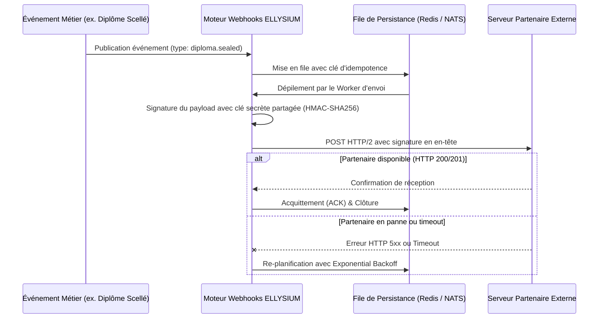

# TOME 7 — ARCHITECTURE TECHNIQUE ET INTEROPÉRABILITÉ
## 116. API Partenaires, Webhooks et Intégrations Externes

---

> **Positionnement :** Protocoles d'échanges avec les systèmes partenaires externes, sécurisation des webhooks et livraison garantie  
> **Autorité :** Conforme aux normes d'interopérabilité des services publics numériques et aux règles de non-répudiation  
> **Liaison amont :** Module 115 (API Internes) | **Liaison aval :** Module 121 (API EPST/ESU), Module 122 (Mobile Money)

---

## 1. Objet et Portée du Sous-Tome

ELLYSIUM doit échanger des données en temps réel avec des écosystèmes informatiques hétérogènes : serveurs des ministères de tutelle (EPST, ESU), plateformes des opérateurs de télécommunications (M-Pesa, Orange, Airtel), et banques partenaires. Ce sous-tome spécifie l'architecture des API ouvertes aux partenaires agréés, le mécanisme d'émission des webhooks sécurisés par signature HMAC-SHA256 et la politique de réessai avec tolérance aux pannes réseau des destinataires.

---

## 2. Architecture du Moteur d'Émission de Webhooks



---

## 3. Sécurisation Cryptographique des Webhooks (HMAC-SHA256)

**Règle TECH-116-01** : Aucun webhook n'est transmis en clair sans signature. Chaque payload émis est signé cryptographiquement à l'aide d'un secret partagé unique attribué au partenaire lors de son enrôlement.

### 3.1 En-têtes HTTP de Sécurité Obligatoires

```http
POST /api/webhooks/cnele-receiver HTTP/1.1
Host: partenaire-etat.cd
Content-Type: application/json
X-Cnele-Event: diploma.sealed
X-Cnele-Delivery: dlv-7a91b2-44f0-bc32
X-Cnele-Timestamp: 1758117000
X-Cnele-Signature: sha256=4f8b92a6c1e54a88f760e1548e65873919e917d5bb008a0d9e87f22316498efc
```

La signature est calculée selon la formule stricte :
$$\text{Signature} = \text{HMAC-SHA256}(\text{Timestamp} + \text{"."} + \text{PayloadBody}, \text{SecretPartenaire})$$

---

## 4. Politique de Réessai avec Exponential Backoff et Gigue (Jitter)

Pour éviter d'achever un serveur partenaire qui redémarre après une panne (effet de tempête de requêtes), ELLYSIUM applique un algorithme de réessai progressif :

| Tentative | Délai d'Attente Avant Nouvel Envoi | Observation |
|---|---|---|
| **1ère tentative** | Immédiate (0 sec) | Tentative nominale |
| **2e tentative** | $30\text{ sec} \pm 5\text{ sec}$ | Premier réessai |
| **3e tentative** | $2\text{ min} \pm 15\text{ sec}$ | Deuxième réessai |
| **4e tentative** | $10\text{ min} \pm 1\text{ min}$ | Troisième réessai |
| **5e tentative** | $1\text{ heure} \pm 5\text{ min}$ | Quatrième réessai |
| **6e tentative** | $6\text{ heures} \pm 30\text{ min}$ | Cinquième réessai |
| **7e tentative** | $24\text{ heures}$ | Ultime tentative avant bascule en Dead-Letter Queue (DLQ) |

---

## 5. Portail Partenaire et Gestion des Clés d'Accès

Les partenaires institutionnels disposent d'une interface de supervision technique dédiée :
- Génération et rotation sans interruption des secrets de signature d'API.
- Outil de simulation d'envoi (*Ping Test*) pour vérifier la conformité de leur serveur récepteur.
- Historique d'audit des 10 000 derniers webhooks émis avec statut HTTP renvoyé et latence.

---

## 6. Verrous Techniques d'Intégration Partenaire

| Réf. | Intitulé | Conséquence en cas de transgression |
|---|---|---|
| **VF-116-01** | Timeout maximal de livraison | Tout serveur récepteur de webhook ne répondant pas dans un délai de **5 secondes** est considéré en échec et fait l'objet d'un réessai différé. |
| **VF-116-02** | Révocation automatique sur défaillance continue | Si un endpoint partenaire renvoie des erreurs continues pendant plus de **72 heures**, la diffusion vers cet endpoint est temporairement suspendue et une alerte est transmise au responsable technique partenaire. |

---

*Sous-tome rédigé conformément aux Normes documentaires ELLYSIUM — Fondations 04.*  
*Version 1.0 — Référence : ELLYSIUM/T7/116/v1.0*

---

## 7. Verrous Fonctionnels Critiques

| Réf. Verrou | Description Fonctionnelle et Technique | Conséquence en Cas de Violation |
| :--- | :--- | :--- |
| **`VF-116-03`** | **Formation numérique guidée pour les parents peu alphabétisés** | Tutoriels audio-visuels en langues nationales pour utiliser la plateforme. |
| **`VF-116-04`** | **Version simplifiée de l'interface pour les non-initiés** | Mode débutant avec 4 boutons principaux uniquement. |
| **`VF-116-05`** | **Assistance téléphonique référencée dans l'application** | Numéro de support clairement affiché sur toutes les pages d'accueil parent. |

---

*Sous-tome rédigé conformément aux Normes documentaires ELLYSIUM — Fondations 04.*
