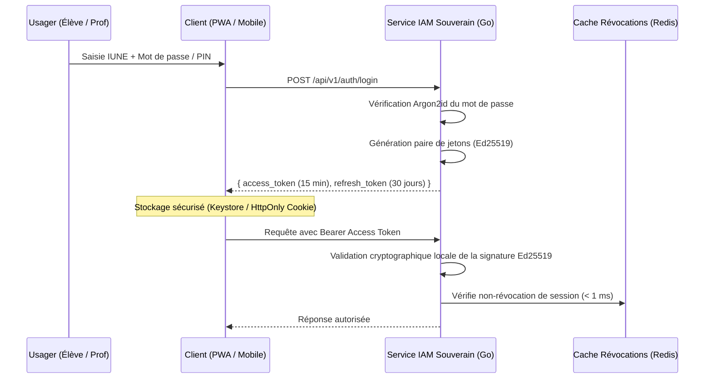

# TOME 7 — ARCHITECTURE TECHNIQUE ET INTEROPÉRABILITÉ
## 117. Authentification, Sessions et Gestion des Identités Souveraines (JWT, OAuth2, mTLS)

---

> **Positionnement :** Sécurisation des accès, architecture des jetons cryptographiques et authentification résiliente hors-ligne  
> **Autorité :** Conforme aux exigences de souveraineté d'accès et au Tome 5, Module 58 (Entonnoir d'accès)  
> **Liaison amont :** Module 58 (IAM Fonctionnel) | **Liaison aval :** Module 118 (Infrastructure), Module 120 (Mode hors-ligne)

---

## 1. Objet et Portée du Sous-Tome

L'authentification dans ELLYSIUM doit résoudre une contradiction apparente : offrir le plus haut niveau de sécurité cryptographique pour protéger les données scolaires de la nation, tout en permettant à un élève en zone rurale de continuer à s'authentifier sur son smartphone pendant 30 jours consécutifs sans la moindre connexion internet. Ce sous-tome formalise le protocole d'authentification souverain par jetons cryptographiques asymétriques Ed25519, la gestion des sessions et l'interopérabilité OAuth2/OIDC.

---

## 2. Architecture de Jetons à Double Niveau (Access Token & Refresh Token)



---

## 3. Spécifications Cryptographiques des Jetons

### 3.1 Pourquoi l'algorithme Ed25519 plutôt que RSA ?
- **Signature ultra-rapide** : Ed25519 est 10 fois plus rapide à vérifier sur un processeur de smartphone modeste que RSA-2048.
- **Taille de clé compacte** : Clé publique de 32 octets et signature de 64 octets (contre 256 octets pour RSA), réduisant le poids des en-têtes HTTP de chaque requête.

### 3.2 Structure Interne de l'Access Token (Payload)

```json
{
  "iss": "https://auth.cnele.cd",
  "sub": "CD-EL-2025-01428590",
  "role": "ELEVE_AFFILIE",
  "school_id": "ECOLE-LUMUMBA-KIN",
  "class_id": "CLS-4SC-A",
  "permissions": ["grades:read", "courses:read", "homework:submit"],
  "iat": 1758117000,
  "exp": 1758117900
}
```

---

## 4. Authentification Locale Hors-Ligne (Jusqu'à 30 Jours)

**Règle TECH-117-01** : Pour garantir le travail sans connexion en milieu rural :
- Lors de la dernière connexion réussie en ligne, la clé publique de signature d'ELLYSIUM est mise en cache sécurisé sur l'appareil.
- En mode hors-ligne, le terminal mobile vérifie lui-même la validité cryptographique de l'IUNE et déverrouille la base SQLite locale chiffrée par SQLCipher au moyen du code PIN de l'usager.
- Le délai maximal d'autonomie hors-ligne sans re-synchronisation est fixé à **30 jours calendaires**, après quoi un rafraîchissement réseau est exigé.

---

## 5. Révocation Immédiate de Session (Token Blacklist)

Pour révoquer immédiatement l'accès d'un compte compromis ou d'un appareil volé sans attendre l'expiration naturelle du jeton :
- Le `jti` (JWT ID unique) de la session révoquée est injecté dans un jeu de données Redis (*Redis Set*) avec un TTL égal à la durée résiduelle du jeton.
- L'API Gateway consulte ce cache en mémoire vive en moins de **0.4 ms** à chaque requête entrante.

---

## 6. Verrous Techniques d'Authentification

| Réf. | Intitulé | Conséquence en cas de transgression |
|---|---|---|
| **VF-117-01** | Algorithme de hachage de mot de passe obligatoire | Tout mot de passe utilisateur est obligatoirement dérivé avec l'algorithme **Argon2id** (paramètres : temps 2, mémoire 64 Mo, parallélisme 2). L'usage de MD5, SHA-1 ou SHA-256 brut est formellement interdit. |
| **VF-117-02** | Interdiction du stockage non sécurisé côté client | L'enregistrement d'un jeton de session dans le `localStorage` du navigateur est proscrit en raison des risques XSS. Utilisation exclusive des cookies `HttpOnly; Secure; SameSite=Strict`. |

---

*Sous-tome rédigé conformément aux Normes documentaires ELLYSIUM — Fondations 04.*  
*Version 1.0 — Référence : ELLYSIUM/T7/117/v1.0*

---

## 7. Verrous Fonctionnels Critiques

| Réf. Verrou | Description Fonctionnelle et Technique | Conséquence en Cas de Violation |
| :--- | :--- | :--- |
| **`VF-117-03`** | **Sondages anonymes de satisfaction parentale semestriels** | Formulaires courts (< 5 questions) pour évaluer la plateforme et l'école. |
| **`VF-117-04`** | **Résultats des sondages retransmis au COPIL** | Synthèse des NPS parents présentée au comité de pilotage chaque trimestre. |
| **`VF-117-05`** | **Droit de retrait sans pénalité des sondages** | La non-participation aux sondages n'impacte aucun service accordé à l'élève. |

---

*Sous-tome rédigé conformément aux Normes documentaires ELLYSIUM — Fondations 04.*
