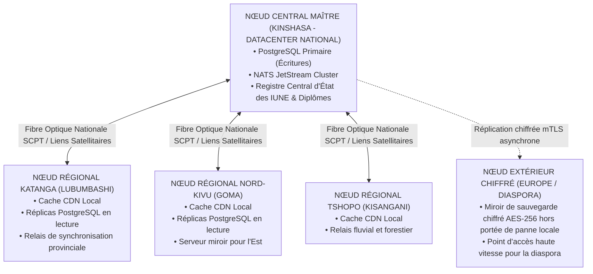

# TOME 7 — ARCHITECTURE TECHNIQUE ET INTEROPÉRABILITÉ
## 118. Infrastructure Cloud et Hébergement Souverain Multi-Cloud

---

> **Positionnement :** Topologie des centres de données, déploiement Kubernetes souverain, Infrastructure as Code et Plan de Reprise d'Activité  
> **Autorité :** Conforme à la Constitution ELLYSIUM (Tome 2, Art. 1 — Souveraineté territoriale et numérique)  
> **Liaison amont :** Module 107 (Principes techniques) | **Liaison aval :** Module 119 (Stockage & CDN), Module 124 (Haute charge)

---

## 1. Objet et Portée du Sous-Tome

L'infrastructure d'hébergement d'ELLYSIUM doit garantir que les données éducatives de la République Démocratique du Congo demeurent sous la juridiction exclusive de la nation tout en bénéficiant de la résilience d'une architecture distribuée moderne. Ce sous-tome définit la topologie multi-nœuds, le déploiement sur serveurs physiques et clouds souverains, l'orchestration par conteneurs K3s et le Plan de Reprise d'Activité (PRA).

---

## 2. Topologie Géographique et Répartition des Centres de Données

---

## 3. Orchestration par Conteneurs Allégés (Distribution K3s)

Au lieu de déployer un cluster Kubernetes lourd consommant plusieurs gigaoctets de mémoire vive rien que pour le plan de contrôle, ELLYSIUM utilise **K3s (distribution Kubernetes certifiée CNCF optimisée pour la frugalité)** :
- Binaire unique de moins de 100 Mo.
- Consommation mémoire du control-plane inférieure à **512 Mo de RAM**.
- Capacité à fonctionner aussi bien sur de grands serveurs dédiés de datacenter que sur des micro-serveurs locaux installés au sein d'un complexe scolaire provincial.

---

## 4. Infrastructure as Code (IaC) et Déploiement Reproductible

**Règle TECH-118-01** : Aucune configuration manuelle de serveur n'est tolérée en production (*Zero Click-Ops*).
- **Provisioning d'infrastructure** : Réalisé par des manifestes déclaratifs **OpenTofu / Terraform**.
- **Configuration des systèmes d'exploitation** : Automatisée par des playbooks **Ansible** versionnés sous Git.
- Tout nouveau nœud régional peut être instancié, configuré et rattaché au cluster national en moins de **45 minutes**.

---

## 5. Plan de Reprise d'Activité (PRA / DRP)

En cas de catastrophe majeure (sinistre sur le datacenter de Kinshasa, coupure générale de câble sous-marin) :

| Métrique de Continuité | Valeur Contractuelle ELLYSIUM | Procédure Technique Activée |
|---|---|---|
| **RPO (Recovery Point Objective)** | **$< 5$ minutes** | Archivage continu des journaux WAL PostgreSQL vers stockage distant chiffré |
| **RTO (Recovery Time Objective)** | **$< 30$ minutes** | Bascule DNS Anycast automatique vers le nœud miroir secondaire |

---

## 6. Verrous Techniques d'Infrastructure

| Réf. | Intitulé | Conséquence en cas de transgression |
|---|---|---|
| **VF-118-01** | Indépendance vis-à-vis d'un fournisseur unique | Aucun service central ne peut dépendre d'une infrastructure propriétaire non réplicable sur des serveurs Linux standards. |
| **VF-118-02** | Chiffrement matériel obligatoire des sauvegardes | Tout disque de sauvegarde ou bande magnétique exportée hors site doit être chiffré matériellement en AES-256 avec clé détenue par l'autorité d'État. |

---

*Sous-tome rédigé conformément aux Normes documentaires ELLYSIUM — Fondations 04.*  
*Version 1.0 — Référence : ELLYSIUM/T7/118/v1.0*

---

## 7. Verrous Fonctionnels Critiques

| Réf. Verrou | Description Fonctionnelle et Technique | Conséquence en Cas de Violation |
| :--- | :--- | :--- |
| **`VF-118-03`** | **Signalement d'urgence sécurité accessible en 1 clic** | Bouton SOS visible sur la page d'accueil parent pour alerter la direction en cas de danger. |
| **`VF-118-04`** | **Procédure de crise partagée avec les parents** | En cas d'incident grave, le plan d'urgence est distribué en push immédiat. |
| **`VF-118-05`** | **Contact de l'assistante sociale de l'école dans l'application** | Accès direct aux coordonnées du conseiller scolaire pour problèmes familiaux. |

---

*Sous-tome rédigé conformément aux Normes documentaires ELLYSIUM — Fondations 04.*
