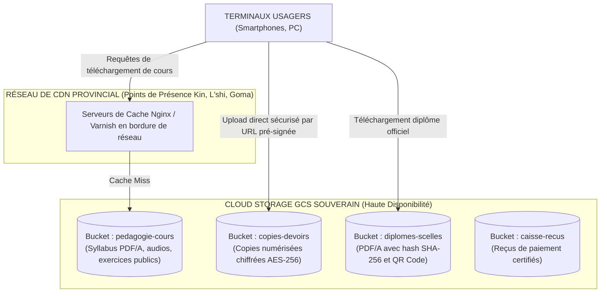
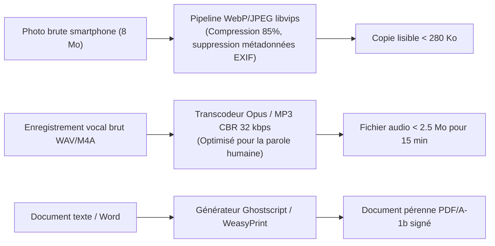

# TOME 7 — ARCHITECTURE TECHNIQUE ET INTEROPÉRABILITÉ
## 119. Stockage de Fichiers, Gestion des Médias et CDN Local Souverain

---

> **Positionnement :** Stockage objet distribué compatible S3, compression multimédia et mise en cache de proximité  
> **Autorité :** Conforme aux impératifs de souveraineté des archives et d'optimisation de la bande passante  
> **Liaison amont :** Module 118 (Infrastructure) | **Liaison aval :** Module 120 (Mode hors-ligne), Module 125 (Cache)

---

## 1. Objet et Portée du Sous-Tome

Les fichiers pédagogiques (syllabus denses, résumés audio de cours, copies de devoirs manuscrites numérisées, reçus de caisse et diplômes certifiés) représentent le volume de données le plus lourd du système. Si ces fichiers sont mal compressés ou servis depuis des serveurs situés à l'autre bout du monde, la bande passante des familles est gaspillée et l'expérience s'effondre. Ce sous-tome formalise l'infrastructure de stockage objet Cloud Storage (GCS) et le réseau de distribution de contenu (CDN) local d'ELLYSIUM.

---

## 2. Architecture du Stockage Objet Distribué (Cluster Cloud Storage (GCS))

---

## 3. Politiques d'Accès et Segmentation des Buckets

| Nom du Bucket | Niveau de Visibilité | Méthode d'Accès Sécurisée | Rétention Légale |
|---|---|---|---|
| `pedagogie-cours` | **Public en lecture** | CDN Edge avec mise en cache illimitée | Permanente |
| `copies-devoirs` | **Strictement Privé** | URL pré-signée temporaire (validité 15 min) | 5 ans après évaluation |
| `diplomes-scelles` | **Public certifié par Hachage** | Accès direct via empreinte SHA-256 unique | **50 ans minimum (Art. 76)** |
| `caisse-recus` | **Confidentiel Parent/École** | mTLS et session RBAC authentifiée | 10 ans (Normes comptables OHADA) |

---

## 4. Pipeline d'Optimisation des Formats de Médias

**Règle TECH-119-01** : Aucun fichier média n'est stocké ou servi dans son format brut d'origine. Tout fichier entrant traverse un pipeline de transcodage et compression automatique :

---

## 5. Caches Locaux d'Établissement (Edge Caching d'École)

Pour les complexes scolaires partenaires regroupant plus de 500 élèves dans une zone où la connexion Internet est coûteuse :
- ELLYSIUM déploie un **Micro-Serveur Relais d'École (CNELE Local Box)** : un mini-PC ou Raspberry Pi 4 avec un disque SSD de 512 Go connecté au réseau local Wi-Fi de l'école.
- Tous les cours, syllabus et manuels DIPROMAT y sont préchargés une fois pour toutes.
- Les élèves téléchargent leurs cours à vitesse gigabit locale (zéro consommation de forfait internet pour l'école ou les familles).

---

## 6. Verrous Techniques de Stockage

| Réf. | Intitulé | Conséquence en cas de transgression |
|---|---|---|
| **VF-119-01** | Plafond de taille pour dépôt de devoir | Tout téléversement de fichier de devoir dépassant **1.5 Mo** est immédiatement rejeté côté client avant émission sur le réseau. |
| **VF-119-02** | Purge systématique des métadonnées privées | Tout upload d'image fait l'objet d'un décapage complet de ses balises EXIF (géolocalisation GPS, identifiant de l'appareil) pour protéger la vie privée des mineurs. |

---

*Sous-tome rédigé conformément aux Normes documentaires ELLYSIUM — Fondations 04.*  
*Version 1.0 — Référence : ELLYSIUM/T7/119/v1.0*

---

## 7. Verrous Fonctionnels Critiques

| Réf. Verrou | Description Fonctionnelle et Technique | Conséquence en Cas de Violation |
| :--- | :--- | :--- |
| **`VF-119-03`** | **Interface de réclamation des bulletins non reçus** | Formulaire de demande de réédition avec traçabilité de la demande. |
| **`VF-119-04`** | **Archivage personnel des bulletins dans l'espace parent** | Coffre-fort numérique personnel pour conserver les bulletins de chaque enfant. |
| **`VF-119-05`** | **Vérification d'authenticité du bulletin par QR code** | Scan du code permettant la vérification institutionnelle immédiate. |
| **`VF-119-06`** | **Toute réponse d'API cache doit être invalidée via Cloud CDN purge sur écriture critique** | **Conséquence : violation = inéligibilité du module pour mise en production** |

---

*Sous-tome rédigé conformément aux Normes documentaires ELLYSIUM — Fondations 04.*
