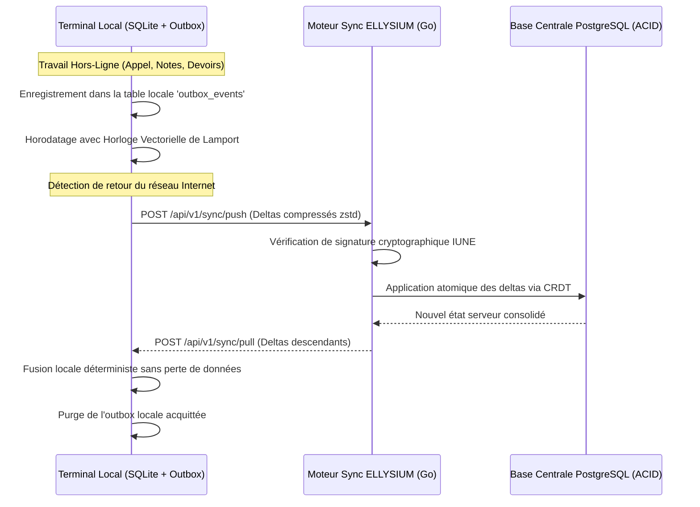

# TOME 7 — ARCHITECTURE TECHNIQUE ET INTEROPÉRABILITÉ
## 120. Mode Hors-Ligne, Synchronisation Différée et Résolution de Conflits CRDT

---

> **Positionnement :** Moteur de synchronisation Local-First, types de données répliqués sans conflit (CRDT) et résilience réseau  
> **Autorité :** Conforme au principe constitutionnel suprême de fonctionnement autonome hors-ligne (Tome 2, Art. 2)  
> **Liaison amont :** Tome 5, Module 82 (Sync Event-Driven), Module 112 (PWA), Module 113 (Mobile) | **Liaison aval :** Module 126 (Résilience réseau)

---

## 1. Objet et Portée du Sous-Tome

Dans la réalité quotidienne de la RDC, l'accès à Internet n'est pas un état permanent mais un événement intermittent. Un système éducatif qui exigerait une connexion active continue exclurait d'emblée plus de $70\%$ de la population scolaire. L'architecture **Local-First** d'ELLYSIUM pose comme postulat que le terminal de l'usager est le lieu d'exécution primaire des calculs et de la persistance. Ce sous-tome spécifie l'algorithmique mathématique des **Conflict-Free Replicated Data Types (CRDT)**, le protocole de synchronisation par deltas et la gestion déterministe des conflits.

---

## 2. Topologie de Synchronisation Client-Serveur

---

## 3. Typologie des Structures CRDT Utilisées

Pour éliminer tout risque de collision destructive lors de la fusion d'enregistrements créés simultanément hors-ligne par plusieurs acteurs :

| Domaine Métier | Type Mathématique CRDT | Règle de Résolution Algorithmique |
|---|---|---|
| **Cahier d'Appel (Présences)** | **State-based OR-Set (Observed-Remove Set)** | Une présence signalée par le professeur prévaut sur un statut indéterminé. La modification la plus récente horodatée fait foi. |
| **Cahier des Cotes** | **Append-Only Operation Log** | Chaque saisie de note est une opération immuable horodatée. En cas de double saisie, la version du professeur titulaire prévaut sur le vacataire. |
| **Profil et État Civil** | **LWW-Element-Register (Last-Write-Wins)** | Arbitrage basé sur les horloges vectorielles combinées à l'autorité du rôle le plus élevé (Direction > Enseignant > Élève). |
| **Compteurs Pédagogiques** | **PN-Counter (Positive-Negative Counter)** | Incrémentation locale indépendante des exercices résolus et somme vectorielle à la fusion. |

---

## 4. Algorithme de Synchronisation Différentielle (Protocole SyncDelta)

**Règle TECH-120-01** : Pour minimiser la consommation data de l'usager, le client ne renvoie jamais la base complète :
1. Chaque entité locale possède un identifiant de version séquentiel monotone (`local_seq`).
2. Lors du handshake de synchronisation, le client envoie son dernier numéro de séquence acquitté par le serveur (`server_checkpoint`).
3. Le serveur ne retourne que la liste différentielle stricte des mutations survenues depuis ce point de contrôle.
4. Les paquets de deltas sont compressés par l'algorithme **Zstandard (zstd)**, atteignant des taux de compression de $80\%$ sur les payloads JSON.

---

## 5. Gestion des Conflits Critiques et Arbitrage Souverain

Lorsqu'un conflit ne peut être résolu mathématiquement de manière triviale (ex. deux notes d'examen différentes attribuées par deux correcteurs distincts sur la même copie en déconnexion) :
- Le système ne bloque pas l'application.
- Les deux valeurs sont conservées dans la table des contentieux (`eval_cotes_litiges`).
- Un événement d'arbitrage est notifié au Préfet des études pour arbitrage humain contradictoire (Tome 2, Art. 8).

---

## 6. Verrous Techniques de Mode Hors-Ligne

| Réf. | Intitulé | Conséquence en cas de transgression |
|---|---|---|
| **VF-120-01** | Zéro blocage d'interface en cas de coupure | Toute tentative de requête réseau qui échoue doit basculer de manière invisible pour l'usager vers la file d'attente locale sans faire planter l'écran. |
| **VF-120-02** | Immutabilité de l'historique des opérations | Les opérations enregistrées dans la file d'attente locale (`outbox`) sont enchaînées par hachage SHA-256 local pour interdire toute falsification d'horodatage a posteriori. |

---

*Sous-tome rédigé conformément aux Normes documentaires ELLYSIUM — Fondations 04.*  
*Version 1.0 — Référence : ELLYSIUM/T7/120/v1.0*

---

## 7. Verrous Fonctionnels Critiques

| Réf. Verrou | Description Fonctionnelle et Technique | Conséquence en Cas de Violation |
| :--- | :--- | :--- |
| **`VF-120-03`** | **Vue consolidée multi-établissements pour famille dispersée** | Un parent dont des enfants sont dans différentes écoles voit tout sur un seul tableau de bord. |
| **`VF-120-04`** | **Alertes de rentrée et inscription anticipée** | Rappels de dates d'inscription aux examens et de renouvellement d'année scolaire. |
| **`VF-120-05`** | **Clôture solennelle de l'espace parents ELLYSIUM** | Validation de l'intégralité des 14 modules de l'Espace Parents et Tuteurs. |

---

*Sous-tome rédigé conformément aux Normes documentaires ELLYSIUM — Fondations 04.*
