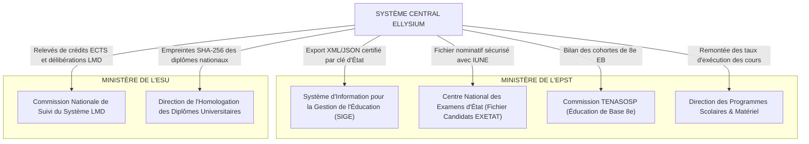

# TOME 7 — ARCHITECTURE TECHNIQUE ET INTEROPÉRABILITÉ
## 121. Interopérabilité — API Ministérielles EPST et ESU, Exports Normalisés

---

> **Positionnement :** Passerelles institutionnelles souveraines vers les ministères de tutelle (EPST, ESU) et génération des états d'État  
> **Autorité :** Conforme aux arrêtés du Ministère de l'EPST et du Ministère de l'ESU (RDC)  
> **Liaison amont :** Module 78 (Passerelles fonctionnelles) | **Liaison aval :** Module 122 (Mobile Money), Module 123 (Comptabilité)

---

## 1. Objet et Portée du Sous-Tome

ELLYSIUM n'est pas une entité isolée en marge de la République : elle est un instrument au service de l'État congolais. Pour que les études accomplies sur la plateforme soient immédiatement reconnues par les autorités scolaires et académiques, le système doit communiquer nativement avec les systèmes informatiques du Ministère de l'EPST (Direction des Examens et Concours, SIGE, DIPROMAT) et du Ministère de l'ESU (Commission Nationale LMD, Direction de la Scolarité). Ce sous-tome spécifie les connecteurs techniques et formats d'exports réglementaires.

---

## 2. Cartographie des Passerelles Ministérielles



---

## 3. Spécifications des Formats d'Exports Normalisés

### 3.1 Fichier Candidats EXETAT (Format Officiel Inspection Générale)

Le système génère pour chaque promotion de 4e des Humanités le bordereau d'enrôlement officiel conforme aux exigences du Centre de Traitement Informatique de l'EPST :

```xml
<?xml version="1.0" encoding="UTF-8"?>
<BordereauEnrolementEXETAT annee="2025-2026" provinceEducationnelle="NORD-KIVU-1">
  <Etablissement codeSECOPE="1048291" nom="INSTITUT DE GOMA">
    <Option code="101" intitule="SCIENTIFIQUE (MATHEMATIQUES-PHYSIQUE)">
      <Candidat iune="CD-EL-2025-01428590" numeroOrdre="01">
        <Identite nom="KABAMBA" postnom="ILUNGA" prenom="Gloire" sexe="M"/>
        <DateNaissance>2008-04-12</DateNaissance>
        <LieuNaissance>Goma</LieuNaissance>
        <PourcentageScolaireCycle>68.4</PourcentageScolaireCycle>
        <PhotoBase64 sha256="e3b0c44298fc1c149afbf4c8996fb92427ae41e4649b934ca495991b7852b855">...</PhotoBase64>
      </Candidat>
    </Option>
  </Etablissement>
</BordereauEnrolementEXETAT>
```

---

## 4. Protocole d'Interopérabilité LMD pour l'ESU

Pour l'enseignement supérieur, ELLYSIUM implémente le standard d'échange universitaire bilingue (Français / Anglais) conforme aux recommandations de l'UNESCO et du CAMES :
- **Relevé de Crédits ECTS** : Export JSON-LD structuré associant chaque unité d'enseignement (UE) à son volume horaire réel, ses compétences acquises et sa note certifiée.
- **Supplément au Diplôme Numérique** : Généré en PDF/A avec signature électronique X.509 d'État garantissant la reconnaissance automatique du diplôme dans l'espace international.

---

## 5. Sécurité et Non-Répudiation des Transmissions d'État

**Règle TECH-121-01** : Tout export officiel à destination des ministères est :
1. Chiffré au moyen de la clé publique officielle du Ministère de tutelle.
2. Signé numériquement avec le certificat institutionnel ELLYSIUM (norme XML-DSig ou JWS).
3. Horodaté par un serveur de temps certifié (Time-Stamping Authority - TSA).

---

## 6. Verrous Techniques d'Interopérabilité Ministérielle

| Réf. | Intitulé | Conséquence en cas de transgression |
|---|---|---|
| **VF-121-01** | Validation stricte contre schéma XSD d'État | Aucun export ministériel ne peut être validé s'il présente la moindre erreur de conformité par rapport au schéma XML Schema (XSD) officiel. |
| **VF-121-02** | Règle d'inviolabilité des listes closes | Dès qu'une liste de candidats EXETAT ou de diplômés est transmise au Ministère avec accusé de réception signé, elle devient inaltérable dans ELLYSIUM. |

---

*Sous-tome rédigé conformément aux Normes documentaires ELLYSIUM — Fondations 04.*  
*Version 1.0 — Référence : ELLYSIUM/T7/121/v1.0*

---

## 7. Verrous Fonctionnels Critiques

| Réf. Verrou | Description Fonctionnelle et Technique | Conséquence en Cas de Violation |
| :--- | :--- | :--- |
| **`VF-121-03`** | **Inventaire automatisé des ressources et équipements** | Traçabilité de tout équipement informatique attribué à un établissement. |
| **`VF-121-04`** | **Gestion des licences logicielles par établissement** | Suivi de l'expiration des licences GCP et Firebase par site de déploiement. |
| **`VF-121-05`** | **Procédure de décommissionnement sécurisé des équipements** | Effacement certifié des données locales avant retrait ou redistribution de matériel. |
| **`VF-121-06`** | **Toute réponse d'API cache doit être invalidée via Cloud CDN purge sur écriture critique** | **Conséquence : violation = inéligibilité du module pour mise en production** |

---

*Sous-tome rédigé conformément aux Normes documentaires ELLYSIUM — Fondations 04.*
