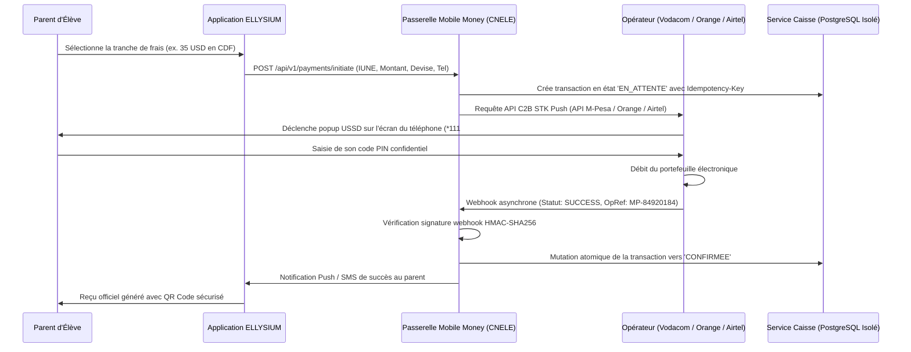

# TOME 7 — ARCHITECTURE TECHNIQUE ET INTEROPÉRABILITÉ
## 122. Interopérabilité — Passerelles Mobile Money (M-Pesa, Orange Money, Airtel Money)

---

> **Positionnement :** Intégration technique native des 3 opérateurs télécoms dominants en RDC, transactions USSD push et idempotence  
> **Autorité :** Conforme aux règlements de la Banque Centrale du Congo (BCC) sur les moyens de paiement électroniques  
> **Liaison amont :** Module 71 (Caisse d'établissement), Module 91 (Parcours parent) | **Liaison aval :** Module 123 (Comptabilité OHADA)

---

## 1. Objet et Portée du Sous-Tome

En République Démocratique du Congo, le taux de bancarisation traditionnel reste inférieur à $10\%$, tandis que la pénétration du Mobile Money dépasse $60\%$ de la population active. Aucun système de scolarité ne peut fonctionner sans une intégration directe, automatisée et sécurisée avec les trois opérateurs télécoms nationaux : **Vodacom M-Pesa**, **Orange Money** et **Airtel Money**. Ce sous-tome spécifie l'architecture des connecteurs de paiement, le flux de prompt USSD et la garantie absolue d'idempotence transactionnelle.

---

## 2. Architecture de la Passerelle Unifiée de Paiement

---

## 3. Spécifications des Connecteurs par Opérateur Télécom

### 3.1 Vodacom M-Pesa RDC (Open API M-Pesa)
- **Protocole** : REST sur TLS 1.3 avec chiffrement de session AES-128-CBC et authentification par jeton Bearer dynamique.
- **Fonctionnalité clé** : C2B (Customer to Business) avec prompt direct sur carte SIM (Push STK).
- **Format de référence transaction** : Numéro unique à 10 caractères alphanumériques (ex. `09A4B8C1D2`).

### 3.2 Orange Money RDC (Orange Money Web Payment & USSD Push)
- **Protocole** : HTTPS REST avec clé marchand et chiffrement des payloads.
- **Fonctionnalité clé** : Déclenchement d'un menu d'autorisation USSD prioritaire sur le réseau Orange.
- **Format de référence transaction** : Code `OM-CD-XXXXXXXXXX`.

### 3.3 Airtel Money RDC (Airtel Africa Developer Portal)
- **Protocole** : REST API OAuth2 v2.0 avec signature de requête asymétrique.
- **Fonctionnalité clé** : API Collections C2B avec acquittement instantané par webhook sécurisé.
- **Format de référence transaction** : Code `AM-CD-XXXXXXXXXX`.

---

## 4. Idempotence Absolue et Prévention des Doubles Débits

**Règle TECH-122-01** : Pour interdire tout double prélèvement d'un parent en cas de saut de réseau :
- Chaque intention de paiement génère un UUID unique d'idempotence (`idempotency_key`) calculé comme suit :
$$\text{Key} = \text{SHA-256}(\text{IUNE} + \text{TrancheID} + \text{Montant} + \text{DateJour})$$
- La table de données applique une contrainte d'unicité stricte sur cette clé ainsi que sur l'identifiant de transaction fourni par l'opérateur (`reference_operateur_unique`).
- Si deux webhooks identiques arrivent de l'opérateur, le second est acquitté immédiatement en HTTP 200 sans altérer les soldes comptables.

---

## 5. Gestion de la Double Monnaie (USD / CDF)

Conformément à la réglementation de la Banque Centrale du Congo (BCC) :
- Les frais scolaires peuvent être libellés en Dollars américains (USD) ou en Francs congolais (CDF).
- La passerelle consulte quotidiennement le taux indicatif officiel de la BCC et permet à l'établissement d'appliquer le taux légal en vigueur sans marge spéculative abusive.
- Le reçu de paiement mentionne obligatoirement les deux montants : le montant facturé et le montant effectivement débité en monnaie locale.

---

## 6. Verrous Techniques Mobile Money

| Réf. | Intitulé | Conséquence en cas de transgression |
|---|---|---|
| **VF-122-01** | Vérification de signature webhook obligatoire | Tout webhook de confirmation de paiement dont la signature cryptographique ne correspond pas au secret de l'opérateur est immédiatement rejeté et classé comme tentative d'intrusion financière. |
| **VF-122-02** | Timeout de transaction non acquittée | Toute transaction en attente depuis plus de **15 minutes** sans retour de l'opérateur bascule automatiquement en état *EXPIREE* et libère la réservation. |

---

*Sous-tome rédigé conformément aux Normes documentaires ELLYSIUM — Fondations 04.*  
*Version 1.0 — Référence : ELLYSIUM/T7/122/v1.0*

---

## 7. Verrous Fonctionnels Critiques

| Réf. Verrou | Description Fonctionnelle et Technique | Conséquence en Cas de Violation |
| :--- | :--- | :--- |
| **`VF-122-03`** | **Test de charge trimestriel obligatoire** | Simulation d'usage concurrent de 10 000 utilisateurs chaque trimestre. |
| **`VF-122-04`** | **Pré-chauffe des instances avant les examens nationaux** | Mise en alerte maximale de Cloud Run 48h avant les sessions d'examens. |
| **`VF-122-05`** | **Rapport de performance transmis au COPIL** | Indicateurs de temps de réponse et taux d'erreur mensuels publiés. |
| **`VF-122-06`** | **Toute réponse d'API cache doit être invalidée via Cloud CDN purge sur écriture critique** | **Conséquence : violation = inéligibilité du module pour mise en production** |

---

*Sous-tome rédigé conformément aux Normes documentaires ELLYSIUM — Fondations 04.*
