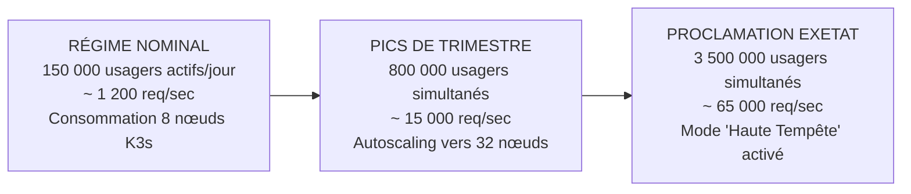
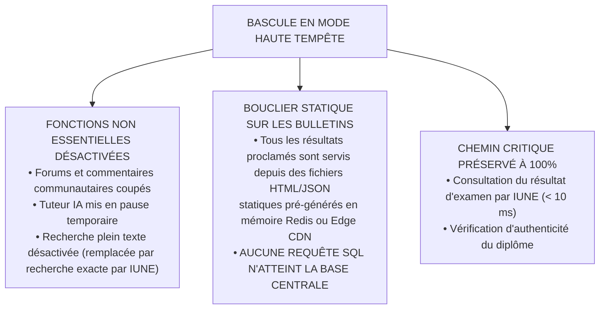

# TOME 7 — ARCHITECTURE TECHNIQUE ET INTEROPÉRABILITÉ
## 124. Gestion de la Charge, Montée en Volume et Haute Performance

---

> **Positionnement :** Stratégie de scalabilité, gestion des pics de consultation massifs (proclamations EXETAT) et dégradation gracieuse  
> **Autorité :** Conforme aux objectifs de continuité de service public de l'État sous contrainte extrême  
> **Liaison amont :** Module 107 (Principes techniques), Module 114 (Bases de données) | **Liaison aval :** Module 125 (Cache), Module 126 (Résilience)

---

## 1. Objet et Portée du Sous-Tome

Les systèmes scolaires et universitaires présentent une courbe de charge atypique : un trafic modéré et prévisible pendant les semaines ordinaires de cours, brutalement suivi de pics paroxystiques lors de la rentrée scolaire, des fins de trimestres et surtout lors de la **proclamation nationale des résultats de l'Examen d'État (EXETAT)**, où plusieurs millions de familles se connectent simultanément en l'espace de quelques minutes. Ce sous-tome spécifie l'ingénierie de montée en charge et le mécanisme de dégradation gracieuse.

---

## 2. Modélisation Mathématique des Profils de Charge

---

## 3. Stratégie d'Autoscaling Horizontal (K3s HPA)

Le cluster K3s déploie un **Horizontal Pod Autoscaler (HPA)** couplé à des métriques personnalisées exposées par Prometheus :
- **Seuil de déclenchement CPU** : Déclenchement d'un nouveau réplica dès que l'utilisation CPU moyenne dépasse **$65\%$**.
- **Seuil de latence HTTP** : Déclenchement immédiat dès que le temps de réponse moyen au reverse-proxy dépasse **$80\text{ ms}$**.
- **Vitesse de montée (Scale-Up)** : Capacité à quadrupler le nombre d'instances de conteneurs en moins de **90 secondes**.
- **Stabilisation de descente (Scale-Down)** : Période de refroidissement de **15 minutes** pour éviter les oscillations intempestives (*flapping*).

---

## 4. Politique de Dégradation Gracieuse (Mode "Haute Tempête")

**Règle TECH-124-01** : Lorsque la charge globale du système franchit le seuil critique de $45\,000\text{ req/sec}$ (surveillance temps réel via circuit breaker global), la plateforme bascule automatiquement en **Mode Haute Tempête** :

---

## 5. Nivellement de Charge par Files d'Attente (Queue-Based Load Leveling)

Pour les opérations lourdes d'écriture (ex. 50 000 enseignants validant leurs cotes au dernier jour du trimestre) :
- La requête de l'enseignant est immédiatement acquittée avec un accusé de réception local (`HTTP 202 Accepted`).
- La charge de calcul mathématique de la formule RDC est insérée dans une file de messages persistante NATS JetStream.
- Des workers Go d'arrière-plan dépilent les calculs de manière constante et régulée, sans saturer les verrous de la base PostgreSQL.

---

## 6. Verrous Techniques de Gestion de Charge

| Réf. | Intitulé | Conséquence en cas de transgression |
|---|---|---|
| **VF-124-01** | Interdiction des requêtes N+1 en production | Tout code backend générant des requêtes SQL itératives non jointes (problème N+1) sur des listes d'élèves est formellement bloqué par les tests de performance. |
| **VF-124-02** | Plafond de temps d'exécution synchrone | Aucun contrôleur HTTP synchrone ne peut exécuter une opération durant plus de **800 millisecondes**. Au-delà, l'opération doit obligatoirement être asynchrone. |

---

*Sous-tome rédigé conformément aux Normes documentaires ELLYSIUM — Fondations 04.*  
*Version 1.0 — Référence : ELLYSIUM/T7/124/v1.0*

---

## 7. Verrous Fonctionnels Critiques

| Réf. Verrou | Description Fonctionnelle et Technique | Conséquence en Cas de Violation |
| :--- | :--- | :--- |
| **`VF-124-03`** | **Gestion des secrets via Google Secret Manager** | Interdiction absolue de stocker des clés API ou mots de passe en dur dans le code source. |
| **`VF-124-04`** | **Rotation automatique des clés cryptographiques** | Clés Cloud KMS renouvelées automatiquement selon les politiques de rotation annuelle. |
| **`VF-124-05`** | **Audit de sécurité Cloud armé par Cloud Security Command Center** | Tableau de bord unifié de vulnérabilités scanné en continu. |

---

*Sous-tome rédigé conformément aux Normes documentaires ELLYSIUM — Fondations 04.*
