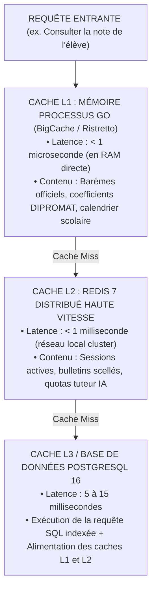

# TOME 7 — ARCHITECTURE TECHNIQUE ET INTEROPÉRABILITÉ
## 125. Gestion du Cache Multi-Niveaux et Optimisation Avancée des Requêtes

---

> **Positionnement :** Stratégie de mise en cache à trois niveaux (L1/L2/L3), invalidation déterministe et indexation SQL poussée  
> **Autorité :** Conforme aux objectifs d'économie d'énergie serveur et d'optimisation de latence (Module 107)  
> **Liaison amont :** Module 114 (Bases de données), Module 124 (Charge) | **Liaison aval :** Module 126 (Résilience réseau)

---

## 1. Objet et Portée du Sous-Tome

Dans un système servant des millions d'apprenants avec un budget d'infrastructure maîtrisé, la requête la plus rapide et la moins coûteuse est celle qui n'atteint jamais la base de données relationnelle. Une stratégie de cache défaillante engendre soit des incohérences de notes dramatiques (cache périmé), soit l'effondrement de la base sous l'effet du "Cache Stampede". Ce sous-tome formalise la hiérarchie de cache à trois niveaux et l'indexation chirurgicale de la base PostgreSQL.

---

## 2. Architecture de Cache à Trois Niveaux (L1 / L2 / L3)



---

## 3. Stratégies d'Alimentation et d'Invalidation du Cache

### 3.1 Modèle Cache-Aside avec Verrou Anti-Stampede

Pour empêcher que 5 000 requêtes simultanées ne se ruent sur la base de données lorsque la clé d'un bulletin de classe expire :

```go
// Patron de verrouillage distribué pour éviter le Cache Stampede
func GetBulletin(ctx context.Context, classID string) (*Bulletin, error) {
    // 1. Lecture Redis L2
    if data, err := redis.Get(ctx, "bulletin:"+classID); err == nil {
        return deserialize(data), nil
    }
    
    // 2. Acquisition d'un mutex distribué (Redlock)
    lock := redis.AcquireLock("lock:bulletin:"+classID, 5*time.Second)
    if lock.Acquired() {
        defer lock.Release()
        // Requête PostgreSQL
        bulletin := db.QueryBulletinFromPostgres(classID)
        redis.SetWithTTL("bulletin:"+classID, serialize(bulletin), 1*time.Hour)
        return bulletin, nil
    }
    
    // Si verrou non acquis, attente brève et nouvelle lecture du cache repeuplé
    time.Sleep(50 * time.Millisecond)
    return GetBulletin(ctx, classID)
}
```

---

## 4. Optimisation des Index PostgreSQL et Index-Only Scans

**Règle TECH-125-01** : Pour garantir que les consultations de notes et de listes d'élèves ne déclenchent aucun parcours de table séquentiel (*Seq Scan* interdit sur tables volumineuses) :

### 4.1 Index Couvrants (Covering Indexes avec clause INCLUDE)

```sql
-- Index permettant un Index-Only Scan parfait pour l'affichage du cahier de cotes
CREATE INDEX idx_cotes_classe_matiere 
ON eval_cotes_journalieres (classe_id, matiere_code, date_evaluation)
INCLUDE (iune, note, maximum, mention);
```
Grâce à la clause `INCLUDE`, PostgreSQL extrait les notes directement depuis l'arbre B-Tree en mémoire vive sans effectuer le moindre accès disque vers la table physique principale.

### 4.2 Index Partiels pour Éliminer les Lignes Obsolètes

```sql
-- Index ne portant que sur les inscriptions actives (ignore les abandons et archivés)
CREATE INDEX idx_inscriptions_actives 
ON registre_inscriptions (annee_scolaire, code_ecole)
WHERE statut = 'ACTIF' AND deleted_at IS NULL;
```

---

## 5. Audit Continu des Requêtes Lentes (Slow Queries)

- Le module PostgreSQL `pg_stat_statements` est activé en permanence.
- Toute requête SQL dont le temps d'exécution moyen dépasse **50 millisecondes** est automatiquement injectée dans le canal de veille technique pour révision d'indexation.

---

## 6. Verrous Techniques de Gestion du Cache

| Réf. | Intitulé | Conséquence en cas de transgression |
|---|---|---|
| **VF-125-01** | Invalidation événementielle obligatoire | Toute mise à jour ou scellement de cote doit obligatoirement émettre un ordre d'invalidation explicite de la clé de cache correspondante sur le bus Redis. |
| **VF-125-02** | TTL obligatoire sur toute clé de cache | Aucune clé ne peut être insérée dans Redis sans durée de vie (TTL) définie. L'insertion d'une clé sans TTL est bloquée par l'adaptateur de persistance. |

---

*Sous-tome rédigé conformément aux Normes documentaires ELLYSIUM — Fondations 04.*  
*Version 1.0 — Référence : ELLYSIUM/T7/125/v1.0*
