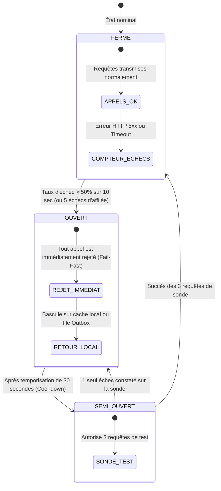

# TOME 7 — ARCHITECTURE TECHNIQUE ET INTEROPÉRABILITÉ
## 126. Résilience aux Échecs Réseau — Circuit Breaker, Politiques de Réessai et Timeouts

---

> **Positionnement :** Ingénierie de la tolérance aux pannes, disjoncteurs logiciels (Circuit Breakers) et gestion des réseaux intermittents  
> **Autorité :** Conforme au principe de résilience totale en environnement technologique dégradé  
> **Liaison amont :** Module 107 (Principes), Module 120 (Hors-ligne) | **Liaison aval :** Module 127 (Environnements), Module 128 (CI/CD)

---

## 1. Objet et Portée du Sous-Tome

Dans les télécommunications d'Afrique centrale, les micro-coupures de liens satellitaires, les engorgements de cellules 3G/4G et les coupures physiques de câbles de fibre optique sont des réalités opérationnelles ordinaires. Si une application attend indéfiniment une réponse réseau, les threads s'accumulent, la mémoire sature et le système entier s'effondre en cascade. Ce sous-tome formalise l'implémentation du patron **Circuit Breaker (Disjoncteur logiciel)**, des politiques de réessai déterministes et des garde-fous de latence.

---

## 2. Machine à États du Circuit Breaker

Tout appel réseau sortant (vers une passerelle Mobile Money, un ministère ou un microservice interne) est enveloppé par un disjoncteur logiciel implémentant 3 états stricts :



---

## 3. Matrice des Délais d'Expiration (Timeouts Déterministes)

**Règle TECH-126-01** : Aucun appel réseau dans ELLYSIUM ne peut exister sans un timeout explicite. Les valeurs maximales tolérées sont arrêtées comme suit :

| Nature de l'Opération | Timeout Connexion (TCP) | Timeout Lecture Réponse | Timeout Global Transaction |
|---|---|---|---|
| **Requête API Client vers Passerelle** | **$1.5$ sec** | **$3.0$ sec** | **$4.5$ sec** |
| **Requête Inter-Microservices (mTLS)** | **$200$ ms** | **$800$ ms** | **$1.0$ sec** |
| **Requête SQL vers PostgreSQL** | **$50$ ms** | **$500$ ms** | **$1.0$ sec** |
| **Appel API Mobile Money Externe** | **$2.0$ sec** | **$6.0$ sec** | **$8.0$ sec** |
| **Téléversement de Devoir Manuscrit** | **$3.0$ sec** | **$12.0$ sec** | **$15.0$ sec** |

---

## 4. Algorithme de Réessai avec Exponential Backoff et Gigue

Pour éviter l'effet de tempête sur un serveur en phase de rétablissement :

```go
// Calcul du délai avant nouvelle tentative
func CalculateBackoff(attempt int, baseDelay time.Duration, maxDelay time.Duration) time.Duration {
    // Calcul exponentiel : base * 2^(attempt)
    temp := float64(baseDelay) * math.Pow(2, float64(attempt))
    if temp > float64(maxDelay) {
        temp = float64(maxDelay)
    }
    // Ajout d'une gigue aléatoire de 25% (Full Jitter) pour désynchroniser les clients
    jitter := rand.Float64() * (temp * 0.25)
    return time.Duration(temp + jitter)
}
```

---

## 5. Dégradation Gracieuse et Réponses Dégradées (Fallbacks)

Lorsqu'un circuit breaker passe à l'état **OUVERT** :
- Le client applicatif ne reçoit jamais une page d'erreur blanche.
- Le système renvoie immédiatement la dernière valeur mise en cache localement avec un en-tête d'avertissement : `Warning: 110 - "Données locales temporaires, synchronisation en attente"`.
- L'utilisateur peut continuer sa saisie ou sa lecture sans blocage.

---

## 6. Verrous Techniques de Résilience

| Réf. | Intitulé | Conséquence en cas de transgression |
|---|---|---|
| **VF-126-01** | Interdiction formelle des retries infinis | Aucun appel réseau ne peut être réessayé plus de **3 fois consécutives** de manière synchrone. Au-delà, l'opération bascule en file d'attente asynchrone différée. |
| **VF-126-02** | Obligation de timeout sur requêtes SQL | Toute session PostgreSQL configure un `statement_timeout = '2s'` obligatoire pour empêcher les requêtes orphelines de verrouiller les tables. |

---

*Sous-tome rédigé conformément aux Normes documentaires ELLYSIUM — Fondations 04.*  
*Version 1.0 — Référence : ELLYSIUM/T7/126/v1.0*

---

## 7. Verrous Fonctionnels Critiques

| Réf. Verrou | Description Fonctionnelle et Technique | Conséquence en Cas de Violation |
| :--- | :--- | :--- |
| **`VF-126-03`** | **Pipeline CI/CD signé avec vérification d'intégrité** | Chaque build Cloud Build est signé avec une attestation Binary Authorization. |
| **`VF-126-04`** | **Rollback automatique en cas d'augmentation du taux d'erreur** | Retour à la version précédente déclenché si le taux d'erreur dépasse 5% en 5 minutes. |
| **`VF-126-05`** | **Environnement de staging miroir de la production** | Promotion impossible de staging vers prod sans validation du RSSI et du CTO. |

---

*Sous-tome rédigé conformément aux Normes documentaires ELLYSIUM — Fondations 04.*
