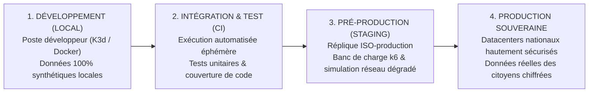

# TOME 7 — ARCHITECTURE TECHNIQUE ET INTEROPÉRABILITÉ
## 127. Environnements de Déploiement — Dev, Test, Staging et Production Souveraine

---

> **Positionnement :** Segmentation des cycles d'environnements, gestion des secrets et étanchéité des données de production  
> **Autorité :** Conforme aux normes de protection de la vie privée des mineurs et à la sécurité opérationnelle  
> **Liaison amont :** Module 118 (Infrastructure), Module 126 (Résilience) | **Liaison aval :** Module 128 (CI/CD)

---

## 1. Objet et Portée du Sous-Tome

Un système éducatif d'État ne peut tolérer qu'un développeur teste un nouveau calcul de cote directement sur la base de données réelle de production. L'étanchéité absolue entre les environnements de développement, de qualification et de production est une condition sine qua non de la souveraineté numérique. Ce sous-tome définit la typologie des 4 environnements, la politique de génération de données de test synthétiques et la gestion sécurisée des secrets d'infrastructure.

---

## 2. Typologie des 4 Environnements Étanchement Isolés

---

## 3. Matrice de Configuration des Environnements

| Caractéristique | Développement (Dev) | Intégration (Test / CI) | Pré-Production (Staging) | Production Souveraine (Prod) |
|---|---|---|---|---|
| **Accès Réseau** | Localhost / VPN interne | Réseau éphémère CI | VPN dédié audité | Réseau public filtré par WAF d'État |
| **Bases de Données** | SQLite / PostgreSQL local | PostgreSQL conteneurisé temporaire | Cluster PostgreSQL miroir (tailles réelles) | Cluster Haute Disponibilité Multi-Nœuds |
| **Données Utilisateurs** | Fictives générées (Faker) | Fictives certifiées | Jeux synthétiques massifs (1M élèves) | **Données réelles chiffrées AES-256** |
| **Passerelles Telco** | Simulateur Mobile Money Mock | Mocks automatisés avec retours 200/500 | Sandbox développeur Vodacom/Orange/Airtel | **Comptes marchands réels bancaires** |
| **Niveau de Journalisation** | `DEBUG` verbeux | `INFO` / Traces de tests | `WARN` / Métriques de latence | `ERROR` / Audit Trail Merkle Tree |

---

## 4. Politique de Données Synthétiques (Zéro Donnée Réelle en Dev/Test)

**Règle TECH-127-01** : Il est formellement interdit d'exporter ou d'importer une copie de sauvegarde de la base de production vers un poste de développement ou un environnement de staging.
- ELLYSIUM dispose d'un **générateur de population synthétique** (`tools/seed_generator.go`).
- Ce générateur crée des cohortes réalistes avec des noms, post-noms congolais authentiques (ex. *Mukendi*, *Ilunga*, *Mwamba*), des classes conformes aux programmes DIPROMAT et des numéros de téléphone fictifs réservés aux tests (`+243 800 000 XXX`).

---

## 5. Gestion des Secrets et Chiffrement des Configurations

- **Zéro secret dans le code Git** : Aucun mot de passe, jeton d'API ou clé privée ne peut être commité dans les dépôts de code (contrôlé par l'outil d'analyse statique *git-secrets*).
- **Injection dynamique des secrets** : En production, les clés d'API Mobile Money et certificats d'État sont injectés dynamiquement en mémoire vive au démarrage des conteneurs via **Google Secret Manager** (couplé à **Cloud KMS**), avec rotation automatique des versions et audit d'accès complet.

---

## 6. Verrous Techniques d'Environnement

| Réf. | Intitulé | Conséquence en cas de transgression |
|---|---|---|
| **VF-127-01** | Détection d'IP de production en environnement dev | Tout service s'exécutant avec le flag `ENV=development` qui tente d'établir une connexion réseau vers une IP ou un nom de domaine de production est immédiatement avorté par blocage réseau interne. |
| **VF-127-02** | Obligation de passage staging avant prod | Aucun déploiement en production ne peut intervenir sans avoir été exécuté et validé sans erreur sur l'environnement de staging pendant au moins **2 heures consécutives**. |

---

*Sous-tome rédigé conformément aux Normes documentaires ELLYSIUM — Fondations 04.*  
*Version 1.0 — Référence : ELLYSIUM/T7/127/v1.0*

---

## 7. Verrous Fonctionnels Critiques

| Réf. Verrou | Description Fonctionnelle et Technique | Conséquence en Cas de Violation |
| :--- | :--- | :--- |
| **`VF-127-03`** | **Scan de vulnérabilité de toutes les images Docker** | Artifact Registry bloque le déploiement de toute image avec CVE critique non patchée. |
| **`VF-127-04`** | **Revue de code obligatoire par deux développeurs seniors** | Fusion de toute PR impactant le moteur de délibération bloquée sans double approbation. |
| **`VF-127-05`** | **Traçabilité Git complète de chaque ligne de code déployée** | Lien biunivoque entre chaque commit et son ticket de feature ou de bug. |

---

*Sous-tome rédigé conformément aux Normes documentaires ELLYSIUM — Fondations 04.*
