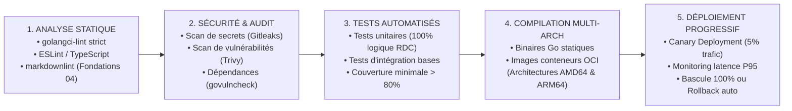

# TOME 7 — ARCHITECTURE TECHNIQUE ET INTEROPÉRABILITÉ
## 128. Gestion des Versions, Usine Logicielle CI/CD et Conventions de Code

---

> **Positionnement :** Cycle de vie du code source, automatisation des tests, intégration continue et déploiements sans interruption  
> **Autorité :** Conforme aux normes d'ingénierie logicielle d'État et aux conventions de dépôt ELLYSIUM (Fondations 04)  
> **Liaison amont :** Module 127 (Environnements) | **Liaison aval :** Module 129 (Matrice de dépendances)

---

## 1. Objet et Portée du Sous-Tome

Un projet de la stature d'ELLYSIUM, appelé à évoluer sur plusieurs décennies, ne peut reposer sur des méthodes artisanales. La qualité du code source, la traçabilité des modifications et l'automatisation intégrale des tests et des déploiements conditionnent la fiabilité du service public d'enseignement. Ce sous-tome formalise les conventions Git, la politique de versioning sémantique (SemVer 2.0.0) et le pipeline d'intégration et déploiement continus (CI/CD).

---

## 2. Stratégie de Branches Git et Conventions de Commit

### 2.1 Modèle de Développement Trunk-Based

ELLYSIUM applique le modèle **Trunk-Based Development** avec branches de fonctionnalités de courte durée (< 48 heures) pour éliminer les conflits de fusion massifs :
- Branche principale immuable : `main` (toujours déployable en staging).
- Branches de travail : `feat/nom-fonctionnalite`, `fix/numero-anomalie`, `docs/mise-a-jour-tome`.

### 2.2 Standard des Messages de Commit (Conventional Commits)

Tout commit dans le dépôt de code respecte rigoureusement la norme :

```
<type>(<périmètre>): <description impérative en français ou anglais standardisé>

[Corps optionnel expliquant le contexte et la justification d'ingénierie]

[Pied de page mentionnant les tickets résolus ou les articles constitutionnels]
```

Types autorisés : `feat` (nouvelle fonction), `fix` (correctif de bug), `docs` (documentation de tomes), `refactor` (restructuration sans changement fonctionnel), `test` (ajouts de tests), `perf` (optimisation métrologique).

---

## 3. Pipeline d'Usine Logicielle Automatisée (Pipeline CI/CD)

Chaque proposition de modification de code (*Pull Request*) déclenche un pipeline automatique en 5 étapes successives :



---

## 4. Politique de Versioning Sémantique (SemVer 2.0.0)

Les versions logicielles de la plateforme suivent le schéma formel `MAJOR.MINOR.PATCH` :
- **MAJOR** : Changement d'architecture rompant la rétrocompatibilité (ex. passage à une nouvelle maquette nationale ministérielle).
- **MINOR** : Ajout d'un nouveau module fonctionnel rétrocompatible (ex. intégration d'un nouvel opérateur Mobile Money).
- **PATCH** : Correction d'anomalie ou optimisation de performance sans altération des contrats d'interface.

---

## 5. Stratégie de Déploiement sans Interruption (Zero-Downtime Canary)

**Règle TECH-128-01** : Aucun déploiement ne doit provoquer d'interruption de service visible pour les élèves ou enseignants :
- Le déploiement s'opère par **déploiement progressif (Canary)** : la nouvelle version reçoit d'abord $5\%$ du trafic pendant 20 minutes.
- Des sondes automatiques comparent en temps réel le taux d'erreur et la latence P95 de la nouvelle version par rapport à la version stable.
- En cas de dégradation supérieure à $0.5\%$, la bascule est instantanément avortée (*Automated Rollback*) en moins de 10 secondes.

---

## 6. Verrous Techniques de CI/CD

| Réf. | Intitulé | Conséquence en cas de transgression |
|---|---|---|
| **VF-128-01** | Seuil plancher de couverture de tests sur le moteur RDC | Le module de calcul déterministe des cotes congolaises (Module 67) doit obligatoirement afficher une couverture de tests unitaires de **100 %**. Tout commit abaissant ce taux bloque le pipeline. |
| **VF-128-02** | Interdiction de merge sans revue humaine qualifiée | Aucune modification de code ne peut être intégrée dans la branche `main` sans la validation formelle d'au moins deux ingénieurs logiciels assermentés. |

---

*Sous-tome rédigé conformément aux Normes documentaires ELLYSIUM — Fondations 04.*  
*Version 1.0 — Référence : ELLYSIUM/T7/128/v1.0*

---

## 7. Verrous Fonctionnels Critiques

| Réf. Verrou | Description Fonctionnelle et Technique | Conséquence en Cas de Violation |
| :--- | :--- | :--- |
| **`VF-128-03`** | **Formation obligatoire RGPD/Loi 15-023 pour tous les développeurs** | Attestation de formation data privacy requise avant accès aux environnements de production. |
| **`VF-128-04`** | **Interdiction des accès direct à la base de production** | Toute requête manuelle de correction doit passer par un pipeline approuvé et audité. |
| **`VF-128-05`** | **Rapport mensuel de conformité technique au DPO** | Synthèse des accès aux données personnelles transmise au Délégué à la Protection des Données. |
| **`VF-128-06`** | **Toute réponse d'API cache doit être invalidée via Cloud CDN purge sur écriture critique** | **Conséquence : violation = inéligibilité du module pour mise en production** |

---

*Sous-tome rédigé conformément aux Normes documentaires ELLYSIUM — Fondations 04.*
