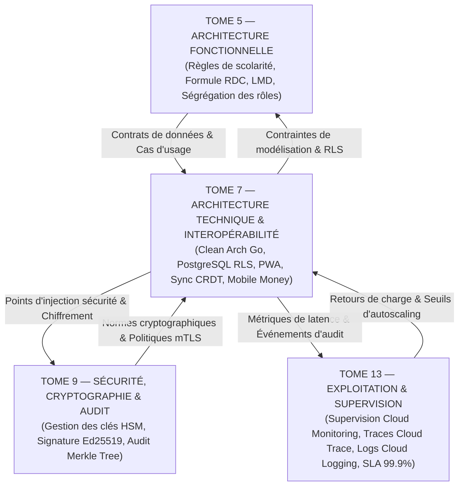

# TOME 7 — ARCHITECTURE TECHNIQUE ET INTEROPÉRABILITÉ
## 129. Matrice des Dépendances Formelle — Liaisons avec les Tomes 5, 9 et 13

---

> **Positionnement :** Cartographie des dépendances contractuelles du socle technique avec la fonction, la sécurité et l'exploitation  
> **Autorité :** Conforme aux conventions de traçabilité intégrale ELLYSIUM (Fondations 04)  
> **Liaison amont :** Tome 5 (Fonctionnel), Tome 6 (Design System) | **Liaison aval :** Tome 9 (Sécurité), Tome 13 (Exploitation)

---

## 1. Objet et Portée du Sous-Tome

L'architecture technique (Tome 7) est le moteur exécutif de l'ensemble du projet ELLYSIUM. Elle matérialise les spécifications fonctionnelles du Tome 5, applique les contraintes cryptographiques et défensives du Tome 9 (Sécurité & Cryptographie), et fournit les métriques d'observabilité et sondes de supervision requises par le Tome 13 (Exploitation, Monitoring & Maintenance). Ce sous-tome formalise la matrice des dépendances croisées fermant le cycle d'ingénierie du Tome 7.

---

## 2. Diagramme d'Interconnexion des Tomes Fondamentaux

---

## 3. Matrice de Traçabilité Croisée Inter-Tomes

| Module Tome 7 (Technique) | Dépendance Fonctionnelle (Tome 5) | Dépendance Sécurité (Tome 9) | Dépendance Exploitation (Tome 13) | Contrat d'Interface & Invariants Assurés |
|---|---|---|---|---|
| **108. Conformité Constitution** | Mod. 56 (Constitution) | Mod. 152 (HSM d'État) | Mod. 220 (Audit légal) | Zéro décision automatique d'IA sur les cotes, étanchéité pédagogie/finances absolue. |
| **111. Clean Architecture** | Mod. 67 (Moteur déterministe) | Mod. 154 (Immutabilité) | Mod. 222 (Tests unitaires) | Isolation pure du domaine de calcul de la formule officielle RDC (zéro dépendance SQL). |
| **114. Base de données PostgreSQL** | Mod. 60 (Dossier IUNE) | Mod. 155 (Chiffrement RLS) | Mod. 224 (Archivage WAL) | Cloisonnement strict des écoles partenaires par Row-Level Security, partitionnement provincial. |
| **117. Authentification JWT/mTLS** | Mod. 58 (Entonnoir d'accès) | Mod. 156 (Signatures Ed25519)| Mod. 225 (Traçabilité IAM) | Validité hors-ligne jusqu'à 30 jours, révocation sub-milliseconde via Cloud Memorystore Blacklist. |
| **119. Stockage Cloud Storage (GCS) & CDN** | Mod. 73 (Bibliothèque OER) | Mod. 158 (Chiffrement at-rest)| Mod. 227 (SLA Bande passante)| Compression WebP < 280 Ko, formats pérennes PDF/A signés pour diplômes et reçus. |
| **120. Synchronisation CRDT** | Mod. 82 (Sync Event-Driven) | Mod. 160 (Anti-falsification) | Mod. 229 (Métriques sync) | Fonctionnement local-first intégral, résolution mathématique des conflits sans écrasement. |
| **121. Interopérabilité Ministères** | Mod. 78 (Passerelles) | Mod. 162 (Certificats X.509) | Mod. 231 (Bordereaux SIGE) | Fichiers EXETAT/TENASOSP conformes aux schémas XML officiels de l'Inspection Générale. |
| **122. Passerelles Mobile Money** | Mod. 71 (Caisse d'école) | Mod. 163 (HMAC Webhooks) | Mod. 232 (Rapprochement auto)| Idempotence absolue, support bimonétaire USD/CDF selon taux officiel BCC. |
| **124. Gestion de la Charge** | Mod. 75 (Examens) | Mod. 165 (Anti-DDoS WAF) | Mod. 234 (Autoscaling GKE Autopilot) | Mode "Haute Tempête" pour absorber 65 000 req/sec lors des proclamations EXETAT. |
| **126. Résilience & Circuit Breaker**| Mod. 81 (Exceptions) | Mod. 167 (Fail-Safe Modes) | Mod. 236 (Alerting Pager) | Timeouts stricts à tous les étages, bascule automatique sur données locales en cache. |
| **128. Usine CI/CD** | Mod. 83 (Matrice globale) | Mod. 169 (Scan SAST/DAST) | Mod. 238 (GitOps Cloud Deploy) | Déploiement Canary sans interruption de service, rollback automatisé en < 10 sec. |

---

## 4. Protocole d'Arbitrage Architecture vs Contraintes Métier

En cas de divergence apparente entre un impératif technique (ex. limitation de bande passante réseau) et une exigence pédagogique (ex. transmission de documents riches d'examens) :
1. **Primauté absolue de la Constitution** : La gratuité pour les indépendants (Art. 4) et la non-discrimination d'accès (Art. 3) l'emportent sur toute considération de facilité technique.
2. **Recherche de la solution frugale maximale** : Au lieu de bloquer la fonction ou d'imposer un surcoût à l'usager, l'ingénierie adapte les algorithmes de compression (ex. vectorisation, synthèse vocale locale, formats de deltas).
3. **Validation collégiale** : Tout arbitrage majeur est consigné au registre des décisions architecturales (*Architectural Decision Record - ADR*) du projet.

---

*Sous-tome rédigé conformément aux Normes documentaires ELLYSIUM — Fondations 04.*  
*Version 1.0 — Référence : ELLYSIUM/T7/129/v1.0*

---

## 7. Verrous Fonctionnels Critiques

| Réf. Verrou | Description Fonctionnelle et Technique | Conséquence en Cas de Violation |
| :--- | :--- | :--- |
| **`VF-129-01`** | **Dépendance amont obligatoire avec le Tome 5 (Fonctionnel)** | Toute composante technique du Tome 7 doit trouver son besoin fonctionnel défini au Tome 5. |
| **`VF-129-02`** | **Dépendance amont obligatoire avec le Tome 6 (UX)** | Le frontend technique implémente strictement les spécifications ergonomiques du Tome 6. |
| **`VF-129-03`** | **Dépendance aval avec le Tome 8 (Infrastructure et Sécurité)** | Les services applicatifs s'appuient exclusivement sur l'infrastructure sécurisée du Tome 8. |
| **`VF-129-04`** | **Compatibilité bidirectionnelle avec le Tome 12 (Applications)** | Le Tome 7 fournit les APIs consommées par les applications web, Android et offline. |
| **`VF-129-05`** | **Clôture solennelle du Tome 7** | Validation de l'intégralité de l'architecture technique de la plateforme ELLYSIUM. |

---

*Sous-tome rédigé conformément aux Normes documentaires ELLYSIUM — Fondations 04.*
