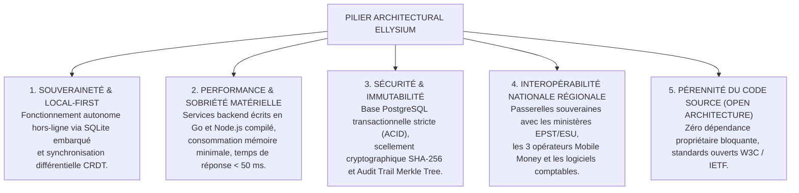

# TOME 7 — ARCHITECTURE TECHNIQUE ET INTEROPÉRABILITÉ

---

> **Autorité doctrinale :** Conforme à la Constitution ELLYSIUM (Tome 2, Art. 1 — Souveraineté technologique, Art. 2 — Local-First, Art. 10 — Pérennité du code source)  
> **Liaison amont :** Tome 5 (Architecture Fonctionnelle) et Tome 6 (Expérience Utilisateur & Design System)  
> **Liaison aval :** Tome 8 (Intelligence Artificielle), Tome 9 (Sécurité & Cryptographie), Tome 10 (Données & Souveraineté)

---

## 1. Vision et Objectifs Techniques

Le Tome 7 définit l'infrastructure logicielle, architecturale, protocolaire et matérielle du Centre National d'Étude en Ligne ELLYSIUM.

L'objectif fondamental d'ELLYSIUM est d'opérer avec une **robustesse absolue**, une **scalabilité horizontale pour des millions d'apprenants**, un **coût d'infrastructure maîtrisé** et une **résilience totale en environnement dégradé** (coupures d'électricité, réseaux instables, terminaux modestes).

### Les 5 Piliers Architecturaux

---

## 2. Sommaire des 23 Sous-Tomes d'Ingénierie Technique

| Sous-Tome | Intitulé | Objet & Contenu Clé |
|---|---|---|
| [**107**](./107/README.md) | **Périmètre du Tome 7 — Principes Techniques** | Scalabilité horizontale, résilience aux pannes, maîtrise des coûts d'hébergement |
| [**108**](./108/README.md) | **Conformité avec la Constitution** | Traduction technique des articles constitutionnels (chiffrement, zéro boîte noire) |
| [**109**](./109/README.md) | **Choix Technologiques Fondamentaux** | Stack backend (Go / Node.js), frontend (TypeScript, Web Components, PWA) |
| [**110**](./110/README.md) | **Architecture Logicielle Globale** | Modulaire et microservices orientés événements (Event-Driven) |
| [**111**](./111/README.md) | **Architecture Backend** | Découpage en couches propres (Clean Architecture, DDD, CQRS) |
| [**112**](./112/README.md) | **Architecture Frontend Web** | SPA / PWA résiliente, Service Workers et mise en cache prédictive |
| [**113**](./113/README.md) | **Architecture des Applications Mobiles** | Client Android natif / Flutter optimisé pour 1 Go de RAM |
| [**114**](./114/README.md) | **Base de Données et Persistance** | PostgreSQL (relationnel strict ACID) et Cloud Memorystore (cache haute performance) |
| [**115**](./115/README.md) | **API Internes et Conventions RESTful** | Spécifications OpenAPI 3.1, versioning d'API, contrats d'interface JSON:API |
| [**116**](./116/README.md) | **API Partenaires et Webhooks** | Passerelles d'intégration externes, livraison garantie des webhooks |
| [**117**](./117/README.md) | **Authentification et Gestion des Sessions** | Protocole d'authentification souverain (JWT, mTLS, OAuth2/OIDC) |
| [**118**](./118/README.md) | **Infrastructure Cloud et Hébergement** | Écosystème Google exclusif — GKE Autopilot (région africa-south1), continuité en environnement dégradé RDC |
| [**119**](./119/README.md) | **Stockage de Fichiers et CDN** | Cloud Storage (GCS), compression WebP/AVIF, Cloud CDN |
| [**120**](./120/README.md) | **Mode Hors-Ligne et Synchronisation Différée** | Moteur de réplication CRDT, synchronisation delta sur réseau dégradé |
| [**121**](./121/README.md) | **Interopérabilité — API EPST et ESU** | Connecteurs officiels pour les systèmes nationaux de scolarité (SIGE, EXETAT) |
| [**122**](./122/README.md) | **Interopérabilité — Mobile Money** | Intégration native des passerelles M-Pesa, Orange Money et Airtel Money |
| [**123**](./123/README.md) | **Interopérabilité — Logiciels Comptables** | Exports et imports normalisés OHADA (formats XML / JSON / FEC) |
| [**124**](./124/README.md) | **Gestion de la Charge et Montée en Volume** | Stratégie de haute disponibilité (100 000 requêtes/sec), dimensionnement |
| [**125**](./125/README.md) | **Gestion du Cache et Optimisation SQL** | Stratégie multi-niveaux (L1 local, L2 Cloud Memorystore), indexation B-Tree et GIN |
| [**126**](./126/README.md) | **Gestion des Échecs Réseau et Résilience** | Modèle Circuit Breaker, Exponential Backoff et dégradation gracieuse |
| [**127**](./127/README.md) | **Environnements de Déploiement** | Découpage des environnements (Dev, Test, Staging, Production) |
| [**128**](./128/README.md) | **Gestion des Versions, CI/CD et Conventions** | Pipelines d'intégration continue, tests automatisés, linters stricts |
| [**129**](./129/README.md) | **Matrice des Dépendances Formelle** | Liaisons contractuelles du Tome 7 avec les Tomes 5, 9 et 13 |

---

*Tome 7 approuvé conformément aux principes directeurs du Plan Général d'Implémentation (PGI).*  
*Référence : ELLYSIUM/T7/README/v1.0*
