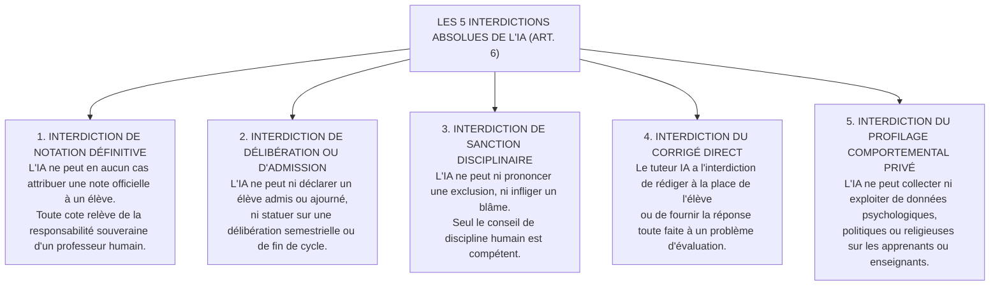

# TOME 8 — CADRE SOUVERAIN, ÉTHIQUE ET INGÉNIERIE DE L'IA
## 130. Périmètre du Tome 8 et Principes Constitutionnels de l'IA

---

> **Positionnement :** Cadrage doctrinaire suprême de l'intelligence artificielle au sein du système éducatif  
> **Autorité :** Constitution ELLYSIUM (Tome 2, Art. 6 — Auxiliarité stricte de l'intelligence artificielle)  
> **Liaison amont :** Tome 2 (Constitution), Tome 5 (Module 74) | **Liaison aval :** Modules 131 à 149

---

## 1. Objet et Portée du Sous-Tome

L'introduction de modèles d'intelligence artificielle générative dans l'enseignement public comporte des risques majeurs : dépossession du rôle de l'enseignant, biais idéologiques ou culturels exogènes, triche systémique et illusions d'omniscience technique. Ce sous-tome délimite le périmètre juridique et technique d'ELLYSIUM, fondé sur le principe inébranlable de l'**auxiliarité absolue de l'IA**.

---

## 2. Les 5 Interdictions Constitutionnelles Formelles (Article 6)

---

## 3. Les 4 Rôles Pédagogiques Légitimes de l'IA

À l'exclusion stricte des actes souverains ci-dessus, l'IA remplit 4 missions exclusives d'assistance :
1. **Tuteur Maïeutique Socratique** : Questionnement progressif pour aider l'apprenant à trouver la réponse par lui-même.
2. **Auxiliaire du Professeur** : Pré-analyse de cohérence des devoirs, détection de lacunes récurrentes dans une classe, génération de variantes d'exercices d'entraînement.
3. **Moteur de Remédiation Pédagogique** : Proposition d'exercices ciblés aux élèves en difficulté sur une notion spécifique après un examen.
4. **Sentinelle de Sécurité pour les Mineurs** : Modération sémantique en temps réel des espaces de discussion communautaires.

---

## 4. Verrous Légaux et Techniques de Non-Substitution

| Réf. | Intitulé | Conséquence en cas de transgression |
|---|---|---|
| **VF-130-01** | Rejet de toute note d'examen non validée par un professeur | Toute cote générée par un algorithme qui ne comporterait pas la signature cryptographique d'un enseignant humain est nulle et non avenue de plein droit. |
| **VF-130-02** | Droit au recours humain systématique | Tout élève ou parent contestataire d'une suggestion d'orientation formulée par l'IA bénéficie d'un réexamen obligatoire par une commission humaine sous 15 jours. |

---

*Sous-tome rédigé conformément aux Normes documentaires ELLYSIUM — Fondations 04.*  
*Version 1.0 — Référence : ELLYSIUM/T8/130/v1.0*
