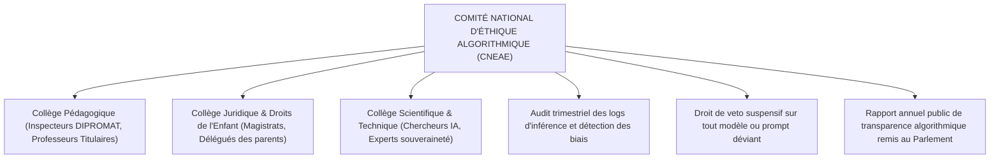
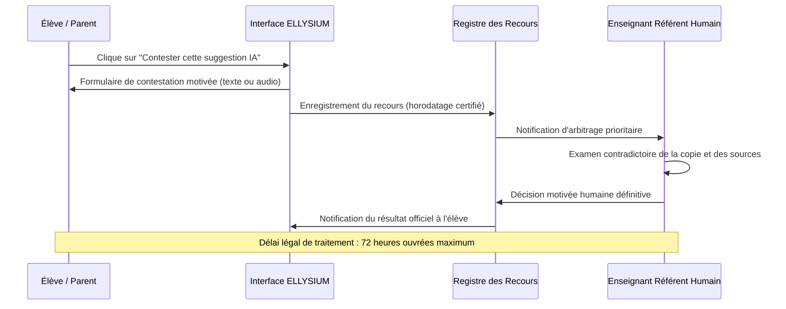

# TOME 8 — CADRE SOUVERAIN, ÉTHIQUE ET INGÉNIERIE DE L'IA
## 131. Gouvernance Éthique, Supervision Humaine et Droits de Recours

---

> **Positionnement :** Instances de contrôle éthique, auditabilité des algorithmes et procédures de recours contradictoire  
> **Autorité :** Conforme aux principes de dignité humaine, de non-discrimination et à la Constitution ELLYSIUM (Art. 3 et 8)  
> **Liaison amont :** Module 130 (Principes) | **Liaison aval :** Module 132 (Modèles), Module 145 (Explicabilité)

---

## 1. Objet et Portée du Sous-Tome

L'éthique de l'IA ne peut être abandonnée à la bonne volonté des concepteurs logiciels. Elle doit être encadrée par des organes institutionnels réguliers, des protocoles d'audit métrologiques et des voies de recours légales garanties aux usagers. Ce sous-tome institue la gouvernance éthique d'ELLYSIUM, les comités de supervision et la procédure opposable de réclamation humaine.

---

## 2. Le Comité National d'Éthique Algorithmique Éducative (CNEAE)

ELLYSIUM place l'ensemble de ses composants d'intelligence artificielle sous le contrôle d'une autorité collégiale indépendante :

---

## 3. Charte de Transparence Immédiate envers l'Apprenant

**Règle ÉTHIQUE-131-01** : Tout écran ou dialogue impliquant une composante d'intelligence artificielle doit afficher une mention visuelle indélébile :
- **Bannière permanente** : *« Vous échangez avec le Tuteur Numérique ELLYSIUM. Ce système est un assistant d'apprentissage et ne remplace pas votre professeur. »*
- **Badge d'état explicite** : Toute suggestion générée automatiquement porte le label `[Généré par IA — Vérifié par l'enseignant]`.

---

## 4. Procédure de Recours Humain Opposable (Human-in-the-Loop)

Lorsqu'un élève estime qu'une pré-évaluation ou une recommandation d'IA est erronée ou injuste :

---

## 5. Souveraineté des Données d'Apprentissage (Zéro Fuite vers des Tiers)

**Règle ÉTHIQUE-131-02** : Aucune interaction d'élève (question posée, devoir rédigé, voix enregistrée) ne peut être transmise à un serveur d'IA commercial externe fermé sans anonymisation complète et accord de souveraineté d'État. Les modèles d'inférence sont exécutés en priorité sur les serveurs nationaux d'ELLYSIUM.

---

## 6. Verrous Éthiques et Juridiques

| Réf. | Intitulé | Conséquence en cas de transgression |
|---|---|---|
| **VF-131-01** | Veto suspensif immédiat du CNEAE | Dès qu'un biais discriminatoire (tribal, religieux ou sexiste) est avéré dans un prompt système, le modèle est désactivé sur-le-champ dans l'ensemble du réseau national. |
| **VF-131-02** | Droit d'effacement de l'historique de conversation | Tout élève ou parent peut exiger à tout moment la purge intégrale de ses conversations avec le tuteur IA sans incidence sur son dossier académique officiel. |

---

*Sous-tome rédigé conformément aux Normes documentaires ELLYSIUM — Fondations 04.*  
*Version 1.0 — Référence : ELLYSIUM/T8/131/v1.0*

---

## 7. Verrous Fonctionnels Critiques

| Réf. Verrou | Description Fonctionnelle et Technique | Conséquence en Cas de Violation |
| :--- | :--- | :--- |
| **`VF-131-03`** | **Surveillance 24/7 par le Security Operations Center (SOC)** | Tableaux de bord Cloud Security Command Center actifs en permanence. |
| **`VF-131-04`** | **Détection et blocage des attaques DDoS via Cloud Armor** | Règles WAF personnalisées avec protection contre les OWASP Top 10. |
| **`VF-131-05`** | **Rapport mensuel des menaces et incidents de sécurité** | Synthèse des incidents et remèdes transmise au CA de l'ASBL. |
| **`VF-131-06`** | **Toute suggestion d'IA doit inclure un code de confiance (0-100) horodaté et vérifiable** | **Conséquence : violation = inéligibilité du module pour mise en production** |

---

*Sous-tome rédigé conformément aux Normes documentaires ELLYSIUM — Fondations 04.*
