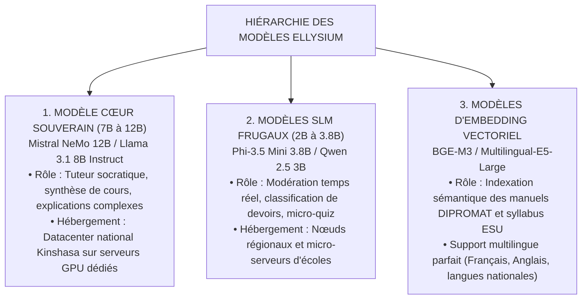

# TOME 8 — CADRE SOUVERAIN, ÉTHIQUE ET INGÉNIERIE DE L'IA
## 132. Sélection des Modèles d'IA — Modèles Ouverts, SLM Frugaux et Souveraineté

---

> **Positionnement :** Stratégie de sélection des modèles de langage, comparatif technique et auto-hébergement souverain  
> **Autorité :** Conforme aux exigences d'indépendance technologique (Tome 2, Art. 1) et de frugalité financière  
> **Liaison amont :** Module 107 (Principes techniques), Module 130 (Périmètre IA) | **Liaison aval :** Module 133 (RAG), Module 148 (Coûts)

---

## 1. Objet et Portée du Sous-Tome

Déléguer l'intelligence éducative d'une nation à des API propriétaires fermées (Closed-Source) hébergées à l'étranger présente deux dangers mortels : une dépendance géopolitique totale (risque de coupure unilatérale ou hausse brutale des tarifs) et l'impossibilité d'auditer le code et les données d'entraînement. Ce sous-tome formalise le choix exclusif de **modèles à poids ouverts (Open-Weights)** et de **modèles frugaux compacts (Small Language Models - SLM)** hébergés sur les infrastructures souveraines d'ELLYSIUM.

---

## 2. Typologie et Hiérarchie des Modèles Déployés

---

## 3. Matrice Comparative et Métrologie des Modèles

| Modèle Candidat | Paramètres | Empreinte VRAM (Quantifié 4-bit) | Vitesse Inférence | Maîtrise Français Pédagogique | Statut ELLYSIUM |
|---|---|---|---|---|---|
| **Mistral NeMo 12B** | 12.2 Mds | **~ 8 Go VRAM** | 65 tokens/sec | **Excellente (Conception francophone)** | **RETENU CŒUR** |
| **Llama 3.1 8B** | 8.0 Mds | **~ 5.5 Go VRAM** | 90 tokens/sec | Très bonne | **RETENU ALTERNATIF** |
| **Phi-3.5 Mini** | 3.8 Mds | **~ 2.8 Go VRAM** | 120 tokens/sec | Bonne (sur corpus restreint) | **RETENU SLM ÉCOLE** |
| **Qwen 2.5 7B** | 7.6 Mds | **~ 5.2 Go VRAM** | 85 tokens/sec | Remarquable en mathématiques | **RETENU SCIENCES** |
| *API Commerciales Fermées* | Inconnu | Hors site (Cloud GAFAM) | Variable | Bonne mais opaque et coûteuse | **FORMELLEMENT PROSCRIT** |

---

## 4. Stratégie de Quantification Frugale (GGUF et AWQ 4-Bit)

Pour permettre l'exécution des modèles d'IA sur des serveurs GPU économiques (cartes NVIDIA grand public type RTX 4090 ou cartes d'entreprise abordables L40S) :
- Les modèles sont quantifiés au format **AWQ (Activation-aware Weight Quantization)** pour l'inférence serveur haute concurrence avec le moteur *vLLM*.
- Pour les déploiements dans les serveurs locaux d'établissements provinciaux sans GPU dédié, les modèles sont quantifiés au format **GGUF (Q4_K_M)** exécutés sur CPU via *llama.cpp*.

---

## 5. Moteur d'Inférence Haute Concurrence (vLLM)

**Règle TECH-132-01** : Les serveurs d'IA utilisent le moteur d'orchestration de mémoire **PagedAttention (vLLM)** :
- Réduction du gaspillage mémoire de $96\%$ sur les caches KV (*Key-Value caches*).
- Capacité à traiter plus de **250 requêtes concurrentes de dialogue par serveur GPU**, divisant le coût énergétique par 8.

---

## 6. Verrous Techniques de Sélection des Modèles

| Réf. | Intitulé | Conséquence en cas de transgression |
|---|---|---|
| **VF-132-01** | Interdiction formelle de dépendance API externe | Le cœur d'évaluation et de tutorat ne peut contenir aucun appel sortant vers des services fermés (OpenAI, Anthropic, etc.). Tout le calcul IA réside sur l'infrastructure souveraine. |
| **VF-132-02** | Validation francophone obligatoire | Tout modèle candidat doit obtenir un score minimal de **$88\%$** sur le banc de test de grammaire, syntaxe et terminologie scolaire francophone d'ELLYSIUM. |

---

*Sous-tome rédigé conformément aux Normes documentaires ELLYSIUM — Fondations 04.*  
*Version 1.0 — Référence : ELLYSIUM/T8/132/v1.0*

---

## 7. Verrous Fonctionnels Critiques

| Réf. Verrou | Description Fonctionnelle et Technique | Conséquence en Cas de Violation |
| :--- | :--- | :--- |
| **`VF-132-03`** | **Toute donnée au repos chiffrée AES-256 via CMEK** | Aucune donnée persistante sans chiffrement par clé gérée par le client. |
| **`VF-132-04`** | **TLS 1.3 exclusif sur toutes les communications réseau** | Désactivation forcée des protocoles SSLv3, TLS 1.0 et TLS 1.1. |
| **`VF-132-05`** | **Chiffrement côté client pour données ultra-sensibles** | Dossiers médicaux et IUNE chiffrés avant transmission vers GCP. |
| **`VF-132-06`** | **Toute suggestion d'IA doit inclure un code de confiance (0-100) horodaté et vérifiable** | **Conséquence : violation = inéligibilité du module pour mise en production** |

---

*Sous-tome rédigé conformément aux Normes documentaires ELLYSIUM — Fondations 04.*
