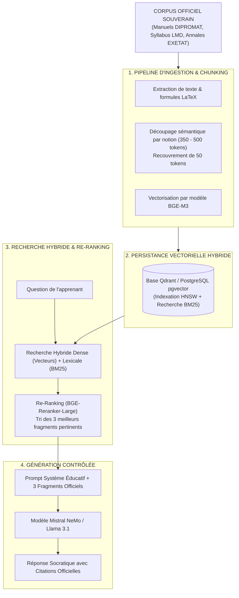

# TOME 8 — CADRE SOUVERAIN, ÉTHIQUE ET INGÉNIERIE DE L'IA
## 133. Architecture RAG Hybride pour les Contenus Pédagogiques Certifiés

---

> **Positionnement :** Architecture de génération augmentée par récupération (RAG), indexation sémantique et rempart anti-hallucination  
> **Autorité :** Conforme au principe de fidélité absolue aux programmes nationaux de la RDC (DIPROMAT et ESU)  
> **Liaison amont :** Module 132 (Modèles), Tome 4 (Programmes) | **Liaison aval :** Module 134 (Tuteur IA), Module 144 (Anti-hallucinations)

---

## 1. Objet et Portée du Sous-Tome

Un modèle de langage générique livré à lui-même tend inévitablement à inventer des règles de grammaire, déformer des événements historiques nationaux ou utiliser des méthodes mathématiques étrangères au programme officiel de la RDC. L'architecture **RAG (Retrieval-Augmented Generation)** d'ELLYSIUM garantit que **100 % des réponses générées sont mathématiquement et textuellement ancrées dans des fragments documentaires officiels validés par l'Inspection Générale**.

---

## 2. Le Pipeline RAG d'ELLYSIUM en 4 Étapes

---

## 3. Stratégie de Découpage Sémantique (Smart Chunking)

Pour ne pas tronquer une démonstration mathématique ou une règle de droit constitutionnel au milieu d'une phrase :
- **Chunking hiérarchique** : Le document est d'abord découpé selon sa table des matières officielle (`Chapitre` > `Section` > `Sous-section`).
- **Taille de chunk** : Calibrée entre **350 et 500 tokens**.
- **Préservation des formules mathématiques** : Toute formule mathématique ou chimique est encapsulée dans un bloc LaTeX unitaire (`$$ ... $$`) interdit de division.

---

## 4. Moteur de Recherche Hybride et Re-Ranking

**Règle TECH-133-01** : La recherche d'informations combine obligatoirement deux méthodes complémentaires :
1. **Recherche Dense (Vectorielle)** : Capture l'intention sémantique même si l'élève utilise des synonymes ou s'exprime dans un français maladroit.
2. **Recherche Sparse (BM25)** : Garantit la recherche exacte des termes techniques, patronymes historiques congolais et codes d'articles de loi.
3. **Re-Ranker (BGE-Reranker)** : Ré-évalue la pertinence contextuelle des 20 meilleurs résultats pour n'en conserver que les 3 plus fidèles.

---

## 5. Règle Anti-Hallucination Absolue (Seuil de Confiance)

$$\text{Score Pertinence} = \text{ReRankerScore}(\text{Question}, \text{Fragment Documentaire})$$

**Règle TECH-133-02** : Si le meilleur score de pertinence obtenu après recherche est **inférieur au seuil strict de $0.72$** (signifiant que la notion demandée ne figure pas dans le corpus scolaire certifié) :
- Le modèle a l'interdiction formelle de puiser dans sa mémoire générique libre.
- Le système renvoie obligatoirement la réponse standardisée :  
  *« Cette notion ne figure pas dans le programme officiel enregistré pour votre niveau. Veuillez consulter votre enseignant titulaire ou le manuel scolaire recommandé. »*

---

## 6. Verrous Techniques RAG

| Réf. | Intitulé | Conséquence en cas de transgression |
|---|---|---|
| **VF-133-01** | Obligation de citation des sources | Toute réponse pédagogique générée par le tuteur IA doit mentionner en bas de message le titre du manuel officiel, le chapitre et le numéro de page source (`[Réf : DIPROMAT Math 4e, Ch. 3, p. 45]`). |
| **VF-133-02** | Imperméabilité des corpus non homologués | Aucun document ne peut être injecté dans la base vectorielle sans avoir été préalablement scellé et validé par le Conseil Pédagogique d'ELLYSIUM. |

---

*Sous-tome rédigé conformément aux Normes documentaires ELLYSIUM — Fondations 04.*  
*Version 1.0 — Référence : ELLYSIUM/T8/133/v1.0*
