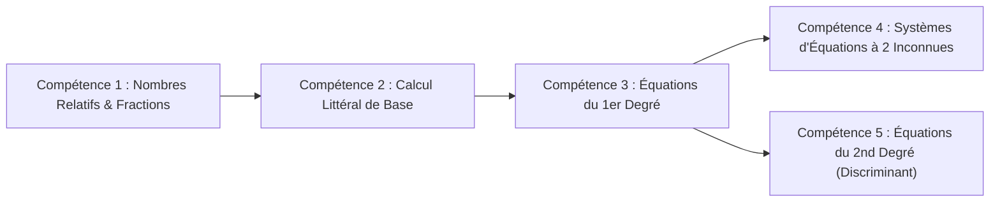

# TOME 8 — CADRE SOUVERAIN, ÉTHIQUE ET INGÉNIERIE DE L'IA
## 135. Personnalisation des Parcours d'Apprentissage et Adaptive Learning

---

> **Positionnement :** Algorithmes d'adaptation au rythme de l'apprenant, graphes de compétences et remédiation personnalisée  
> **Autorité :** Conforme au respect de la diversité des rythmes d'apprentissage sans profilage invasif  
> **Liaison amont :** Module 134 (Tuteur), Tome 4 (Programmes) | **Liaison aval :** Module 136 (Génération d'exercices), Module 139 (Remédiation)

---

## 1. Objet et Portée du Sous-Tome

Tous les apprenants ne progressent pas à la même vitesse ni avec les mêmes facilités cognitives. Dans une classe ordinaire de 45 élèves, l'enseignant ne peut pas démultiplier son temps pour chaque élève. Le moteur d'**Apprentissage Adaptatif (Adaptive Learning)** d'ELLYSIUM personnalise la séquence des exercices et des révisions en fonction des forces et lacunes démontrées par l'élève, sans jamais l'enfermer dans un déterminisme algorithmique réducteur.

---

## 2. Le Graphe National de Dépendance des Compétences

Chaque programme d'études est modélisé sous la forme d'un **Graphe Orienté Acyclique (DAG)** de prérequis :

### 2.1 Diagnostic des Prérequis Manquants
Si un élève échoue de manière répétée sur la *Compétence 5 (Équations du 2nd degré)*, l'algorithme ne se contente pas de lui infliger d'autres exercices identiques. Il remonte l'arbre de dépendance et identifie que l'origine du blocage se situe au niveau de la *Compétence 2 (Développement et factorisation)*. Il lui propose alors un micro-module de rappel de 10 minutes sur la factorisation.

---

## 3. Algorithme d'Ajustement de Difficulté (Théorie de Réponse à l'Item - TRI)

Pour maintenir l'élève dans sa **Zone Proximale de Développement (ZPD)** sans le décourager ni l'ennuyer :
- Chaque item d'exercice possède un paramètre de difficulté étalonné $\beta$.
- Le niveau de maîtrise de l'élève $\theta$ est réévalué de manière bayésienne après chaque série d'exercices :
$$P(\text{Succès}) = \frac{1}{1 + e^{-(\theta - \beta)}}$$
- Le système sélectionne en priorité les exercices où la probabilité de succès estimée se situe entre **$60\%$ et $75\%$**, seuil idéal pour stimuler l'effort intellectuel sans générer d'anxiété.

---

## 4. Souveraineté du Choix de l'Élève (Non-Directivité)

**Règle PÉDAGOGIE-135-01** : Les parcours personnalisés suggérés par l'IA ont un caractère **strictement consultatif** :
- L'élève voit sur son tableau de bord : *« Parcours de renforcement conseillé par le tuteur »*.
- L'élève conserve à tout moment la liberté d'ignorer la suggestion et d'accéder directement au chapitre suivant de son choix.
- Aucun élève ne peut être bloqué dans sa progression générale sur la seule base d'un score d'adaptive learning.

---

## 5. Protection contre le Profilage Déterministe

- **Zéro étiquetage pérenne** : Aucun profil d'élève ne comporte d'attribut figé tel que *« Niveau faible »*, *« Incapable en sciences »* ou *« Profil littéraire exclusif »*.
- **Réinitialisation périodique des scores** : Au début de chaque trimestre ou semestre, les coefficients de difficulté repartent d'une base neutre pour offrir à chaque élève une opportunité de renaissance académique.

---

## 6. Verrous Techniques d'Apprentissage Adaptatif

| Réf. | Intitulé | Conséquence en cas de transgression |
|---|---|---|
| **VF-135-01** | Interdiction d'accès aux recruteurs | Les données granulaires d'erreurs et de vitesse d'apprentissage sont strictement confidentielles. Elles ne peuvent être cédées à aucun employeur, école tierce ou annonceur. |
| **VF-135-02** | Alignement strict sur les programmes officiels | L'IA ne peut recommander que des exercices figurant dans le catalogue officiel homologué par le Ministère de tutelle. |

---

*Sous-tome rédigé conformément aux Normes documentaires ELLYSIUM — Fondations 04.*  
*Version 1.0 — Référence : ELLYSIUM/T8/135/v1.0*

---

## 7. Verrous Fonctionnels Critiques

| Réf. Verrou | Description Fonctionnelle et Technique | Conséquence en Cas de Violation |
| :--- | :--- | :--- |
| **`VF-135-03`** | **Rétention des journaux pendant 3 ans minimum** | Cloud Logging configuré en rétention longue durée pour obligations légales. |
| **`VF-135-04`** | **Export immédiat des journaux vers BigQuery pour analyse SIEM** | Corrélation des événements en temps réel pour détection d'anomalies. |
| **`VF-135-05`** | **Imputabilité de tout événement système à un compte nominatif** | Interdiction des comptes génériques partagés sur les systèmes de production. |

---

*Sous-tome rédigé conformément aux Normes documentaires ELLYSIUM — Fondations 04.*
