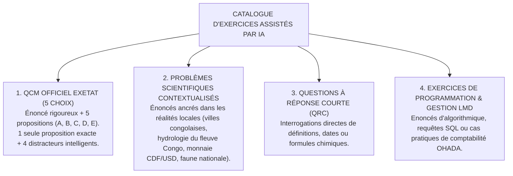
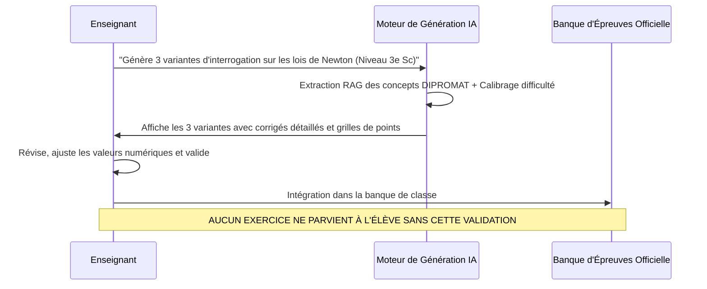

# TOME 8 — CADRE SOUVERAIN, ÉTHIQUE ET INGÉNIERIE DE L'IA
## 136. Génération et Suggestion d'Exercices Pédagogiques (QCM, Problèmes, Variantes)

---

> **Positionnement :** Moteur de génération d'exercices d'entraînement, conception de distracteurs plausibles et contextualisation africaine  
> **Autorité :** Conforme aux formats d'évaluation officiels de l'EXETAT, du TENASOSP et des examens universitaires LMD  
> **Liaison amont :** Module 133 (RAG), Tome 4 (Programmes) | **Liaison aval :** Module 137 (Correction assistée), Module 139 (Remédiation)

---

## 1. Objet et Portée du Sous-Tome

Les enseignants passent un temps considérable à rédiger des sujets d'interrogations et des variantes pour éviter la fraude en classe. Les élèves, quant à eux, manquent souvent de recueils d'exercices variés pour s'entraîner aux épreuves d'État. Ce sous-tome spécifie l'architecture du générateur d'exercices assisté par IA, la conception rigoureuse des questions à choix multiples (QCM type EXETAT) et l'ancrage culturel congolais des énoncés.

---

## 2. Typologie des Formats d'Exercices Générés



---

## 3. Ingénierie des Distracteurs Plausibles (Norme EXETAT)

**Règle ÉVAL-136-01** : Dans un QCM généré par l'IA, les 4 mauvaises réponses (distracteurs) ne doivent jamais être fantaisistes ou trivialement fausses. Elles doivent refléter des erreurs de raisonnement classiques identifiées par les inspecteurs pédagogiques :

```
Exemple de génération calibrée en Mathématiques (4e Humanités) :
Question : Calculer la dérivée de f(x) = (3x^2 + 1)^4
- Proposition A : f'(x) = 12x (3x^2 + 1)^3          [RÉPONSE EXACTE]
- Proposition B : f'(x) = 4 (3x^2 + 1)^3            [Distracteur 1 : oubli de la dérivée interne u']
- Proposition C : f'(x) = 24x (3x^2 + 1)^3          [Distracteur 2 : erreur de dérivation de 3x^2]
- Proposition D : f'(x) = 12x (3x^2 + 1)^4          [Distracteur 3 : oubli de la décrémentation de puissance]
- Proposition E : f'(x) = (6x)^4                    [Distracteur 4 : confusion totale de formule]
```

---

## 4. Contextualisation Culturelle et Géographique des Énoncés

Pour renforcer le sens concret des apprentissages chez les élèves congolais :
- Les problèmes d'arithmétique utilisent des transactions courantes en Francs Congolais (CDF) et Dollars (USD).
- Les calculs de vitesse ou de débit mettent en scène des navires reliant Kinshasa à Mbandaka sur le fleuve Congo, ou le transport ferroviaire entre Lubumbashi et Kolwezi.
- Les exercices d'histoire et de géographie s'appuient sur les écosystèmes réels du Bassin du Congo et les grandes figures nationales (Kasa-Vubu, Lumumba, Kimbangu, etc.).

---

## 5. Workflow de Validation Enseignant



---

## 6. Verrous Techniques de Génération

| Réf. | Intitulé | Conséquence en cas de transgression |
|---|---|---|
| **VF-136-01** | Vérification mathématique automatique | Tout problème de mathématiques ou de physique généré par l'IA doit être résolu et validé par un solveur formel symbolique (ex. SymPy) pour vérifier l'exactitude de la solution avant affichage à l'enseignant. |
| **VF-136-02** | Absence d'ambiguïté | Les questions à choix multiples ne doivent présenter qu'une seule et unique réponse mathématiquement ou grammaticalement juste. |

---

*Sous-tome rédigé conformément aux Normes documentaires ELLYSIUM — Fondations 04.*  
*Version 1.0 — Référence : ELLYSIUM/T8/136/v1.0*

---

## 7. Verrous Fonctionnels Critiques

| Réf. Verrou | Description Fonctionnelle et Technique | Conséquence en Cas de Violation |
| :--- | :--- | :--- |
| **`VF-136-03`** | **Scans de vulnérabilité hebdomadaires des conteneurs** | Artifact Registry Analysis bloque le déploiement d'images avec CVE critiques. |
| **`VF-136-04`** | **Processus de patch management sous 24h pour CVE critiques** | Toute vulnérabilité CVSS >= 9.0 est patchée dans les 24h suivant sa publication. |
| **`VF-136-05`** | **Programme de bug bounty ouvert aux chercheurs congolais et africains** | Programme de récompense pour découverte de vulnérabilités responsable. |

---

*Sous-tome rédigé conformément aux Normes documentaires ELLYSIUM — Fondations 04.*
