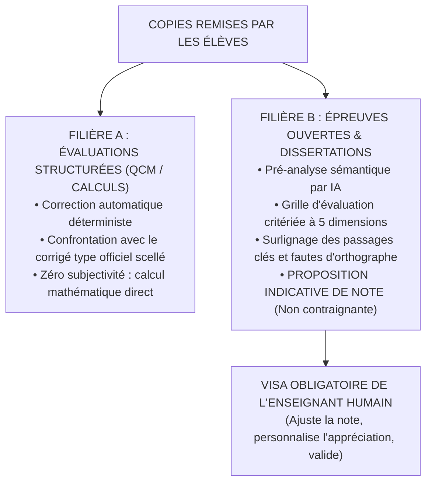

# TOME 8 — CADRE SOUVERAIN, ÉTHIQUE ET INGÉNIERIE DE L'IA
## 137. Correction Assistée par IA — Évaluations Structurées et Dissertations Ouvertes

---

> **Positionnement :** Outils d'aide à la correction pour le corps enseignant, grilles critériées et pré-analyses sémantiques  
> **Autorité :** Conforme à l'Article 6 de la Constitution ELLYSIUM (Souveraineté humaine exclusive de la note définitive)  
> **Liaison amont :** Module 69 (Devoirs fonctionnels), Module 90 (Parcours enseignant) | **Liaison aval :** Module 142 (Plagiat), Module 146 (Journal d'audit)

---

## 1. Objet et Portée du Sous-Tome

Corriger manuellement 150 copies de dissertation littéraire ou 300 devoirs de physique représente un fardeau horaire épuisant pour un enseignant du secondaire ou un assistant d'université. Cette surcharge favorise la fatigue de notation et les biais d'inattention. La **correction assistée par IA** d'ELLYSIUM fournit au professeur une pré-lecture analytique structurée, tout en maintenant sa souveraineté intégrale sur l'appréciation pédagogique et la note finale.

---

## 2. Deux Filières de Correction Rigoureusement Distinctes

---

## 3. Grille Critériée Multidimensionnelle pour Dissertations

Pour les épreuves ouvertes de français, philosophie, histoire ou travaux de recherche LMD, l'IA décompose son analyse selon 5 axes normés :

| Critère d'Évaluation | Poids Barème | Analyse Assistée par l'IA | Validation Enseignant |
|---|---|---|---|
| **1. Compréhension du Sujet** | 20 % | Vérifie la présence des concepts clés et l'absence de hors-sujet manifeste | Curseurs ajustables |
| **2. Rigueur du Plan & Progression** | 25 % | Analyse la structure Introduction / Développement / Conclusion et transitions | Note modifiable |
| **3. Cohérence de l'Argumentation** | 25 % | Détecte les syllogismes, affirmations gratuites ou contradictions internes | Note modifiable |
| **4. Qualité de la Langue & Syntaxe** | 15 % | Repère les fautes de grammaire, d'accord et le niveau de vocabulaire | Correction manuelle |
| **5. Originalité & Réflexion Critique** | 15 % | Évalue la richesse des exemples et la réflexion personnelle | Appréciation libre |

---

## 4. Interface d'Assistance pour le Professeur

L'écran de correction de l'enseignant (Tome 6, Module 90) présente côte à côte :
1. **La copie de l'élève** (manuscrite scannée ou saisie en ligne) avec surlignages intelligents :
   - *Bleu* : Citations ou arguments pertinents bien articulés.
   - *Rouge* : Fautes de grammaire ou contre-vérités historiques.
   - *Orange* : Rupture de logique ou contresens conceptuel.
2. **La grille critériée pré-remplie** : Chaque critère affiche une note suggérée accompagnée d'une justification textuelle en 2 lignes.
3. **Zone de décision humaine souveraine** : L'enseignant peut d'un clic accepter la suggestion, remonter ou baisser la note critère par critère, et saisir son appréciation humaine personnalisée.

---

## 5. Verrous Techniques de Non-Substitution

| Réf. | Intitulé | Conséquence en cas de transgression |
|---|---|---|
| **VF-137-01** | Blocage de publication sans visa enseignant | Le système informatique refuse techniquement de transmettre une note ou un corrigé à un élève tant que l'enseignant n'a pas formellement cliqué sur le bouton scellé *« Valider et signer cette correction »*. |
| **VF-137-02** | Traçabilité des divergences IA / Enseignant | Tout écart significatif ($> 30\%$) entre la pré-note suggérée par l'IA et la note définitive fixée par le professeur est journalisé pour servir au réétalonnage du modèle. |

---

*Sous-tome rédigé conformément aux Normes documentaires ELLYSIUM — Fondations 04.*  
*Version 1.0 — Référence : ELLYSIUM/T8/137/v1.0*

---

## 7. Verrous Fonctionnels Critiques

| Réf. Verrou | Description Fonctionnelle et Technique | Conséquence en Cas de Violation |
| :--- | :--- | :--- |
| **`VF-137-03`** | **Plan de communication de crise testé annuellement** | Simulation d'incident majeur avec activation du plan de communication. |
| **`VF-137-04`** | **Porte-parole désigné pour les incidents de sécurité publics** | Communication officielle centralisée pour éviter les déclarations contradictoires. |
| **`VF-137-05`** | **Clôture solennelle du Tome 8** | Validation de l'intégralité de l'architecture d'infrastructure, de sécurité et de résilience. |

---

*Sous-tome rédigé conformément aux Normes documentaires ELLYSIUM — Fondations 04.*
