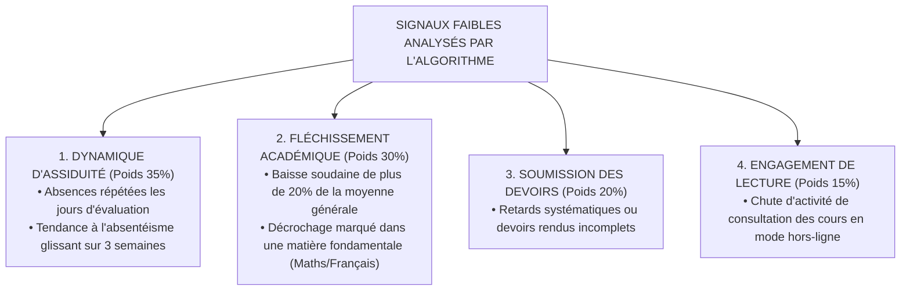

# TOME 8 — CADRE SOUVERAIN, ÉTHIQUE ET INGÉNIERIE DE L'IA
## 138. Détection Précoce des Difficultés et Prévention du Décrochage Scolaire

---

> **Positionnement :** Système d'alerte précoce (Early Warning System), modélisation des signaux faibles et déclenchement du soutien social  
> **Autorité :** Conforme aux impératifs d'inclusion républicaine et de lutte contre l'exclusion scolaire (Tome 2, Art. 3)  
> **Liaison amont :** Module 65 (Présences), Module 66 (Cotes) | **Liaison aval :** Module 139 (Remédiation), Module 140 (Assistance administrative)

---

## 1. Objet et Portée du Sous-Tome

En République Démocratique du Congo, le taux d'abandon scolaire au niveau secondaire et universitaire demeure préoccupant, souvent causé par des difficultés matérielles, des maladies non signalées ou le découragement silencieux devant une accumulation de mauvaises notes. L'intelligence artificielle a pour devoir républicain de **détecter les signaux faibles de rupture avant que l'abandon ne devienne irrémédiable**, afin de mobiliser immédiatement la solidarité pédagogique et familiale.

---

## 2. L'Indice de Vulnérabilité Scolaire (IVS — Échelle 0 à 100)

L'algorithme de détection précoce calcule un indice composite dynamique sans porter de jugement moral :

$$\text{IVS} = (w_1 \cdot \text{ScoreAbsence}) + (w_2 \cdot \text{TendanceCotes}) + (w_3 \cdot \text{RégularitéDevoirs}) + (w_4 \cdot \text{Connexions})$$

---

## 3. Seuils d'Alerte et Actions de Solidarité Déclenchées

| Seuil IVS | Niveau de Vigilance | Action Automatique Déclenchée | Destinataire de l'Alerte |
|---|---|---|---|
| **$< 35$** | **Vert (Nominal)** | Suivi pédagogique ordinaire | Aucun |
| **$35 - 60$** | **Jaune (Vigilance)** | Proposition d'exercices de consolidation par le tuteur IA | Élève uniquement |
| **$61 - 80$** | **Orange (Alerte Pédagogique)** | Notification de soutien au Professeur Titulaire pour entretien | Professeur Titulaire |
| **$> 80$** | **Rouge (Risque Critique)** | Déclenchement d'un protocole d'écoute sociale et contact bienveillant | Préfet des études & Responsable légal |

---

## 4. Règle Absolue de Bienveillance et Non-Stigmatisation

**Règle ÉTHIQUE-138-01** : L'Indice de Vulnérabilité Scolaire est un outil de secours, jamais une étiquette infamante :
- L'IVS n'apparaît sur aucun bulletin officiel, aucun relevé de notes et aucune fiche publique.
- L'élève ne voit jamais de mention alarmiste du type *« Vous êtes en situation d'échec probable »*. L'application affiche uniquement des encouragements constructifs : *« Cette semaine a été chargée ! Prenons 15 minutes pour réviser ensemble les notions clés. »*
- Le contact pris avec les parents est formulé sur le ton de l'écoute solidaire, jamais du reproche financier ou disciplinaire.

---

## 5. Verrous Techniques de Protection contre l'Exclusion

| Réf. | Intitulé | Conséquence en cas de transgression |
|---|---|---|
| **VF-138-01** | Interdiction formelle d'exclusion prédictive | Il est strictement interdit d'utiliser le score IVS pour justifier un refus de réinscription, un redoublement forcé ou une radiation d'établissement. |
| **VF-138-02** | Obligation d'entretien humain avant toute décision | Aucune mesure d'aménagement de scolarité ne peut être validée sans un entretien physique ou téléphonique préalable entre l'élève, sa famille et la direction. |

---

*Sous-tome rédigé conformément aux Normes documentaires ELLYSIUM — Fondations 04.*  
*Version 1.0 — Référence : ELLYSIUM/T8/138/v1.0*

---

## 7. Verrous Fonctionnels Critiques

| Réf. Verrou | Description Fonctionnelle et Technique | Conséquence en Cas de Violation |
| :--- | :--- | :--- |
| **`VF-138-03`** | **Délibération systématique par le jury humain souverain** | Aucun algorithme ne peut proclamer les résultats officiels sans délibération du jury. |
| **`VF-138-04`** | **Conservation des procès-verbaux de jury pendant 50 ans** | Archivage long terme des délibérations dans le Cloud Storage avec scellement KMS. |
| **`VF-138-05`** | **Appel des résultats encadré par des délais légaux** | Le recours contre une délibération doit être introduit dans les 15 jours suivant la publication. |

---

*Sous-tome rédigé conformément aux Normes documentaires ELLYSIUM — Fondations 04.*
