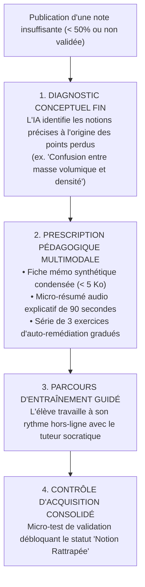

# TOME 8 — CADRE SOUVERAIN, ÉTHIQUE ET INGÉNIERIE DE L'IA
## 139. Recommandations Pédagogiques et Remédiation Ciblée Post-Évaluation

---

> **Positionnement :** Moteur d'ordonnancement de remédiation, analyse d'erreurs conceptuelles et plans de rattrapage ciblés  
> **Autorité :** Conforme au principe de réussite républicaine pour tous et au perfectionnement continu (Tome 3, Module 3.9)  
> **Liaison amont :** Module 137 (Correction assistée), Module 138 (Détection précoce) | **Liaison aval :** Module 140 (Assistance administrative)

---

## 1. Objet et Portée du Sous-Tome

L'évaluation scolaire n'a aucun sens si elle se borne à sanctionner par une mauvaise note sans offrir immédiatement le chemin de la compréhension et de la rédemption académique. Le moteur de **Remédiation Pédagogique Ciblée** d'ELLYSIUM intervient immédiatement après la publication d'un devoir ou d'un examen pour transformer l'erreur en levier d'apprentissage, tant au niveau individuel pour chaque élève qu'au niveau collectif pour l'enseignant.

---

## 2. Le Cycle de Remédiation en 4 Temps



---

## 3. Remédiation Collective : Le Tableau de Bord Enseignant

L'enseignant ne doit pas être laissé seul face à une classe en difficulté. Dès la fin de correction d'un devoir, l'IA génère un **Diagnostic de Cohorte** :

```
Rapport de Remédiation de Classe — 3e Scientifique A :
- Devoir : Physique Générale (Optique géométrique)
- Taux de réussite global : 58.2 %

POINT D'ACHOPPEMENT MAJEUR IDENTIFIÉ :
- 68 % des élèves ont échoué sur le tracé des rayons divergents à travers une lentille concave.
- Cause probable : Oubli de la règle de passage par le foyer virtuel.

RECOMMANDATION PÉDAGOGIQUE IA :
- Consacrer les 15 premières minutes de la prochaine séance à un rappel démonstratif au tableau.
- Fiche de soutien projetable prête à l'emploi disponible en 1 clic.
```

---

## 4. Prescription Multimodale et Éco-Conçue

**Règle PÉDAGOGIE-139-01** : Tout contenu de remédiation produit par le système respecte une compacité extrême :
- **Fiches mémo** : Format texte enrichi ou SVG vectoriel pur pesant moins de **10 Ko**, téléchargeable en une fraction de seconde même en connexion 2G.
- **Audios de remédiation** : Synthèse vocale ultra-légère lue en local par le moteur de synthèse du smartphone de l'élève (consommation data = **0 Ko**).

---

## 5. Valorisation du Rétablissement Académique

Lorsqu'un élève réussit son parcours de remédiation :
- Son profil s'enrichit d'un badge de persévérance et de progression.
- Le professeur titulaire est notifié de l'effort accompli par l'élève, ce qui peut motiver une bonification de points de travaux journaliers (TJ) lors de la période suivante.

---

## 6. Verrous Techniques de Remédiation

| Réf. | Intitulé | Conséquence en cas de transgression |
|---|---|---|
| **VF-139-01** | Gratuité intégrale des modules de remédiation | Aucun contenu ou exercice de remédiation ne peut faire l'objet d'une tarification ou d'un abonnement supplémentaire payant. |
| **VF-139-02** | Alignement strict sur les curricula nationaux | Les explications de remédiation doivent employer les notations, unités et symboles strictement prescrits par le manuel national congolais. |

---

*Sous-tome rédigé conformément aux Normes documentaires ELLYSIUM — Fondations 04.*  
*Version 1.0 — Référence : ELLYSIUM/T8/139/v1.0*
