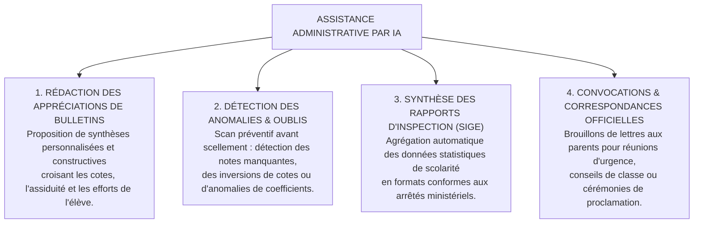

# TOME 8 — CADRE SOUVERAIN, ÉTHIQUE ET INGÉNIERIE DE L'IA
## 140. Assistance Administrative par IA — Bulletins, Rapports et Alertes Institutionnelles

---

> **Positionnement :** Outils d'aide à la gestion administrative scolaire, synthèse d'appréciations de bulletins et détection d'incohérences  
> **Autorité :** Conforme aux règlements administratifs de l'EPST et de l'ESU et à la déontologie directoriale  
> **Liaison amont :** Module 68 (Bulletins), Module 92 (Préfet) | **Liaison aval :** Module 141 (Modération), Module 146 (Journal d'audit)

---

## 1. Objet et Portée du Sous-Tome

La gestion administrative d'une école ou d'une faculté universitaire en RDC impose aux préfets, directeurs et professeurs titulaires une charge bureaucratique écrasante : rédaction manuelle de centaines d'appréciations de bulletins, établissement des procès-verbaux de délibération, rapports de rentrée et déclarations d'effectifs pour l'inspection provinciale. L'**assistance administrative par IA** automatise les tâches rédactionnelles répétitives tout en réservant la signature légale exclusive aux autorités humaines compétentes.

---

## 2. Domaines d'Intervention de l'Assistance Administrative



---

## 3. Génération Assistée des Appréciations de Bulletins

**Règle ADMIN-140-01** : Pour bannir les appréciations stéréotypées ou paresseuses (*« Passable »*, *« Peut mieux faire »* recopié 40 fois) :
- L'IA analyse le profil complet de la période : régularité de présence, progression par rapport au trimestre précédent, matières de pointe et faiblesses.
- Le système propose un projet d'appréciation bienveillant et stimulant :

```
Exemple d'appréciation suggérée :
« Trimestre solide marqué par d'excellents résultats en Mathématiques et Sciences Physiques (74%).
Gloire a fait preuve d'une belle assiduité. Un effort soutenu de méthode en Français et en Histoire 
permettra de viser l'excellence au prochain examen d'État. Encouragements chaleureux du jury. »
```
- Le Professeur Titulaire ou le Préfet peut valider d'un clic, amender le texte ou le réécrire intégralement.

---

## 4. Sentinelle de Cohérence Administrative (Contrôle Pré-Délibération)

Avant toute clôture de période ou scellement officiel :
1. L'algorithme passe au crible les 15 colonnes de notes de l'ensemble des élèves.
2. Il alerte la direction sur les incohérences métrologiques :
   - *« Attention : 3 élèves n'ont aucune note saisie en Chimie en 4e Sc. B »*.
   - *« Attention : Un élève affiche une note supérieure au maximum (15/10) par erreur de frappe »*.
   - *« Attention : Le professeur de Philosophie n'a consigné que 4 heures sur les 12 heures hebdomadaires prévues »*.

---

## 5. Verrous Techniques Administratifs

| Réf. | Intitulé | Conséquence en cas de transgression |
|---|---|---|
| **VF-140-01** | Signature humaine exclusive de tout acte d'État | Aucun bulletin scolaire, aucun certificat et aucun rapport officiel ministériel ne peut être émis avec la seule mention d'une génération par IA sans la signature électronique du chef d'établissement. |
| **VF-140-02** | Neutralité absolue des appréciations | Le modèle a l'interdiction d'insérer des considérations privées d'ordre financier, médical ou religieux dans une appréciation scolaire officielle. |

---

*Sous-tome rédigé conformément aux Normes documentaires ELLYSIUM — Fondations 04.*  
*Version 1.0 — Référence : ELLYSIUM/T8/140/v1.0*

---

## 7. Verrous Fonctionnels Critiques

| Réf. Verrou | Description Fonctionnelle et Technique | Conséquence en Cas de Violation |
| :--- | :--- | :--- |
| **`VF-140-03`** | **Surveillance d'examen hors-ligne opérationnelle sans réseau** | Le module de surveillance fonctionne intégralement en mode PWA hors connexion. |
| **`VF-140-04`** | **Détection automatique des comportements suspects** | Flagging des changements d'application, captures d'écran et changements d'onglet. |
| **`VF-140-05`** | **Enregistrement vidéo horodaté des sessions de proctoring** | Sessions vidéo archivées 90 jours avec chiffrement pour audit en cas de contestation. |

---

*Sous-tome rédigé conformément aux Normes documentaires ELLYSIUM — Fondations 04.*
